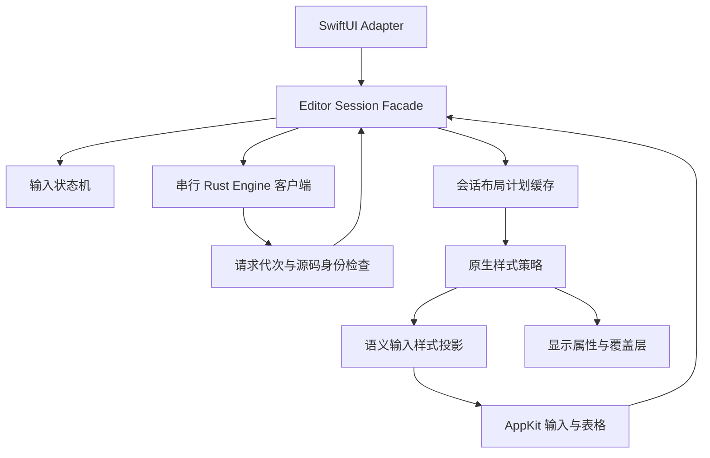

# 编辑核心架构审查与重构（2026-09-23）

## 结论与证据范围

当前即时编辑的反复缺陷有明确的架构诱因：原生输入、SwiftUI 绑定、Engine 确认和渲染任务可以从不同入口影响同一份会话状态；显示属性曾被反向用作输入属性；部分异步操作缺少独立的请求身份。文件过长只是这些职责交叉的表现，不是单独的根因。不能仅凭代码规模或测试数量量化缺陷归因，也不能宣称引入设计模式后不再出现交互问题。

本轮审查覆盖 SwiftUI 编辑入口、AppKit 输入/选区、Rust Engine 客户端、原生排版、表格和资源调度的调用关系；实施重构集中在直接影响输入可靠性和扩展性的编辑核心。文件安全、恢复、导出沿用既有边界，通过完整回归检查兼容性。

## 主要问题与处置

| 优先级 | 问题与证据 | 本轮处置 |
| --- | --- | --- |
| P1 | 会话中的 `pendingOptimisticText`、`deferredCompositionSnapshot`、`isApplyingEngineMutation` 被多个回调分别维护，IME 取消、Engine 拒绝和绑定刷新需要重复判断 | 用 `MarkdownInputState` 明确同步、待确认、组合输入状态；Engine 回写抑制采用可嵌套的作用域，离开作用域自动恢复 |
| P1 | 异步确认只比较当前文本；A→B→A 可能让旧 A 确认通过。`reset` 回调原先没有后续输入保护 | `EditorEngineClient` 为输入与 reset 增加单调请求代次，只发布最新请求的确认；保留串行 Engine 命令与唯一撤销历史 |
| P1 | `syncRenderedTypingAttributes` 从显示用 NSTextStorage 读取字体和颜色，隐藏标记的 0.1pt、透明色及显示时字体回退可能影响输入 | 在隐藏标记和挂载覆盖层之前生成 `MarkdownTypingStyleProjection`。后续输入只消费独立语义属性，不读取实时显示 storage |
| P1 | 临时派生缓存用 Swift String `==` 判断身份；例如 `é` 与 `e`+组合重音规范等价，但 UTF-8/UTF-16 偏移不同 | 缓存改为逐字节身份检查，并增加两种规范形式的范围回归 |
| P1 | `deriveContent` 在等待后先修改会话计划，外层 Store 才检查取消，取消并不能撤销已经发生的副作用 | 在安装计划前检查取消状态与派生代次；外部重载使旧派生代次及布局缓存失效 |
| P1 | SwiftUI adapter 卸载时清除了由持久会话安装的 focus/theme/link 回调，重新挂载不会自动恢复全部回调 | adapter 只拆除自己拥有的 delegate、挂载与粘贴/拖入回调；会话回调在会话生命周期内保留 |
| P2 | 原约 6,000 行文件包含 SwiftUI 桥接、会话、原生输入、表格、图片、行号和几何计算 | 按拥有状态的对象拆分真实类型，不通过放宽所有 private 字段来拼接多个 extension |
| P2 | 编辑手势多处直接同步请求 Markdown 计划，普通字符退格也进入解析路径 | 会话内布局计划缓存统一供给结构命令；普通退格先做词法判断，无结构动作时直接使用 AppKit；同步结构布局省略 HTML |

## 重构后的职责

| 模块 | 拥有的职责 | 不允许依赖的内容 |
| --- | --- | --- |
| `MarkdownSourceEditor.swift` | SwiftUI/AppKit Adapter；独立选区请求控制器保留请求代次和待挂载选区 | 不自行清除会话回调、不决定输入确认状态 |
| `MarkdownSourceEditorSession.swift` | 会话 Facade，组合 Engine、输入状态、样式与原生控件，保留既有公共入口 | 不在显示属性中推导待提交输入的样式 |
| `MarkdownInputState.swift` | 输入同步状态转换、组合确认延后、原生变更回写抑制、绑定接收决策 | 无 NSTextView、SwiftUI、文件系统或渲染器依赖 |
| `WindowAwareTextView.swift` | AppKit 第一响应者、真实 IME 生命周期、键盘/剪贴板/鼠标适配 | 配置会话后通过计划提供器查询语法，不各自构建解析器 |
| `RenderedMarkdownTableView.swift` | 表格单元格、导航、多选和表格编辑回调 | 不直接提交独立的文档历史 |
| `MarkdownNativeStyleSheet.swift` | 无状态的原生排版策略，应用语义和显示属性 | 不持有编辑器、Engine、选区或异步任务 |
| `MarkdownTypingStyleProjection.swift` | 输入样式快照与编辑后的范围重定位 | 不读取实时显示 storage，不携带 kern、附件、透明标记等显示属性 |
| `MarkdownLayoutPlanCache.swift` | 单会话、单项的布局计划缓存，可注入构建策略 | 不发布正文、不执行撤销或文件操作 |
| `MarkdownNativeGeometry.swift` / 图片视图 / 行号视图 | 原生几何和各自控件呈现 | 不管理输入确认 |

状态机和 Adapter 是新增的明确边界；Command（编辑事务）与 Memento（Rust 撤销/重做）沿用原有实现。样式和计划构建采用可替换的策略，不为每个类增加只有一种实现的协议，也没有引入全局事件总线或 Service Locator。

## 算法、更新顺序与约束

1. 原生输入先更新本地表面；非组合输入提交给串行 Engine。SwiftUI 绑定在有待确认输入或组合事务时不能覆盖原生文本。
2. 组合输入开始时保存待确认状态，提交和取消均结束事务。延后的确认只有在源码字节完全匹配时才释放；Engine 主动拒绝编辑时仍可恢复权威正文。
3. 回车等结构事务仍先生成当前语义布局再滚动光标，保留上一轮修复的即时/最终几何一致性。普通正文退格不走全文解析；必要的结构命令共用布局缓存。
4. 输入样式投影在一次原生渲染时生成。普通编辑复用已有 UTF-8 安全单段 diff，转换为 UTF-16 范围后更新属性和范围，不引入第二套 Markdown parser。
5. diff 最坏仍为 O(n)，语义样式投影需要 O(n) 存储。单项缓存不会随着历史正文无限增长，但本轮并未把长文档结构编辑变为增量解析，不能据此声称所有大文档输入延迟都已解决。
6. async 操作必须在修改会话状态前检查请求代次/取消；仅在调用者返回后检查不够。正文分析与图表任务使用独立代次，切换源码视图取消图表时不能误取消仍有效的正文分析。文本相同不等于请求相同，源码身份必须按字节判断。
7. adapter 的解除绑定只能影响自己注册的回调。会话状态、Engine 命令、显示策略分别拥有各自生命周期。

## 验证与后续维护规则

新增回归覆盖：状态机中的 IME 取消/提交和嵌套回写作用域；A→B→A 与 reset 后继续输入；Unicode 规范等价文本的字节身份；取消派生的副作用；显示属性污染；输入样式 Unicode 范围重定位；计划缓存配置隔离和普通退格解析次数；adapter 重挂载回调所有权。

测试总数及清单同步纳入 `quality/personal-xctest-scope.tsv`，保持当前直接、宿主、后续和固定性能用例的明确分区。原先要求“输入字体名字必须等于 AppKit 回退字体名字”的断言改为检查语义字体家族、字号和字重；原有真实行几何、光标高度、位置和撤销断言保留。

扩展新语法时，解析范围仍由 Rust 提供，编辑规则进入事务规划器，视觉规则进入样式策略；不要在 text view 的绘制回调中改正文或决定选区。新增异步来源必须说明它的失效条件和结果接收代次。任何绕过输入状态机的正文写入都需要独立的外部重载或 Engine mutation 入口。

## 仍存在的架构债务

- `MarkdownEditorView` 仍约 3,500 行，文件安全、恢复、导出和原生窗口协调虽然各有服务，但界面组合仍过重，后续适合按用例抽出协调器。
- Session 和 WindowAwareTextView 仍较大，资源调度和覆盖层范围管理可继续拆分；本轮没有把互相耦合的代码机械转移到一个新的巨型 Presenter。
- 大文档的结构操作仍可能同步派生一次完整计划。下一阶段应以真实输入延迟为依据，评估 Rust 增量计划和局部布局，而不是增加更复杂的全局缓存。
- 真实中文输入法候选窗、辅助功能、窗口切换和长时间编辑仍需要人工验收。自动用例验证边界和回归，不替代这些体验验证。

## 本轮验证结果

- `xcodebuild ... build-for-testing` 通过，构建位于 `/private/tmp/inflow-architecture-verification/Build/Products/Debug/Inflow.app`。
- 编辑核心专项：25 项 Engine/输入协调测试 + 52 项原生渲染编辑测试，共 77 项通过。
- 共用排版的集成验证：离线 JS 渲染综合用例、PDF 当前快照/安全链接/长文分页/宽代码表格/宽公式，共 6 项通过。
- 最终 `code/scripts/verify-launch.sh --personal` 通过：148 项 Rust 测试、317 项当前直接 XCTest，以及生成绑定、固定 JS 资源、Rust fmt/clippy、macOS Analyze、diff 检查。
- 总测试清单为 442 项：317 当前直接、34 当前宿主、86 后续、5 固定性能。上述 77 项与门禁有重叠，不能相加当成互不重复的总数。
- 初次实机复验因 Mac 锁屏未完成；后续验证见下文，不把自动测试等同于真实 IME 验收。

## 实机续验与回归修复（2026-09-23）

实机验证使用独立未命名文稿。通过正常退出后复制已测试的构建到 `code/Build/Products/Debug/Inflow.app`，并核对 `Inflow.debug.dylib` 的 SHA-256，避免继续运行重构前的旧应用。

发现并修复以下自动命令级测试未充分覆盖的问题：

1. **正文 Shift+Enter**：AppKit 默认键绑定可能分派到 `insertNewline:`，直接调用 `insertLineBreak` 的测试无法发现这个入口差异。原生 `keyDown` 在即时编辑且非组合输入时识别 Shift+Return/数字键盘 Enter，再进入既有语义换行事务；组合输入继续交给系统。回归改为挂载 NSWindow 后发送 NSEvent，检查正文及选区。
2. **异步生命周期耦合**：正文分析曾复用图表任务的取消代次。独立正文代次只在新派生、文本修改和外部重载时失效，源码展示更新不再误取消分析。资源/主题刷新取代计划安装时，仍向原调用者返回有效的不可变分析结果，只禁止旧请求安装计划，避免启动恢复时误报“更新失败”。已取消的派生在提交 Engine 前退出。增加展示刷新及并发资源/分析请求的回归。
3. **表格退出的段落边界**：表格范围已经包含行尾时，原先直接把光标放在范围末尾，随后输入会吃掉与正文之间的空行。退出现由编辑事务规划器生成两侧的段落分隔与目标选区，并通过同一原生事务提交。回归覆盖 LF/CRLF、文档末尾、已有行尾、后续正文。
4. **合法缺列表格被拒绝**：GFM 会为短行补充范围为空的单元格，而 Swift 桥接层禁止全部空范围，导致整个分析结果 `invalid_response`。仅允许 `table_cell` 的空范围，其余块仍严格校验；加入带 ` `、短行和中文行的实际失败样例。
5. **快速历史操作与视图切换**：撤销/重做原先同时捕获旧源码；SwiftUI 又可能合并 A→B→A 的变化，遗留过期预览错误。会话现在顺序执行历史命令，在前一命令完成后读取源文；Store 直接消费原生确认事件来刷新分析，并按 UTF-8 字节比较请求。菜单在历史命令排队期间继续接收撤销/重做，避免异步撤销尚未完成时 Cmd+Shift+Z 被禁用。回归同时检查发布顺序、最终正文、菜单状态和预览恢复。
6. **退出空列表/引用后仍被解析为续行**：只删除标记不足以退出 Markdown 的懒续行。事务规划器补充所需空行并保留外层引用；已覆盖普通列表、引用中的列表、引用退出及 CRLF，嵌套列表逐级减少缩进的规则不变。

最终代码的自动验证：77 项编辑核心专项、6 项离线渲染/PDF 集成用例通过；完整个人门禁通过（148 Rust、317 当前直接 XCTest、生成绑定、固定 JS 资源、fmt/clippy、macOS Analyze、diff 检查）。本次扩充既有回归用例，测试清单总数保持 442；各专项与门禁有重叠。

日志：`/private/tmp/inflow-ui-fixed-tests.log`、`/private/tmp/inflow-ui-render-export-tests.log`、`/private/tmp/inflow-ui-verification-gate.log`。

### 实机结果及边界

| 项目 | 观察结果 |
| --- | --- |
| 在含中文正文的样例中连续键入英文、Enter / Shift+Enter | 新字符出现在目标新行；段落与软换行源码不同，正文光标没有缩小；中文初始样例通过粘贴载入 |
| 标题转正文、引用续段/续行、空列表/引用退出 | 标题后的正文使用正文大小；引用边线连续；退出后的文字有正确段落分隔 |
| 表格 Tab / Shift+Tab、末尾新增行、Cmd+Enter | 焦点顺序正确，未观察到跳回正文；这不是长表格端到端延迟基准 |
| 表格 Shift+Enter、Enter 退出后继续输入 | 单元格使用 ` `；后续正文与表格、原后续段落分离，统计和预览正常 |
| Cmd+Z / Cmd+Shift+Z 紧接模式切换 | 最终构建恢复文本，源码/预览/即时编辑切换后无残留失败状态 |
| 窗口缩放到最大、最小化、从窗口菜单恢复 | 操作成功，恢复后返回原大小；此处测试 macOS 缩放，不是独占全屏 |
| 正常退出与启动恢复 | 无保存确认；测试文稿内容恢复；未命名标签重新编号，因此以文稿内容核对 |
| 启动恢复后分析及三种模式切换 | 最终构建统计正常，未再出现“更新失败” |
| 真实简体拼音候选窗、选词与取消 | **未完成**：系统已配置 ABC/简体拼音，但工具按 n、i 只出现英文输入/自动纠正。已请求用户在 Inflow 手动激活候选窗；尚未收到候选窗已出现的确认。不能用中文粘贴或组合态单元测试代替此项 |

本轮的“通过”仅覆盖上表已实际执行的路径。VoiceOver、长时间编辑、所有长文档输入延迟和完整产品 UAT 签署不在这些结果中。最终已安装到日常调试路径的构建包含本轮修复；中文候选窗验证仍需继续。

## 表格工具栏、正文宽度与输入几何补充（2026-09-23）

本次对应四项反馈：表格操作入口、正文过窄、源码光标与即时编辑不一致、标题前回车破坏标题。

### 根因和实现边界

- 表格原先把所有操作放在单个下拉框里。新增独立 `MarkdownTableToolbar`，提供尺寸弹层、当前列对齐、整表删除；“更多”和右键菜单共享行列操作。窄表格自动收起直接对齐按钮，菜单仍可使用；只读预览隐藏工具栏并收回其高度。尺寸校验由 `RenderedMarkdownTableEditing` 共用。工具栏仅发送语义命令，扩缩和删除通过 Session 的同一源码事务与 Engine 历史执行，不另建 UI 状态存储或撤销栈。当前列菜单显示对齐状态，不能再删除的最后一行/列禁用相应命令。
- 正文默认最大宽度从 760 调整至 1080，设置范围为 600–1800。实际宽度继续由可用窗口/分栏空间决定，宽屏居中、窄栏收缩，源码模式保持使用可用编辑宽度。首次迁移将旧默认 760 更新为 1080，其他自定义宽度保留；迁移后用户再次选择 760 也会保留。设置标签改为“最大正文宽度”，说明它是上限而不是强制宽度。
- 源码和即时编辑已经共用光标绘制解析器，但上游排版并不一致：源码使用 `lineHeightMultiple`，正文使用按字号计算的 `minimumLineHeight`；源码光标还读取易受语法高亮和字体回退影响的 `typingAttributes`。新增 `MarkdownNativeTypography` 统一两种模式的正文行高生成，源码样式刷新和增量高亮也使用它；源码光标使用独立的配置字体，输入属性同步覆盖源码模式，组合输入期间仍交给系统。字体选择允许两种模式不同，但行高规则、光标定位和输入协调共用现有路径。
- 即时编辑隐藏 `# ` 后，可见标题行首实际位于标记之后；按普通光标位置插入换行，会留下空标题并把原文字拆为正文。结构事务规划器现在识别标题标记区域，在整个标题块前插入段落分隔，并把选区放到前面的空段落。标题中间和末尾原有行为不变；源码模式保留逐字符编辑语义。

表格入口参考 [Typora Table Editing](https://support.typora.io/Table-Editing/) 的尺寸、对齐、删除和更多操作；写作区上限参考 [Typora Width of Writing Area](https://support.typora.io/Width-of-Writing-Area/)。这是针对本轮需求的原生实现，并不声称已复刻 Typora 的全部表格能力。

### 本次验证

- 首轮 94 项专项通过（原生编辑、Engine 和设置）；补充工具栏事务后，69 项原生编辑/设置专项通过。专项与门禁重叠，不作为独立总数累加。
- 最终完整个人门禁通过：148 Rust、317 当前直接 XCTest、固定 JS 资源、生成绑定、fmt/clippy、macOS Analyze、diff 检查。
- 最终构建的 6 项离线 JS/PDF 集成测试通过，覆盖宽表格、宽代码、公式、纸张边距、安全链接和多页输出。
- 新增或扩充的断言包括：表格扩缩内容与列对齐保留、无效尺寸拒绝、扩缩/整表删除及 Engine 撤销、只读工具栏收起高度；源码英文、中文、尾部空行的固定光标高度与行片段中心；标题标记前后、CRLF、标题中间/末尾换行；默认宽度迁移与用户自定义保留。
- 实机在独立测试文档中确认：当前列居中、3×2 扩到 4×3 并一次撤销、删除表格后恢复；标题可见行首回车后输入 `Before123`，原标题仍是标题；源码回车输入 `Source123`/`After123` 落在新行；1080 宽度生效且分栏时自动收缩。最终构建另外复核尺寸弹层完整显示、更多菜单和只读预览不留空白工具栏。
- 已把最终构建安装到 `code/Build/Products/Debug/Inflow.app`；运行前正常退出旧进程，再复制并核对动态库 SHA-256 一致。未命名文档恢复后可能重新编号，验证依据实际内容识别文档，未覆盖原有用户文稿。

日志：`/private/tmp/inflow-table-ux-build.log`、`/private/tmp/inflow-table-ux-tests.log`、`/private/tmp/inflow-table-ux-gate.log`、`/private/tmp/inflow-table-ux-render-export-tests.log`。

## 表格焦点菜单与引用单行续接（2026-09-23）

- 表格工具栏默认隐藏，仅当原生焦点位于当前表格的单元格/工具栏或正在操作其尺寸弹层时显示。窗口更新事件用于核对 responder，只有显隐状态改变才更新控件和辅助功能子树；离开窗口时解除观察。菜单使用期间不会因为焦点进入弹层而突然消失。
- 工具栏占用表格上方固定的编辑间隔，不因显隐重排单元格或改变点击位置；网格边框从表头开始绘制，隐藏菜单时不会显示空白表格行。只读预览继续省去这段编辑间隔。
- 引用的 Enter 原先生成 `\n>\n> `，含两个换行。改为只追加一个换行及当前引用前缀，例如 `> 引用\n> `；嵌套引用、行中拆分及 CRLF 保留各自前缀和选区。空引用再次回车仍退出到正文，引用中的列表沿用列表规则。
- 构建通过；全部 52 项 `RenderedMarkdownEditorTests` 通过。扩充表格焦点进入/离开与几何不变断言，引用的普通回车、嵌套、行中、CRLF 和原生输入续写断言。同时修正前一轮只读工具栏已收起、但宿主综合用例仍要求读写表格总高度相等的过时预期；检查单元格高度时允许 AppKit 屏幕像素取整差异。
- 实机验证：正文中表格菜单不可见，点击单元格立即显示，尺寸弹层内保持显示，回到引用后隐藏；引用回车键入 `Next123` 紧接下一行，空引用再回车后键入 `Outside123` 正常退出引用。最终构建已更新到本机应用并核对动态库哈希一致。

本轮日志：`/private/tmp/inflow-focus-quote-build.log`、`/private/tmp/inflow-focus-quote-tests.log`。本轮未修改用户已有的 `文档/01-产品设计/00-产品设计总览.md` 工作区变更。

## 引用撤销后的原生渲染同步（2026-09-23）

问题出在历史事务与排版提交的边界。普通回车会立即解析当前源码并更新 TextKit 属性；`applyEngineMutation` 恢复正文和选区后，过去只对待恢复表格焦点同步调用渲染，其他情况依赖稍后的 Store 派生。此时 `engineRenderedPlan` 仍属于撤销前的源码，普通调度因源码不匹配无法应用新排版，引用竖线范围和隐藏 `>` 的属性会短暂或持续停留在旧状态。

新增共用 `synchronizeStructuralPresentation`，普通结构输入与 Engine 历史/格式事务均使用它：通过既有布局缓存得到结果源码的原生计划，完整更新显示属性、装饰范围及输入样式，再发布恢复后的正文。图表资源继续异步处理，不改变 Engine 历史和 IME 的所有权边界。

扩充原生窗口中的回归测试，覆盖列表、普通引用、嵌套引用、退出空引用和引用后的正文。测试在撤销命令结束时直接检查源码、选区、布局计划身份、引用范围，以及每个字符的字体、段落和颜色属性，不额外调用 `deriveContent` 掩盖不同步。修复前该用例产生 15 个断言失败（旧引用范围、普通字体替代隐藏标记字体等），修复后通过；全部 52 项原生编辑和 25 项 Engine 测试共 77 项通过，构建和 diff 检查通过。

实机独立文稿验证：两次回车退出引用后撤销，空引用行和竖线恢复；继续撤销恢复单行引用和原正文间距；连续重做、再撤销后输入 `Continue123`，新文字保持引用样式，后续正文不受影响。已更新本机应用并核对动态库哈希。

日志：`/private/tmp/inflow-quote-undo-before.log`（修复前失败证据）、`/private/tmp/inflow-quote-undo-build.log`、`/private/tmp/inflow-quote-undo-tests.log`。用户产品文档的既有工作区修改未纳入本次提交。

## 标题后可选空行的显示规则（2026-09-24）

按本轮明确的规则，标题后的第一个空白源段落作为可选分隔行折叠：没有空行与一个空行显示一致，n 个空行保留 n−1 个。其余空行继续使用对应视图原有的行高。规则共用于原生即时编辑和只读预览，不删除或改写 Markdown，也不改变源码模式。

样式层从现有解析计划识别标题及其紧邻空白行，兼容 H1–H6、Setext 下划线标题、LF/CRLF，以及仅含空格或 Tab 的分隔行。Session 记录当前正在编辑的分隔行，光标进入时暂时恢复正常编辑高度，离开后折叠。输入属性在显示折叠之前捕获，避免把极小的显示字号和行高传递给新输入；撤销继续使用现有 Engine 历史。

构建和全部 52 项原生编辑测试通过。扩充的测试比较实际 TextKit 正文纵坐标，覆盖零、一、二、五个空行在可编辑/只读视图下的 n−1 几何结果，并验证源码不变、进入折叠行后输入及撤销、离开后重新折叠。实机独立文稿核对零、一、二、三个空行：前两者间距一致，后两者分别多出一行、两行；分栏预览遵循相同规则，源码仍保留所有空行。

最终构建已更新到 `code/Build/Products/Debug/Inflow.app`，动态库 SHA-256 与测试构建一致。日志：`/private/tmp/inflow-heading-gap-build.log`、`/private/tmp/inflow-heading-gap-tests.log`。用户产品文档的既有修改不纳入本次提交。

### 同样处理标题前空行（2026-09-24）

标题前的连续空白行也采用 n−1 规则，包括文档开头的空白行。样式层沿标题前的连续空白段落找到首行，与标题后的分隔行统一按源码位置去重；因此两个标题共享的一段空白只折叠一行，不会分别从两端折叠两行。继续使用现有的焦点展开、语义输入属性和撤销路径，不改动 Markdown 源码。

扩充实际 TextKit 几何测试，覆盖正文后、文档开头、相邻标题，以及 H1–H6、Setext、LF/CRLF、空格/Tab 分隔行；标题前空行中的输入、撤销和离开后折叠同样通过。构建通过，全部 52 项原生编辑测试通过；首次沙箱运行中的 WebKit/剪贴板集成用例受系统服务访问限制，允许访问这些服务后整套通过。实机独立文稿在即时编辑和分栏预览中核对零、一、二、三个空行，以及相邻标题间两个空行仅保留一行，源码空行完整保留。

已更新本机应用并核对动态库 SHA-256。日志：`/private/tmp/inflow-heading-before-build.log`、`/private/tmp/inflow-heading-before-tests.log`。

### 修复选择与焦点引起的空行数量变化（2026-09-24）

之前的实现只保留每段空白中的第一行，并在选区与它相交时展开，导致两个交互缺陷：跨行选择/全选也会撑开分隔行；多个空行中光标进入第一行时，显示数量从 n−1 变回 n，后续内容下移一行。此前静态几何用例和单空行输入用例没有覆盖这两种状态。新增聚焦窗口中的回归断言后，旧实现出现 5 个失败，实测额外位移约 24 点。

现在识别阶段记录整段连续空白，显示阶段根据折叠策略选择其中一行。非空选区不触发展开；光标进入第一空行且还有其他空行时，改为折叠另一行，让光标保持正常编辑高度，同时维持 n−1 行总间距。只有唯一空白行正在接受光标输入时，仍临时提供一行编辑空间，离开后折叠。相邻标题共用同一空白段落，源码、输入属性和历史所有权保持不变。

构建和全部 52 项原生编辑测试通过，包含标题前/后、相邻标题的焦点移动几何检查、跨行选择、输入、撤销以及此前静态排版用例。实机独立文稿确认全选及光标进入多个空行时，后续标题和正文位置不变；输入 `Before123` 成功，撤销后辅助功能文本恢复原文及空行。界面控制在输入后多次出现长时间响应/超时；重连能读取撤销后的文本，但最终截图仍超时，因此不声称完成了撤销后的实机截图复核。自动化撤销排版验证已通过。

本机应用已更新，动态库 SHA-256 与测试构建一致。日志：`/private/tmp/inflow-heading-interaction-before.log`（5 个失败断言）、`/private/tmp/inflow-heading-interaction-build.log`、`/private/tmp/inflow-heading-interaction-tests.log`。用户产品文档的既有修改未纳入本次提交。

### 统一为与焦点无关的通用块间空行策略（2026-09-24）

本节按最新要求替代上述“唯一空行聚焦时临时展开”的行为。标题前后均执行 `max(0, n - 1)`：0/1 个空行不显示额外空白行，2 个保留 1 个，3 个保留 2 个。光标、全选、焦点变化均不参与空行数量计算；标题自身的段前/段后样式间距仍保留。源码模式不应用任何折叠计划，模式切换不改变源文本。

新增纯 Foundation 的 `MarkdownBlockSpacingPlan`，输入为同一份源码及语法块的完整范围，统一扫描空白段落、识别块前/块后相邻空白段、对共享间隔去重并生成显示折叠范围。它不依赖标题类型或编辑器状态。`headingSpacingBoundaries` 只是现有解析计划的标题边界适配，负责把 Setext 下划线包括在块范围内；其他语法接入时提供完整的表格、引用、代码块范围即可复用，无需复制前后空行算法。当前产品接入点仍为标题，通用策略已用这三种块的范围验证，未在本轮擅自改变其他语法的外部间距。

原生样式层只消费计划并写入显示属性；只读视图原有的普通空行紧凑行高也复用该计划提供的空白行清单，不再单独扫描。Session 中删除了标题专用的焦点状态、临时展开判断和重复计算。输入属性仍在显示折叠之前捕获，保证在折叠处输入时使用正常字体；空行定义限于 Markdown 的空格、Tab 和换行符，不把非断行空格或全角空格误判为空行。

构建通过；55 项原生编辑测试及测试清单范围检查通过。新增通用策略的表格/引用/代码块复用和内部空行保护、源码模式往返后的原始行高和内容恢复用例，并拆出标题焦点独立性用例；此前标题等级、Setext、LF/CRLF、多个空行、输入和撤销测试继续通过。测试清单同步更新为 445 个选择器，其中 320 个 current-direct。

实机独立文稿核对：分栏源码完整保留 0/1/2/3 个空行，预览与即时编辑按 0/0/1/2 显示；光标分别进入标题前、后的唯一空行时，标题和后续正文均不发生位移。本机应用已更新并核对动态库 SHA-256。日志：`/private/tmp/inflow-block-spacing-build.log`、`/private/tmp/inflow-block-spacing-tests.log`、`/private/tmp/inflow-block-spacing-scope.log`。

### 段前回车后输入多出空行（2026-09-24）

这次有两个相互叠加的原因。首先，ATX 标题开头固定插入两个换行，普通正文行首也走了段落中间拆分的双换行分支；其次，标题前已有折叠分隔行时，新文字插在该行之后，会把原分隔行留在两个普通文本行之间，导致它不再邻接标题而重新显示。单纯减少回车数不能解决第二个问题。

结构事务现在在标题开头只插入一个换行；有前置空白时，将输入位置放在原有最后一条空白行，把新分隔行留在标题旁。直接在标题前最后一条空白行按回车也使用这一位置规则。前置空白范围由通用 `MarkdownBlockSpacingPlan.leadingBlankLines` 提供，复用同一次扫描，不另建空行识别器。普通正文行首只插入一个换行并保持向前移动光标；段落中间及末尾的分段、引用和列表规则沿用原语义。源码模式继续由原生文本编辑处理。

修复前专项测试产生 6 个源码/选区断言失败。最终构建和 55 项原生编辑测试通过，扩充了 LF/CRLF、原有 0–3 个空行、标题行首/正文行首/标题前已有空行、回车后输入中文和表情、连续撤销及重做；额外检查输入后的可见空行数量，避免只验证按回车那一刻。实机确认 `前文\n\n## 标题` 在标题前回车并输入 `Before123` 后为 `前文\nBefore123\n\n## 标题`，预览中新文字前无额外空行；正文行首回车输入 `Body123` 只多一行，输入位置正确。最终应用已更新并核对动态库 SHA-256。

日志：`/private/tmp/inflow-leading-return-before.log`、`/private/tmp/inflow-leading-return-build.log`、`/private/tmp/inflow-leading-return-tests.log`。用户产品文档的既有修改不纳入提交。

### 将块间空行策略接入全部顶层语法（2026-09-24）

本节替代前述“仅标题接入”的范围限制。Engine 派生结果已经包含解析器生成的完整块树，现在桥接层统一将顶层块范围转换为 TextKit 的 UTF-16 范围，并随原生渲染计划传递。删除标题标记与 Setext 的专用边界推断，段落、标题、列表、引用、代码块、表格等通过同一个 `RenderedMarkdownPlan.blockSpacing` 入口执行 `MarkdownBlockSpacingPlan`：0/1 个分隔空行不显示额外空行，n≥2 时显示 n−1 个，共享间隔只处理一次。

列表、引用和代码使用完整容器边界，不将内部段落或列表项作为外部块；内部空行不折叠。计划新增 `separatorLines`，只读预览的普通间隔压缩也仅消费这些外部分隔行，避免压缩容器内部空行。结构输入事务复用同一计划的 `leadingBlankLines`，不再限定标题。焦点不改变折叠结果，源码模式和 Markdown 原文保持不变；图表异步解析替换计划时保留块边界。

构建通过；56 项原生编辑测试与 25 项 Engine 测试，共 81 项全部通过。新增 282 组跨语法/LF/CRLF/1–3 空行的规范解析边界检查，覆盖松散列表、引用、围栏及缩进代码的内部空行保护；实际 TextKit 几何验证覆盖可编辑与只读的段落、列表、引用、代码、表格间隔。此前输入、撤销、焦点和源码模式测试继续通过。测试范围检查通过，清单为 446 个选择器，其中 321 个 current-direct。

实机新建独立文稿验证混合段落、列表、引用、代码和表格；即时编辑及分栏预览均折叠单个块间空行，2/3 个空行分别保留 1/2 个，代码内部空行保留，源码栏完整保留原文。已更新本机应用并核对动态库 SHA-256 一致。日志：`/private/tmp/inflow-all-block-spacing-build.log`、`/private/tmp/inflow-all-block-spacing-tests.log`、`/private/tmp/inflow-all-block-spacing-scope.log`。用户产品文档的既有修改不纳入提交。

### 块间留白、列表间距与标题行框（2026-09-29）

空行折叠之后，普通语义块的段间距仍为零，导致段落、列表及引用过于贴近。原生样式层新增统一的 `applyBlockSpacing`，直接消费解析计划的顶层块边界，在后续块前设置最少 0.8 倍正文大小的间距（16 号字时为 12.8 点），保留标题已有的较大间距。规则在表格和图表布局之后应用，只修改首段的段落样式属性区间，保留覆盖层锚点的特殊高度。它不增加源空行，不影响块内部结构，也不改变既有 n−1 空行规则；源码模式不应用这一步。

列表项间距由固定 2 点增为默认 5 点并随字号缩放，HTML 的列表项间距共享同一参数。标题取消固定最大行高，让中文回退字体能够撑开行框。几何排查确认 TextKit 的完整行框包含段后留白，例如文字行高 39.2 点加 16 点段后间距会得到 55.2 点的完整行框；用它居中光标会向下偏移 8 点。共享光标解析改用实际文字行框 `lineFragmentUsedRect`，标题分隔线也不再落到段后留白底部。

构建通过；56 项原生编辑、25 项 Engine 和 1 项 HTML 样式契约测试共 82 项通过。扩充实际排版断言，检查段落、列表、引用、代码、表格之后的统一间距，H1–H6 及有序/无序/任务列表光标相对文字行框的居中，以及列表间距缩放；原有 0/1 空行等价、多空行、输入、撤销与源码模式回归全部通过。

确认 Inflow 未运行后，已更新本机应用并核对动态库 SHA-256 一致。Mac 锁屏导致本轮实机视觉检查未完成，已请求用户解锁；不将自动化几何验证等同于实机截图复核。日志：`/private/tmp/inflow-layout-spacing-build.log`、`/private/tmp/inflow-layout-spacing-tests.log`。用户产品文档已有修改不纳入提交。
