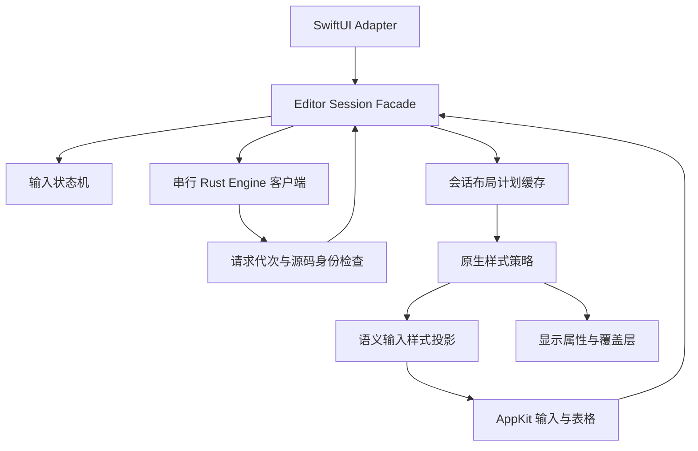

# 编辑核心架构审查与重构（2026-09-23）

## 结论与证据范围

当前即时编辑的反复缺陷有明确的架构诱因：原生输入、SwiftUI 绑定、Engine 确认和渲染任务可以从不同入口影响同一份会话状态；显示属性曾被反向用作输入属性；部分异步操作缺少独立的请求身份。文件过长只是这些职责交叉的表现，不是单独的根因。不能仅凭代码规模或测试数量量化缺陷归因，也不能宣称引入设计模式后不再出现交互问题。

本轮审查覆盖 SwiftUI 编辑入口、AppKit 输入/选区、Rust Engine 客户端、原生排版、表格和资源调度的调用关系；实施重构集中在直接影响输入可靠性和扩展性的编辑核心。文件安全、恢复、导出沿用既有边界，通过完整回归检查兼容性。

## 主要问题与处置

| 优先级 | 问题与证据 | 本轮处置 |
| --- | --- | --- |
| P1 | 会话中的 `pendingOptimisticText`、`deferredCompositionSnapshot`、`isApplyingEngineMutation` 被多个回调分别维护，IME 取消、Engine 拒绝和绑定刷新需要重复判断 | 用 `MarkdownInputState` 明确同步、待确认、组合输入状态；Engine 回写抑制采用可嵌套的作用域，离开作用域自动恢复 |
| P1 | 异步确认只比较当前文本；A→B→A 可能让旧 A 确认通过。`reset` 回调原先没有后续输入保护 | `EditorEngineClient` 为输入与 reset 增加单调请求代次，只发布最新请求的确认；保留串行 Engine 命令与唯一撤销历史 |
| P1 | `syncRenderedTypingAttributes` 从显示用 NSTextStorage 读取字体和颜色，隐藏标记的 0.1pt、透明色及显示时字体回退可能影响输入 | 在隐藏标记和挂载覆盖层之前生成 `MarkdownTypingStyleProjection`。后续输入只消费独立语义属性，不读取实时显示 storage |
| P1 | 临时派生缓存用 Swift String `==` 判断身份；例如 `é` 与 `e`+组合重音规范等价，但 UTF-8/UTF-16 偏移不同 | 缓存改为逐字节身份检查，并增加两种规范形式的范围回归 |
| P1 | `deriveContent` 在等待后先修改会话计划，外层 Store 才检查取消，取消并不能撤销已经发生的副作用 | 在安装计划前检查取消状态与派生代次；外部重载使旧派生代次及布局缓存失效 |
| P1 | SwiftUI adapter 卸载时清除了由持久会话安装的 focus/theme/link 回调，重新挂载不会自动恢复全部回调 | adapter 只拆除自己拥有的 delegate、挂载与粘贴/拖入回调；会话回调在会话生命周期内保留 |
| P2 | 原约 6,000 行文件包含 SwiftUI 桥接、会话、原生输入、表格、图片、行号和几何计算 | 按拥有状态的对象拆分真实类型，不通过放宽所有 private 字段来拼接多个 extension |
| P2 | 编辑手势多处直接同步请求 Markdown 计划，普通字符退格也进入解析路径 | 会话内布局计划缓存统一供给结构命令；普通退格先做词法判断，无结构动作时直接使用 AppKit；同步结构布局省略 HTML |

## 重构后的职责

| 模块 | 拥有的职责 | 不允许依赖的内容 |
| --- | --- | --- |
| `MarkdownSourceEditor.swift` | SwiftUI/AppKit Adapter；独立选区请求控制器保留请求代次和待挂载选区 | 不自行清除会话回调、不决定输入确认状态 |
| `MarkdownSourceEditorSession.swift` | 会话 Facade，组合 Engine、输入状态、样式与原生控件，保留既有公共入口 | 不在显示属性中推导待提交输入的样式 |
| `MarkdownInputState.swift` | 输入同步状态转换、组合确认延后、原生变更回写抑制、绑定接收决策 | 无 NSTextView、SwiftUI、文件系统或渲染器依赖 |
| `WindowAwareTextView.swift` | AppKit 第一响应者、真实 IME 生命周期、键盘/剪贴板/鼠标适配 | 配置会话后通过计划提供器查询语法，不各自构建解析器 |
| `RenderedMarkdownTableView.swift` | 表格单元格、导航、多选和表格编辑回调 | 不直接提交独立的文档历史 |
| `MarkdownNativeStyleSheet.swift` | 无状态的原生排版策略，应用语义和显示属性 | 不持有编辑器、Engine、选区或异步任务 |
| `MarkdownTypingStyleProjection.swift` | 输入样式快照与编辑后的范围重定位 | 不读取实时显示 storage，不携带 kern、附件、透明标记等显示属性 |
| `MarkdownLayoutPlanCache.swift` | 单会话、单项的布局计划缓存，可注入构建策略 | 不发布正文、不执行撤销或文件操作 |
| `MarkdownNativeGeometry.swift` / 图片视图 / 行号视图 | 原生几何和各自控件呈现 | 不管理输入确认 |

状态机和 Adapter 是新增的明确边界；Command（编辑事务）与 Memento（Rust 撤销/重做）沿用原有实现。样式和计划构建采用可替换的策略，不为每个类增加只有一种实现的协议，也没有引入全局事件总线或 Service Locator。

## 算法、更新顺序与约束

1. 原生输入先更新本地表面；非组合输入提交给串行 Engine。SwiftUI 绑定在有待确认输入或组合事务时不能覆盖原生文本。
2. 组合输入开始时保存待确认状态，提交和取消均结束事务。延后的确认只有在源码字节完全匹配时才释放；Engine 主动拒绝编辑时仍可恢复权威正文。
3. 回车等结构事务仍先生成当前语义布局再滚动光标，保留上一轮修复的即时/最终几何一致性。普通正文退格不走全文解析；必要的结构命令共用布局缓存。
4. 输入样式投影在一次原生渲染时生成。普通编辑复用已有 UTF-8 安全单段 diff，转换为 UTF-16 范围后更新属性和范围，不引入第二套 Markdown parser。
5. diff 最坏仍为 O(n)，语义样式投影需要 O(n) 存储。单项缓存不会随着历史正文无限增长，但本轮并未把长文档结构编辑变为增量解析，不能据此声称所有大文档输入延迟都已解决。
6. async 操作必须在修改会话状态前检查请求代次/取消；仅在调用者返回后检查不够。文本相同不等于请求相同，源码身份必须按字节判断。
7. adapter 的解除绑定只能影响自己注册的回调。会话状态、Engine 命令、显示策略分别拥有各自生命周期。

## 验证与后续维护规则

新增回归覆盖：状态机中的 IME 取消/提交和嵌套回写作用域；A→B→A 与 reset 后继续输入；Unicode 规范等价文本的字节身份；取消派生的副作用；显示属性污染；输入样式 Unicode 范围重定位；计划缓存配置隔离和普通退格解析次数；adapter 重挂载回调所有权。

测试总数及清单同步纳入 `quality/personal-xctest-scope.tsv`，保持当前直接、宿主、后续和固定性能用例的明确分区。原先要求“输入字体名字必须等于 AppKit 回退字体名字”的断言改为检查语义字体家族、字号和字重；原有真实行几何、光标高度、位置和撤销断言保留。

扩展新语法时，解析范围仍由 Rust 提供，编辑规则进入事务规划器，视觉规则进入样式策略；不要在 text view 的绘制回调中改正文或决定选区。新增异步来源必须说明它的失效条件和结果接收代次。任何绕过输入状态机的正文写入都需要独立的外部重载或 Engine mutation 入口。

## 仍存在的架构债务

- `MarkdownEditorView` 仍约 3,500 行，文件安全、恢复、导出和原生窗口协调虽然各有服务，但界面组合仍过重，后续适合按用例抽出协调器。
- Session 和 WindowAwareTextView 仍较大，资源调度和覆盖层范围管理可继续拆分；本轮没有把互相耦合的代码机械转移到一个新的巨型 Presenter。
- 大文档的结构操作仍可能同步派生一次完整计划。下一阶段应以真实输入延迟为依据，评估 Rust 增量计划和局部布局，而不是增加更复杂的全局缓存。
- 真实中文输入法候选窗、辅助功能、窗口切换和长时间编辑仍需要人工验收。自动用例验证边界和回归，不替代这些体验验证。

## 本轮验证结果

- `xcodebuild ... build-for-testing` 通过，构建位于 `/private/tmp/inflow-architecture-verification/Build/Products/Debug/Inflow.app`。
- 编辑核心专项：25 项 Engine/输入协调测试 + 52 项原生渲染编辑测试，共 77 项通过。
- 共用排版的集成验证：离线 JS 渲染综合用例、PDF 当前快照/安全链接/长文分页/宽代码表格/宽公式，共 6 项通过。
- 最终 `code/scripts/verify-launch.sh --personal` 通过：148 项 Rust 测试、317 项当前直接 XCTest，以及生成绑定、固定 JS 资源、Rust fmt/clippy、macOS Analyze、diff 检查。
- 总测试清单为 442 项：317 当前直接、34 当前宿主、86 后续、5 固定性能。上述 77 项与门禁有重叠，不能相加当成互不重复的总数。
- 最终实机复验时 Mac 已锁定，工具要求手动解锁；没有绕过锁屏、替换正在运行的应用或把窗口/真实 IME 验收标为通过。
