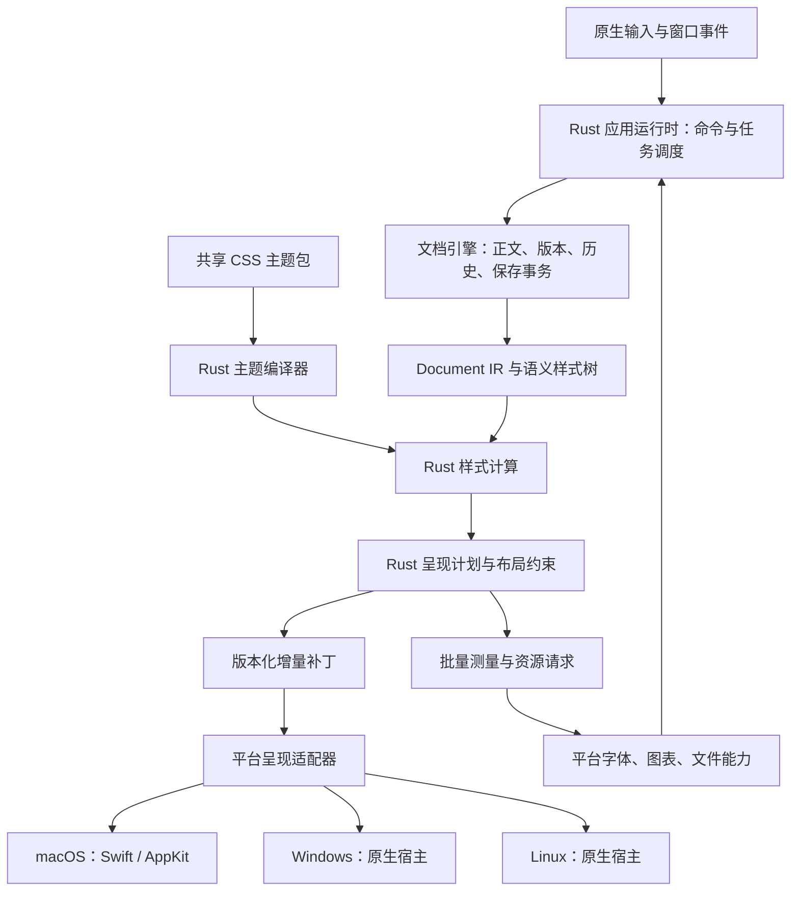

# Rust 核心与跨平台主题架构

日期：2026-10-04。状态：目标架构与迁移设计，尚未完成实现。当前运行基线为 `d818fa5`；本设计不代表 Windows/Linux 宿主已经存在或已通过验收。

## 1. 决策与兼容承诺

采用一个 Rust 文档与呈现核心，配合各 OS 的薄宿主。Rust 统一决定正文、编辑命令、语义结构、CSS 主题解释、样式、布局策略和异步结果有效性；宿主执行原生输入、文本测量、绘制与受授权的系统操作。

CSS 解析应进入 Rust，而且必须连同选择器匹配、层叠、继承、变量、单位和样式失效一起迁移。只把字符串解析换成 Rust，三个前端各自解释属性，仍然无法获得一致性。

主题是平台无关的源文件，平台渲染器消费 Rust 编译后的类型化样式，不能再接收 CSS 并自行决定含义。主题支持以版本化的 `Inflow Theme Profile` 为合同：相同文档、主题版本、环境输入与 profile，在三端得到相同语义样式和布局策略。三端通过共同测试之前，不宣称实现了兼容。

该合同不承诺任意浏览器 CSS、任意 Typora 插件 DOM 或逐像素一致。字体可用性、字形塑形、抗锯齿和系统缩放会影响最终像素。若将来要求任意 Web CSS 或严格统一字形布局，需要另行选择统一 Web/绘制引擎；不是补一个解析器就能实现。本阶段继续使用原生编辑控件，保留已有输入法、选择、可访问性与 macOS 集成。

## 2. 当前代码与缺口

| 当前位置 | 已有职责 | 目标变化 |
| --- | --- | --- |
| `core/src/engine.rs`、`history.rs` | 正文、revision、命令、撤销、保存 receipt | 保持唯一事实源，扩充主题/呈现版本与效果协议 |
| `core/src/markdown_ir.rs`、`ports.rs`、`markdown_adapter.rs` | 一次 Markdown 解析，多种派生 | 从共同 IR 构建语义样式树，避免第二次 Markdown 扫描 |
| `core/src/render_ir.rs`、`native_render.rs` | 跨平台块结构与偏 TextKit 的原生计划 | 演进为语义节点、共享样式表、约束与增量呈现补丁 |
| `macos/Inflow/Settings/CSSThemes.swift` | CSS 解析、层叠、变量、单位、字体适配和目录安装混在一起 | 解析/计算进 Rust；目录授权与 NSFont 实例化留宿主 |
| `macos/Inflow/Editor/MarkdownNativeStyleSheet.swift` | 元素映射、上下文选择器、数值限制、原生属性 | 只映射类型化样式；上下文关系和限制策略进 Rust |
| `macos/Inflow/Editor/RenderedMarkdownEditor.swift` 中表格布局策略 | 内容测量与列宽分配 | 测量经端口提供；列宽分配算法进 Rust |
| `macos/Inflow/Editor/MarkdownSourceEditorSession.swift` | 输入、请求编排、样式构建、资源回填、原生布局 | 拆成输入适配、呈现提交与资源效果执行器 |
| `macos/Inflow/Preview/JavaScriptRendering.swift` | 离线 JS、排队、缓存、SVG 输出 | JS 执行仍是宿主能力；请求身份、缓存键和淘汰策略进共享层 |

上一轮 35,490 字节样本的 Rust 与桥接约 57 ms，原生展示优化后约 260 ms。数据说明需要迁移和减少主线程工作，但把相同同步调用改写为 Rust 不会自动离开主线程。详见[测量边界与日志](document-loading-performance.md)。

## 3. 分层与依赖



先在现有 `inflow-core` 内建立模块边界，稳定后按实际复用拆 crate，避免为了分层增加序列化或线程跳转。拟定模块：

- `theme/{parser,selectors,cascade,values,profile,diagnostics}`：CSS 编译与兼容诊断。
- `presentation/{tree,style,plan,diff,layout,source_map}`：平台无关的呈现模型。
- `runtime/{scheduler,cache,effects,trace}`：任务优先级、缓存、效果协议、追踪。
- 现有 engine/document/history 保留；`ffi` 只处理边界，不承载业务。

依赖方向为宿主 → FFI/runtime → engine/presentation/theme → 纯值模型；核心不得引用 AppKit、Windows UI 或 GTK 类型。平台特定 Rust 代码如需要，可进入单独的 host crate，不能反向污染核心。

“Swift 仅做渲染”的工程含义是薄呈现与系统适配层：可以持有 NSTextView、NSFont、marked text、系统文件句柄；不能拥有第二套文档业务状态、CSS 层叠器或表格布局规则。IME 未提交的临时文本必须留在原生控件，不能为了缩减 Swift 而破坏原生输入事务。

## 4. 端到端数据流

### 打开与首屏

1. 宿主取得用户文件授权，在后台读取一次原始字节，传给 Rust `OpenBytes`。原始大小检查和编码判断复用这次读取，避免预检与正式打开重复读取；文件变更竞争仍由宿主协调。
2. Rust 解码并建立正文、内容 hash、UTF-8/UTF-16 索引与单调 revision。返回最小正文投影，宿主尽早显示可编辑内容。
3. 同一快照生成 Document IR、语义样式树、分析和引用。渲染不需要 HTML 时不生成 HTML。
4. 从主题缓存取得已编译主题；优先计算可见块与必要祖先的样式和呈现计划。全局语义依赖仍正确处理，不能将“只呈现可见块”误写为“任意 Markdown 都只需解析可见文本”。
5. 宿主一次提交可见区域样式和占位图形，报告首个实际绘制帧；剩余块、图表和非关键资源在预算内逐批就绪。
6. 后续资源结果绑定文档、节点、主题与请求版本，Rust 验证后产生补丁。宿主不直接把旧异步结果写入当前 UI。

### 编辑与输入法

- 原生控件负责键盘、选区、候选词、合成文本。组合期间不刷正文或强制替换样式；确认后一次提交 `ReplaceText(base_revision, range, inserted, selection)`。
- Rust 原子更新正文与历史，失效受影响的解析/样式/呈现缓存，输出正文确认与派生补丁。宿主的乐观显示不是第二事实源。
- 范围变更使用明确的 UTF-8 byte range；macOS 使用同 revision 的索引转换 UTF-16。复用已有边界校验，不能根据 Swift String 规范等价跳过精确字节校验。
- 表格操作、格式命令、查找、撤销、只读模式和保存资格在 Rust 决定；宿主只提交意图。异常时保留最后有效正文，安全回退源码显示。

### 主题、窗口和保存

- 主题变化只重编译主题、计算样式差异；不改变正文 revision、不登记撤销、不重新解析 Markdown。
- 调整窗口宽度只推进 layout/environment 版本；媒体查询可以使样式失效，但不触发正文解析。纯颜色变化不触发布局；字体、行高和宽度变化按依赖失效。
- Rust 冻结保存快照并产生写入效果；宿主执行权限、路径、原子写入和系统文件协调，再回传 receipt。只有对应保存成功才能更新 saved hash。
- 导出冻结文档、主题、资源清单与环境；HTML 输出也从同一语义树和样式计划生成，避免把未经支持检查的原始 CSS 整段注入造成编辑器与导出不一致。PDF 暂保留平台打印适配，分页像素一致性单独验收。

## 5. CSS 主题编译器

管线为 CSS 源码 → token/AST → 选择器与属性校验 → 规则索引 → 语义节点匹配 → cascade/inheritance/variables → computed style → 布局依赖解析 → 类型化样式表。

建议使用 `cssparser` 处理 CSS Syntax，使用 `selectors` 匹配 Inflow 语义树上的选择器，并由 Inflow 实现受支持属性、层叠、继承和布局语义。这两个库不等于完整浏览器；依赖版本、MSRV、许可和三端编译在实施时锁定验证。本次不添加依赖。参见 [cssparser 文档](https://docs.rs/cssparser/latest/cssparser/)与 [selectors 文档](https://docs.rs/selectors/latest/selectors/)。

构建稳定的虚拟文档结构 `:root → body → #write → Markdown 节点`，包含段落/内联父子关系、兄弟序号、语义 class、属性和 token 类型。`p strong`、`h1 + h2`、`tr:nth-child(even)`必须根据树计算，不能再用“选择器字符串等于某个元素名”替代匹配。界面工具栏、侧栏、窗口按钮不属于文档样式树。

主题 profile v1 的目标合同如下；所有 required 能力须在发布前通过三端一致性测试，否则 profile 不得标记稳定：

| 范围 | v1 合同 |
| --- | --- |
| 选择器 | 元素、class、ID、通配、列表、后代/子代/相邻兄弟；`:root`、`:first-child`、`:last-child`、`:nth-child(An+B)`；`::selection`作为独立样式目标 |
| 层叠 | 明确应用默认值、主题、用户覆盖的来源和顺序；遵循支持范围内的 specificity、`!important`、声明顺序；默认层不使用 important 强行覆盖用户主题 |
| 值计算 | 继承与非继承属性、`initial/inherit/unset`；节点作用域的自定义变量、递归 fallback、循环诊断；不能只读取根变量 |
| 排版 | font-family/size/weight/style、line-height、letter-spacing、text-align、text-decoration；嵌套 strong/em/code 合并样式，不按覆盖顺序猜测字体 |
| 盒模型 | margin/padding、width/min/max-width、边框/圆角、背景；块间距合并和表格边框模型由 Rust 统一定义；只支持文档 profile 的流式盒模型，不暗示完整 CSS 布局 |
| 单位与颜色 | px/em/rem/%/pt、无单位行高；hex/rgb/rgba/hsl/hsla、固定名称表、transparent/currentColor；百分比按属性保留依赖，不能统一乘字号 |
| 环境 | screen/print、min/max-width、prefers-color-scheme；输入来自统一 StyleEnvironment，非宿主硬编码判断 |
| 文档扩展 | 稳定的代码 token、数学与图表容器 class；现有 `--md-*` / `--inflow-*` 逐项登记类型、默认值、作用域、范围及弃用映射 |
| 暂不支持 | 任意生成内容、复杂伪元素、flex/grid、动画、任意脚本/DOM、远程 import/font、未经定义的厂商私有扩展；给出有位置的诊断 |

白色主题已有装饰分隔线等扩展先转为 Rust 的 DecorationSpec；不能把有限装饰支持描述为通用 `::before/::after`。现有仅 HTML 导出用的 flex、focus、动画规则不是原生 profile 已支持的证据，迁移时分别归为宿主样式、导出扩展或可移植文档样式。

W3C 区分声明值、计算值、使用值与实际值。因此 `ComputedStyle` 不能在不知道容器宽度时提前把所有百分比转成像素。字体度量相关值通过测量端口求解。参见 [CSS Cascading and Inheritance](https://www.w3.org/TR/css-cascade-3/)。

主题解析失败保留最后有效快照，不能清空正文或让 UI 停在加载中。未知声明按 CSS 恢复规则局部跳过并报告；语法严重损坏、profile 版本不支持或必需能力不足时拒绝激活新快照。不做逐帧弹窗。

Typora CSS 通过显式导入映射支持常见 `#write` 与 token 别名，并报告未支持项；它依赖自己的结构与约定，不能宣称全部主题直接等价。参见 [Typora 主题编写文档](https://theme.typora.io/doc/Write-Custom-Theme/)。

## 6. 主题包、单位与平台适配

共享主题资源最终移至 `code/themes/`，由各 OS 构建脚本打包同一源目录与清单 hash，避免维护三份副本。单个 `.css` 仍可导入，赋予默认 profile；目录包可带 `theme.json`（id、profile、必需能力、CSS 入口、资源 hash、字体声明）。编译缓存是派生物，不作为唯一主题源格式。

资源引用统一为包内相对 URI，禁止 Windows 盘符、反斜杠与 macOS 绝对路径进入可移植主题；统一大小写规则并拒绝仅大小写不同的资源重名。Rust 决定资源身份和请求，宿主根据授权读取字节。原生窗口 token 从文档 CSS 分离；旧 token 可迁移，但不要求 Linux 窗口装饰模拟 macOS 标题栏。

布局单位统一为逻辑像素：100% 缩放时 1 CSS px 对应 1 个应用逻辑单位，macOS 映射 point、Windows 映射 DIP、Linux 映射工具包逻辑单位；设备 scale 仅用于最终栅格化，避免重复乘 DPI。CSS pt 统一按 96/72 转为逻辑像素；用户缩放作为独立输入。该规则用于屏幕 profile，打印转换另有环境。

字体保存为有序族名、通用族、weight、style 和语言信息，不保存 NSFont 名或句柄。三端遵循同一 fallback 策略，由字体端口返回实际字体实例 ID 与 metrics generation。若要求更接近的换行，随包提供许可允许的相同字体并固定度量基准；字体一致仍不自动等于字形栅格像素一致。宽度不足时统一表格溢出/滚动策略，不根据 OS 改主题文件。

## 7. 呈现协议与布局责任

以下为拟定协议形状，不是已经存在的 API：

```text
PresentationKey = {
  document_id, revision, theme_hash, profile_version,
  environment_generation, font_metrics_generation, presentation_generation
}
ComputedStyle = { font, color, background, line_height, spacing, border, ... }
PresentationDelta = {
  key, base_presentation_generation,
  style_table_changes, block_upserts, removed_blocks,
  text_runs: [source_range + style_id], decorations, layout_constraints,
  measurement_requests, resource_requests, diagnostics
}
```

Rust 合并嵌套 inline 样式，生成不重叠的最终 text runs，并复用 style ID。Swift 将 style ID 缓存成 NSAttributedString 属性字典，批量安装变动范围；不再解析 CSS、猜字体继承或从 source 反推相邻标题。

核心不能在一次样式计算中逐字跨 FFI 请求字体宽度。测量采用批量两阶段协议：Rust 发出 `(node, style, width constraint, version)`；宿主按允许线程批量测量并返回；Rust 计算列宽分配、间距、溢出策略并提交最终约束。字体对象实例化、字形塑形、实际换行、caret/hit testing 仍由原生文本系统执行，避免另建一套与原生编辑控件不一致的字符几何。

表格先获取单元格 intrinsic/min-content 度量，再由 Rust 分配可用列宽；宿主按列宽测量换行高度，Rust 合并行高。度量结果按字体、文本和宽度缓存；取整与收敛规则固定，布局反馈不允许无限往返。测量尚未返回时显示有界占位或上一有效布局。

block ID 不能只用源码内容 hash 推断持续身份：相同段落重复出现、前方插入和父节点变化都会影响匹配。第一阶段在快照内使用稳定标识，跨 revision 匹配以变更范围与结构校验为准；匹配失败发完整相关子树。增量补丁 base 不匹配必须请求完整重同步，不能错套范围。

FFI 延续 opaque engine handle、明确 bytes 所有权、生成 header 与能力协商。初期扩充现有 JSON envelope，先缩小返回数据和请求次数，再根据打点决定是否将大数组迁移为有所有权的二进制缓冲区；不能未经测量就以“零拷贝”换取生命周期风险。不透传 Rust trait object 或引用地址。

## 8. 调度、缓存与资源

目标 runtime 为每文档串行命令邮箱，加有界后台工作池。命令修改正文只发生在邮箱内；耗时派生在不可变快照上执行，不长时间占有文档锁。完成后重验 key，再发布结果。调度优先级：输入确认/保存屏障 → 可见块 → 可见资源 → 后台分析/预取。

现阶段由 Swift transport actor 串行调用 Rust；它能隔离主线程，却不表示新的重计算自动并行。迁移 runtime 时只保留一个调度权威，不在 Swift actor 和 Rust runtime 各自实现竞争的重试/取消策略。运行时产生批量事件，宿主桥接调度到 UI 线程，禁止同步 Rust → 主线程 → Rust 的重入等待。

缓存层明确分开：

| 缓存 | 关键身份与失效 |
| --- | --- |
| ThemeProgram | CSS/依赖资源 hash、profile、编译器版本；不含文档内容 |
| Document IR / source map | 文档 ID、revision、解析配置 |
| ComputedStyle | 节点结构/相关内容、主题、交互状态、环境依赖；祖先继承和兄弟选择器变化向受影响节点传播 |
| Layout | 节点内容、影响几何的样式、容器约束、实际字体/metrics、资源 intrinsic size |
| Resource | kind、源码 hash、渲染器及资源包版本、主题相关参数、字体环境 |

缓存按字节预算而非仅按条数设限，关闭文档释放会话引用；同键请求合并，过期请求取消或丢弃。全局缓存不持有文档正文引用而无限延长寿命。

Mermaid/数学仍可使用同一离线 JS 包。核心负责请求、主题参数、缓存与结果身份；宿主提供实际 JS/DOM 运行能力。Mermaid 可能依赖 DOM/字体测量，因此不能假定塞入任意无 DOM 的 Rust JS 引擎即可等价。Windows/Linux 适配器须验证同一资源包的 SVG 尺寸、字体和失败回退。SVG 回填只更新相关块，不重做全文排版。

## 9. 迁移顺序与退出标准

| 阶段 | 具体交付 | 退出标准 |
| --- | --- | --- |
| P0：建立合同 | CSS/token 清单、语义树、profile 草案、现有六主题与 Unicode 样本、打点基线 | 每条现有主题规则有支持/迁移/拒绝归属；不以“有解析结果”代替画面正确 |
| P1：Rust 主题编译 | theme 模块、不可变 ThemeProgram、typed style DTO；后台编译；macOS 改用结果 | 选择器、继承、变量、单位与诊断金样通过；Swift 不再解释 CSS |
| P2：共享呈现计划 | 语义树、final text runs、上下文间距、style ID、版本化补丁、统一范围索引 | 源码/即时编辑/只读预览消费同一计划；输入法/Unicode/撤销测试通过 |
| P3：共享布局与调度 | 表格约束算法、批量测量端口、增量提交、有界缓存、Rust 调度与资源效果 | resize 不解析 Markdown；颜色变化不排版；过期主题/文档/资源结果不能发布 |
| P4：三端宿主验证 | Windows/Linux 最小阅读与输入宿主；统一主题打包；相同 fixture | 三 OS 执行同一语义金样与 UI/输入验证后，才将 profile v1 标记可移植 |
| P5：清理旧路径 | 移除 Swift NativeCSSStyles 的解析/计算、旧策略和双运行开关 | 无双事实源、无生产双重解析；跨平台门禁保持通过 |

P1 先在测试/开发模式做旧 Swift 与 Rust 结果差分，不在用户生产加载路径永久双算。现有 Swift 的 selector/root 特例并非完整 CSS 标准，不能盲目复制为新合同；每个差异要区分 bug 修复与视觉变化，更新主题或明确迁移说明。生产切换按整个主题快照完成，不能单个属性随机退回旧解析器。阶段验收通过即移除相应旧策略。

实施顺序优先 P0 → P1 → P2。不要先重写窗口/输入控件，也不要先换 FFI 格式。这些工作对已确认的主线程样式热点收益更直接。

## 10. 性能、正确性与跨平台验收

以下是待实现的门禁与目标，不是已测达成值：

- 三 OS 同一 Markdown/CSS/环境 fixture 的规范化 ComputedStyle、诊断和布局策略 JSON 必须相等；使用可控假字体 metrics 排除操作系统字体差异，真实字体另做 UI 测试。
- 覆盖六套内置主题、嵌套列表/引用/inline、相邻标题、表格奇偶行、深浅/打印、缺字体、高 DPI、宽窄窗口；图像比较使用明确容差，检查裁剪、重叠和可读性，而非假定像素完全相等。
- CSS 恶意或异常输入要有大小/深度/展开预算；CSS、FFI、Unicode source map 做 fuzz/property 测试。依赖、生成绑定、三端编译与现有文件安全测试继续作为门禁。
- 实际文件端到端测试测量打开请求 → 可编辑正文 → 首个可见绘制帧 → 可见资源就绪。按冷/热缓存、10 KB/100 KB/1 MB 与应用既有上限、普通/表格/图表样本区分 p50/p95、峰值内存和跨边界字节数；基准机器、Release 配置和重复次数固定。
- 60 Hz 的帧预算为约 16.7 ms，目标每批 UI 提交占用控制在 8 ms 左右并留出输入/绘制空间；这是调度目标，不是现有整篇 260 ms 测量的承诺。记录最长主线程任务，超过 50 ms 作为回归信号。超预算按块让出，块内布局仍超预算则优先切回可编辑源码再逐步呈现。
- 主题切换不得产生新的 Markdown parse；颜色补丁不得触发布局；窗口变化不得重编译 CSS；连续编辑仅保留最新相关派生任务。增量 Markdown 解析另行验证全局引用/围栏等依赖，不能为性能损坏语义。
- Rust trace 与宿主 trace 显式传递同一 trace ID、request ID 与 PresentationKey；Rust 时长不依赖 Swift TaskLocal。区分 CPU、队列等待、宿主执行和帧提交。延续默认关闭、惰性元数据、不记录正文路径的规则。

交付“Windows/Linux 主题兼容”的证据应包含三端执行结果、主题/profile/hash、渲染器与字体环境及失败项。只有本机 Rust 单元测试或 macOS 截图不足以证明此承诺。
