# Typora 默认主题实现核对（2026-10-03）

## 后续修复

本报告保留修复前证据；已发现的问题及验证失败已在[修复与验证记录](theme-fix-verification-2026-10-03.md)中逐项闭环。

## 结论

**部分符合预期，尚不能作为六套主题完整对齐验收通过。** 六套主题均可切换，主要背景色、字体类别、标题对齐、引用及表格边框风格已实现；仍存在主题规则没有进入原生渲染的缺陷，以及适配 CSS 与官方参数的差异。本轮只做核对和记录，未修改产品代码或主题 CSS。

核对基准是直接借鉴 GitHub、Whitey、Night、Newsprint、Pixyll、Gothic，而非此前生成的原创概念图。保留用户阅读宽度、本机字体回退、原生窗口与侧栏，是已约定的适配边界，不计作缺陷。

## 范围与证据

- 代码基线：`4187030`；已有的产品设计总览未提交修改未纳入本报告提交。
- 实际截图来自正在运行的 `code/Build/Products/Debug/Inflow.app`，不是 HTML 模拟或生成图。其六份资源 CSS、用户主题目录六份 CSS 均逐文件确认与仓库一致。
- 使用同一份[中英混排样例](assets/theme-audit-2026-10-03/theme-sample.md)，以即时编辑模式依次切换六套主题，并滚动检查下半部分。采集时正文字号设置为 16、缩放为 100%、阅读宽度设置为 1080、外观跟随系统；未重置用户偏好。完成后回到 GitHub 和文档顶部。
- 12 张原始截图分辨率均为 2400 × 1520，含窗口顶部、正文与右侧大纲；下半部分截图有滚动产生的视口裁切，不代表完整长图。证据文件与主题资源指纹见 [evidence.json](assets/theme-audit-2026-10-03/evidence.json)。
- 对照 [Typora 官方默认主题仓库](https://github.com/typora/typora-default-themes/tree/master/themes)，并读取本机 Typora 随附的六份 CSS。在线核实了 [GitHub](https://raw.githubusercontent.com/typora/typora-default-themes/master/themes/github.css)、[Whitey](https://raw.githubusercontent.com/typora/typora-default-themes/master/themes/whitey.css)、[Night](https://raw.githubusercontent.com/typora/typora-default-themes/master/themes/night.css) 的关键规则。
- Typora 本机试用到期，停在激活页。因此没有完成 Typora 实际渲染截图对照，不声称逐像素一致。未绕过激活限制。

## 逐步核对

| 步骤 | 主题与操作 | 已确认正确 | 状态与主要差异 |
| --- | --- | --- | --- |
| 1 | 切换 GitHub，检查正文及下半区块 | 白底、无衬线、H1/H2 分隔线、完整表格边框 | 部分符合；H1–H4 比官方小，表头中文粗体与英文不一致 |
| 2 | 切换 Whitey，检查标题、引用与表格 | 衬线、H1–H3 居中、H2 短横线、H3 斜体、横线表格 | 主特征符合；标题间距经过简化，官方方形列表标记未体现，表头中文粗体不一致 |
| 3 | 切换 Night，检查链接、引用、代码及标题 | 深灰背景、灰蓝正文、独立标题字体 | 偏差较多；链接、引用线与缩进、低级标题及代码高亮需要对齐 |
| 4 | 切换 Newsprint，检查正文、引用与代码 | 暖灰纸色、衬线、小标题比例、斜体引用、灰色代码背景 | 主特征符合；存在共用渲染问题，H6 意外变灰 |
| 5 | 切换 Pixyll，检查大字排版、链接与表格 | 大字号衬线正文、无衬线粗标题、下划线链接、横线表格 | 主特征符合；表格未按来源主题铺满可用宽度，H6 意外变灰 |
| 6 | 切换 Gothic，检查标题、链接与区块 | 居中轻标题、几何无衬线回退、暗红链接、横线表格 | 主特征符合；英文标题未大写，H6 意外变灰；表头中文粗体不一致 |

### 1. GitHub

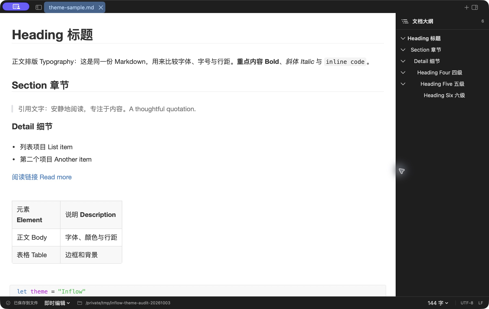

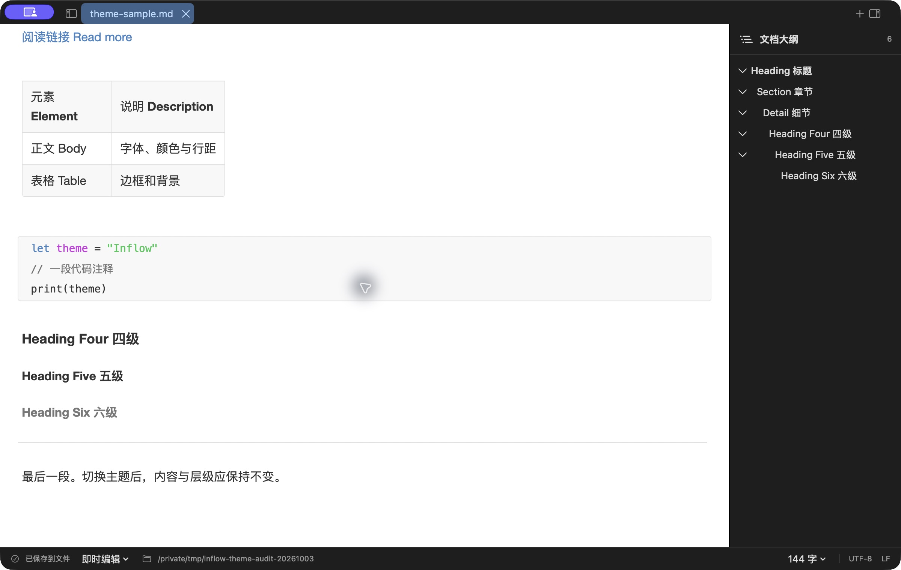

### 2. Whitey

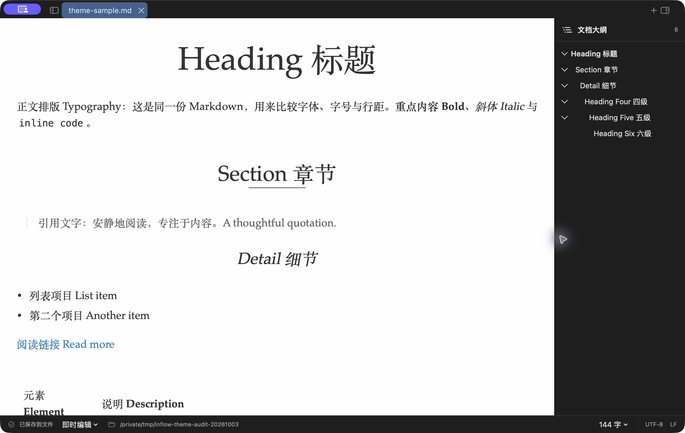

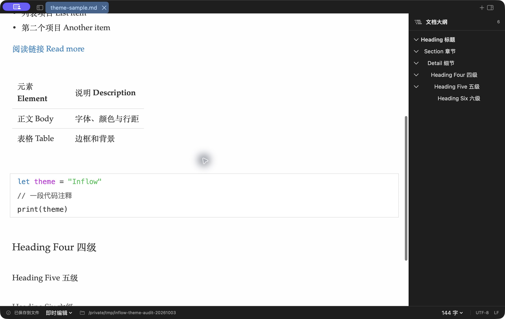

### 3. Night

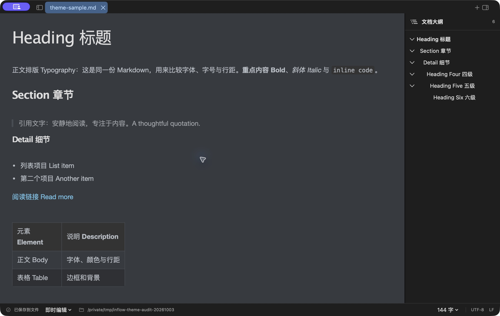

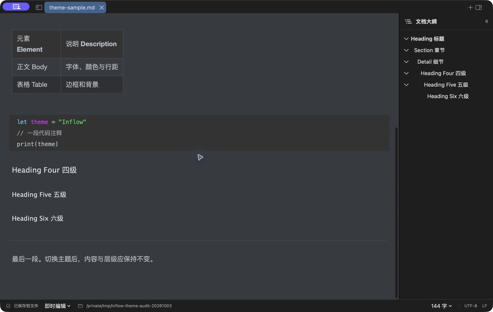

### 4. Newsprint

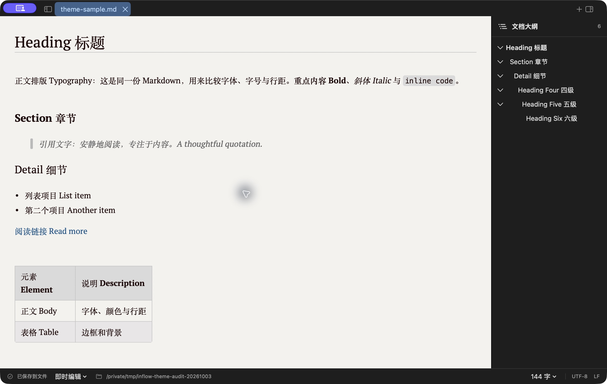

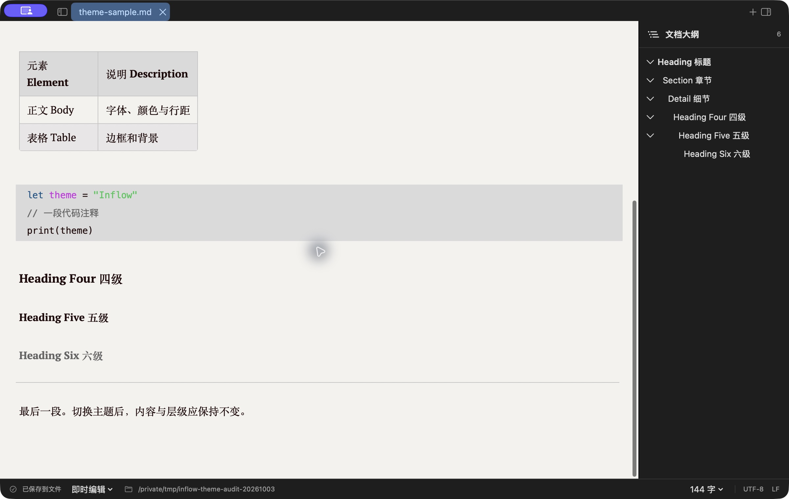

### 5. Pixyll

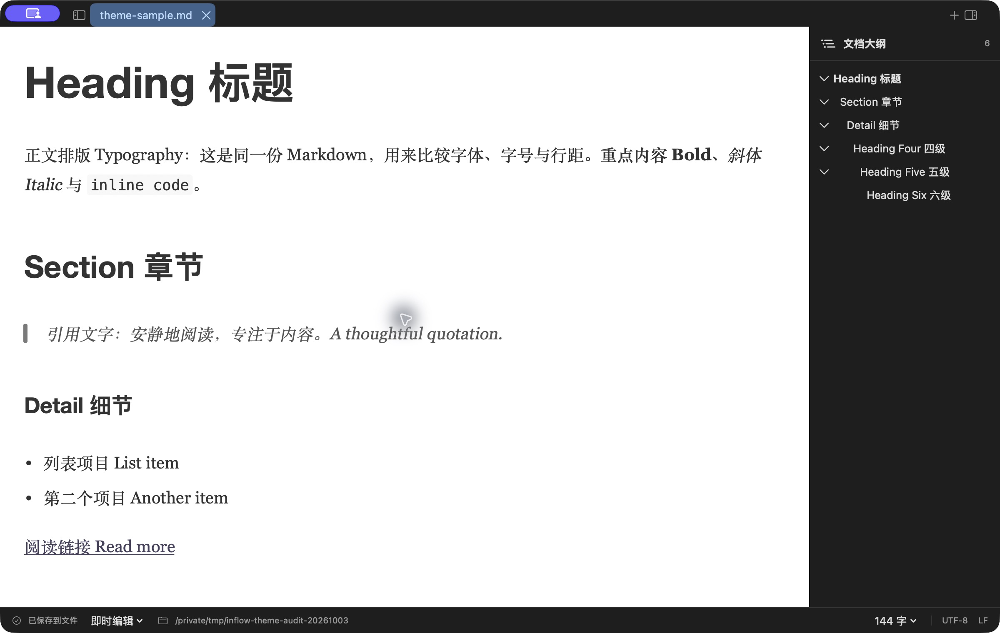

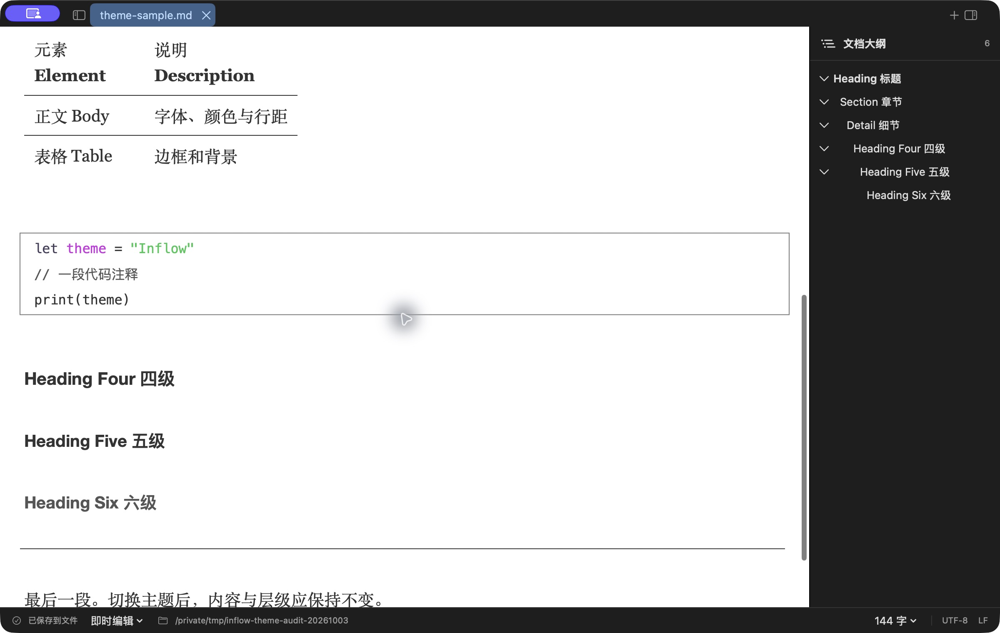

### 6. Gothic

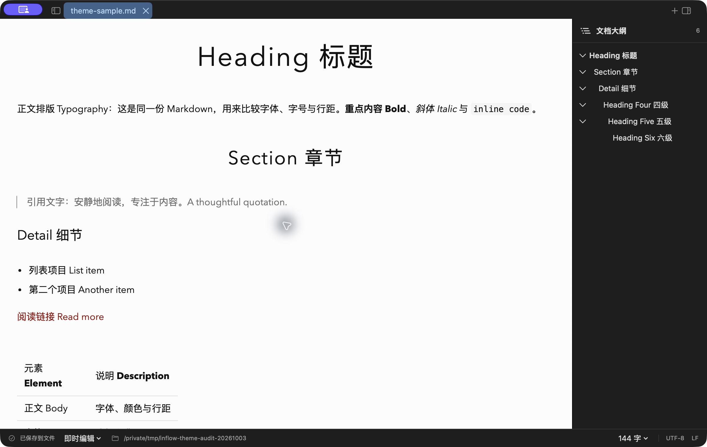

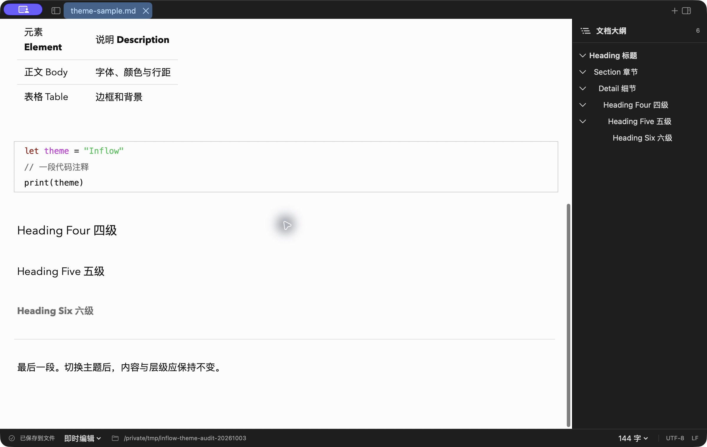

## 需要修正的问题

### P2：代码语法颜色绕过主题

步骤 3 下半截图中，字符串仍是亮绿，注释仍是灰色。然而 Inflow 自己的 `night.css:35` 声明字符串为 `#d26b6b`、注释为 `#da924a`、关键字为 `#c88fd0`。

原因位于 `MarkdownSourceEditorSession.swift:1317` 的 `applyCodeMirrorTokens`：关键字取链接强调色，字符串取 `NSColor.systemGreen`，数字取系统橙，类型取系统紫，注释取次级正文色，没有使用 palette 已存储的 keyword/string/number/type/comment/tag。六套主题的代码区都会受到这条链路影响；即使 CSS 声明正确，也不能得到预期颜色。

建议先让原生 token 上色使用主题语义颜色，增加断言验证最终 NSTextStorage 中的颜色，而不只验证 CSS 能否解析。步骤 1、4、5、6 的浅色代码区还存在亮绿字符串辨识度偏低的可访问性风险；本轮未测完整对比度，不作合规结论。

### P2：表头中文没有随英文一起正确加粗

六套截图均可看到表头 `Element` / `Description` 比中文“元素”/“说明”明显更粗；辅助功能富文本结果也只在英文部分表达表头粗体。

`RenderedMarkdownTableView.swift:249` 和 `:456` 直接用 `NSFontManager.convert` 转换字体，没有使用已存在、会同时转换中文回退链的 `NativeCSSStyles.font(_:bold:)`。正文粗体使用了后者，因此同一页面的正文粗体与表头表现不一致。`MarkdownInlineProjection.swift` 的表格内强调也存在同类转换路径。

建议统一正文和表格的中文回退字体处理，并用中英混排表头与单元格粗体进行字形级验证；现有测试只检查表格普通单元格字体族，不能发现此问题。

### P2：GitHub 和 Night 的主题参数尚未忠实对齐

| 项目 | 来源规则 | Inflow 当前规则 | 影响 |
| --- | --- | --- | --- |
| GitHub H1–H4 字号比例 | 2.25 / 1.75 / 1.5 / 1.25 em | 2 / 1.5 / 1.25 / 1.125 em | 标题层级整体缩小；16 基准下 H1 为 32，而来源为 36 |
| Night 链接 | `#e0e0e0`，下划线 | `#6dc1e7`，无常驻下划线 | 误把 primary-color 当成最终正文链接规则，步骤 3 可见 |
| Night 引用 | 2px 引用线、30px 左内距及额外左外距 | 4px 引用线、1em 左内距，无对应左外距 | 引用更粗、更贴近正文左边缘 |
| Night H5/H6 | H5 粗体；H6 为 .93rem、白色 | H5 常规；H6 为 .97em、统一标题色 | 低级标题差异被抹平 |

这几项是适配 CSS 的可修改参数，不需要完整浏览器 CSS 支持，不能一概归因于 TextKit 限制。建议优先改 `github.css:22` 和 `night.css:14` 等规则，再以相同样例重新截图。

Whitey 的 H1/H2/H3 段前分别有独立规则，当前合并为统一 1.5rem；Gothic 来源 H1/H2 有英文大写转换，当前未实现。后者属于尚未提供的样式桥接能力，应明确登记，不应改写 Markdown 源文本来模拟。

### P2：没有单独声明颜色的 H6 被共用逻辑强制淡化

步骤 4、5、6 下半截图中 H6 变灰。`MarkdownNativeStyleSheet.swift:157` 对六级标题默认使用 `secondaryTextColor`，而后续 `applyCSS` 只在 h6 有显式 color 时覆盖；CSS 对 body 颜色的继承没有还原。因此 Newsprint、Pixyll、Gothic 等主题会继承 GitHub 式的淡化习惯。

建议通用标题默认使用主题标题色，将六级标题的淡化交给 GitHub 自身的 `h6 { color: #777777; }`；同时验证其他主题的继承行为。

### P2：表格仍以共用几何规则为主

步骤 3、5 中，短内容表格只占正文左侧一小块。Night 和 Pixyll 来源 CSS 声明 `table { width: 100%; }`，当前对应 CSS 未表达这项差异；`AdaptiveRenderedMarkdownTableLayoutStrategy.columnWidths` 在首选总宽小于可用宽度时直接返回内容宽度。

此外，`RenderedMarkdownTableView.applyTheme` 主要消费边框与圆角，单元格布局仍从共用 metrics 获取 12/8 的内边距，表格行高也使用共用值。来源主题之间的不同单元格留白尚未完整进入原生布局。建议增加受限的主题表格宽度/内边距/行高配置，保留其与用户阅读宽度的关系；无需支持任意网页布局。

## 验证结果与限制

- 当前源码执行 Debug `build-for-testing`：通过。
- 新构建执行 `InflowTests.AppPreferencesTests`：25 项中 24 项通过，1 项失败，产生 2 个断言失败；详见[测试日志](assets/theme-audit-2026-10-03/preferences-tests.log)。
- 失败项为 `testSettingsPersistenceFailureKeepsSessionValuesAndSupportsRetry`：`AppPreferencesTests.swift:729`、`:737` 仍期待 1200，实际共用 CSS 默认宽度为 800。这是现有默认值与测试预期未同步；未在本轮修改测试以掩盖失败。
- CSS 文件发现、变量与层叠、选区颜色、主题切换、字体/颜色/标题/表格基础传播、主题持久化、HTML 快照相关测试通过。这些是功能验证，并非对 Typora 的视觉一致性验证。
- 窗口和右侧大纲的系统深色外观保持不变、主题正文按各自色系显示，是当前约定的原生界面边界；没有把这项区别计为本轮缺陷。
- 本轮没有覆盖每套主题的窄窗口、200% 缩放、不同操作系统字体、所有输入法、VoiceOver、完整对比度、HTML 实际浏览器输出或 PDF 导出，不作全面可访问性或导出一致性结论。
- 截图来自运行中的本地 Debug 应用；仅确认其主题资源与当前仓库一致。新编译的测试针对当前源码，未声称运行中二进制与新编译二进制逐字节一致。

修正顺序建议：先处理代码上色、中文回退字体和 H6 继承，再对齐各主题的 CSS 参数与表格几何，最后补齐逐主题视觉基线和窄窗口验收。
