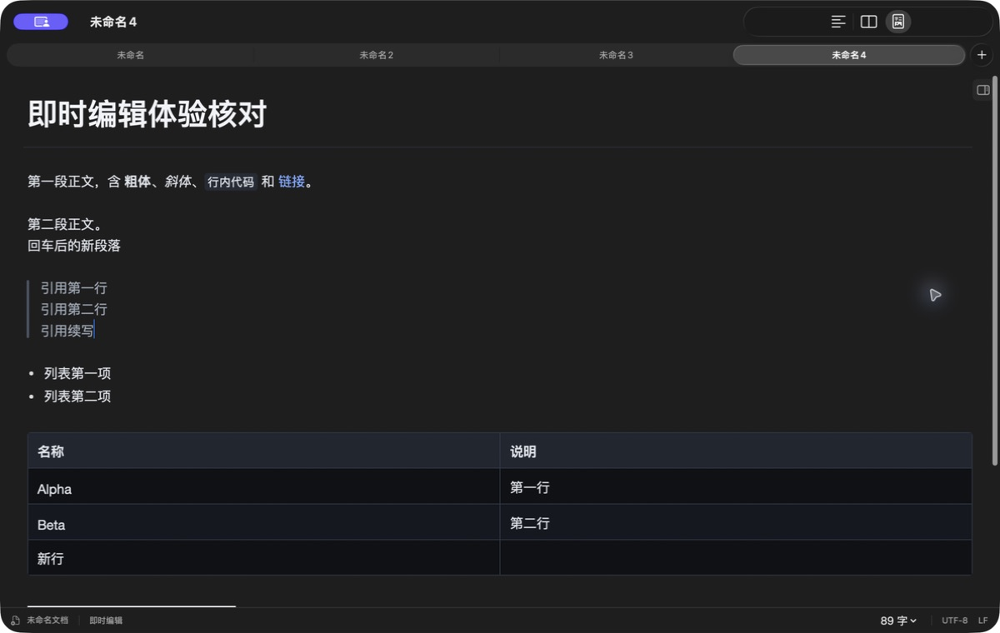
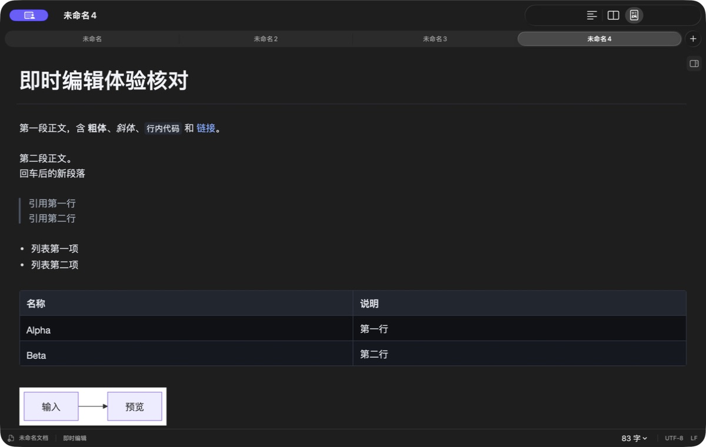
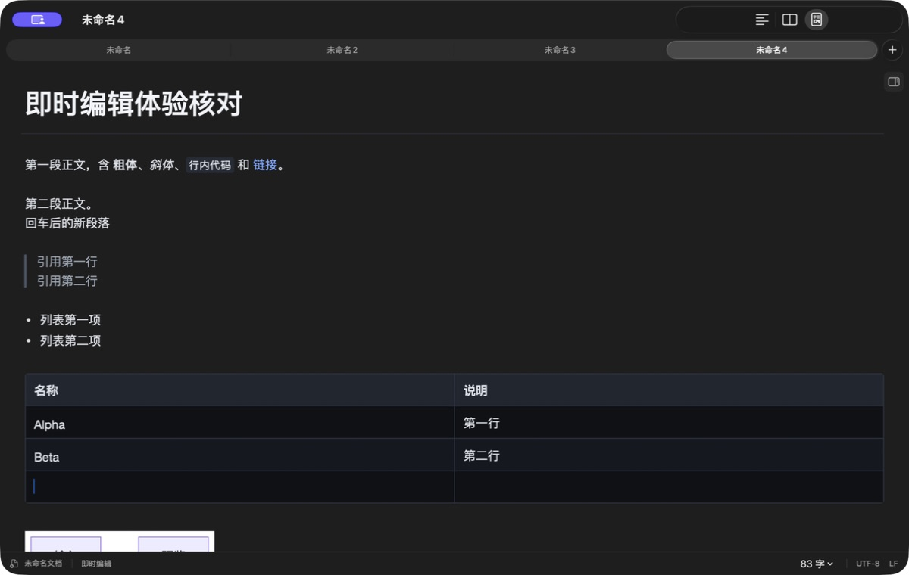
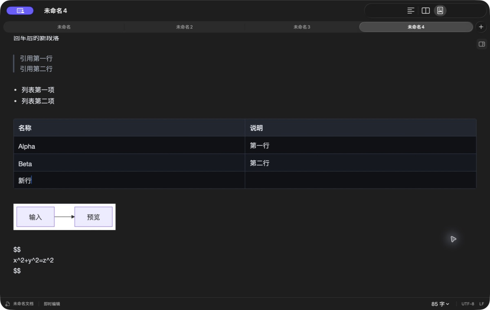
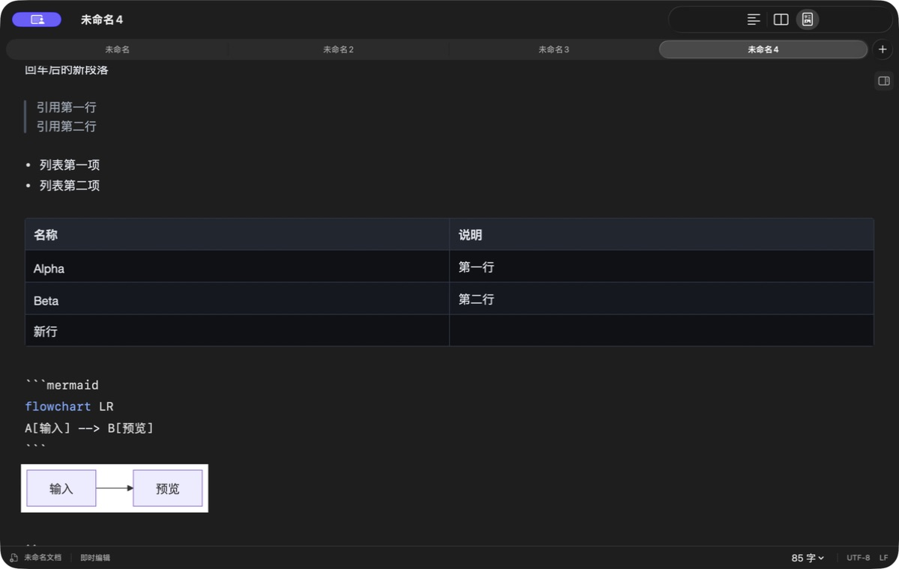
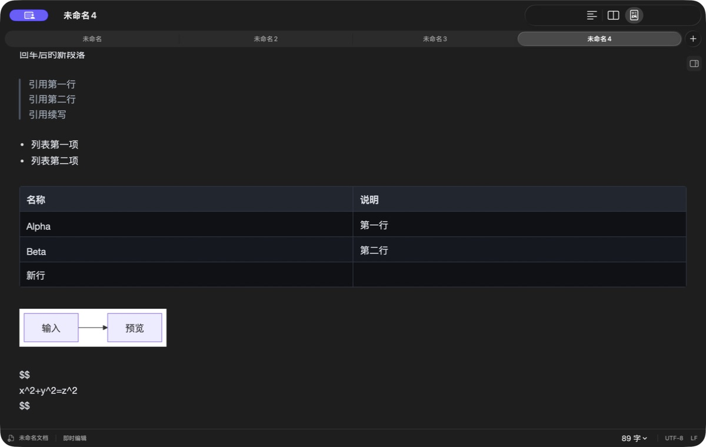

# 即时编辑模式与 Typora 的体验差距审查

审查日期：2026-09-23。代码基线：`2c7c3b4`。本轮只进行体验审查与文档整理，不修改产品代码。

当前即时编辑已经具备基础渲染、语法隐藏、表格单元格编辑和图表源码切换，但还没有形成统一的“按文档结构编辑”的交互模型。最应优先解决的是输入、段落、选区和块边界的一致性；字体、间距和图表配色应在这些规则稳定后统一。继续按单个截图或单个按键补丁修复，容易在另一种语法中产生相同问题。

## 1. 范围与证据边界

- 实机对象：仓库已有的 Debug `Inflow.app`，版本 0.1.0，macOS，深色界面，窗口约 1200×760。未重新构建；实机观察与当前源码分析分别标记。
- 对照对象：已安装 Typora 1.13.8，但新建文档时出现试用到期激活窗口，未能完成 Typora 的真实编辑对照。以下 Typora 行为依据官方文档，不能据此声称两款应用的帧级响应已经对比。
- 在新增的“未命名4”测试标签页中操作，未改动原有三个标签页。样本包含正文、行内格式、引用、列表、两列表格、Mermaid 和块公式。
- **实测**：本轮实际界面、按键和可访问性树观察；**代码**：当前源码确认的行为或边界；**目标**：为 Inflow 提议的交互约定；**待验**：没有充分实测证据。
- 中文内容主要通过纯文本粘贴输入；这不能替代拼音候选、组字取消和快速连打测试。工具调用耗时也不能当作输入延迟。
- 图表起初显示加载占位，后续聚焦操作后成功显示；未将其判定为永久渲染失败。公式在本轮多个后续状态中仍显示源码，原因尚未定位。
- 所有下列截图均来自本轮，保存后重新打开检查。Typora 的截图未捕获到有效激活窗口，因此不把空白截图当作对照证据。

## 2. 实际操作流程与健康状态

### 1）打开混合语法文档：部分可用

标题、段落、引用、列表和表格可以读懂；内容区域几乎铺满窗口。两列短内容表格占据约 1134px，缺少统一的阅读栏宽度。源码中虽有 `readingWidth = 760`，原生编辑器仍主要按窗口宽度布局。

### 2）正文行末 Enter 后继续输入：与目标存在明确差距

在“第二段正文。”末尾按 Enter，再粘贴“回车后的新段落”。文字落在下一行，没有在本轮退回原行开头；但源码仅新增一个换行，视觉上也是同段连续行。Typora 默认 Enter 新建段落，对应两个源码换行；Shift+Enter 才是段内换行。[Typora 换行说明](https://support.typora.io/Line-Break/)

结论：旧的“回到原行开头”问题本轮未复现，**段落语义不一致已经复现**。不能用增加每一行的行距来模拟新段落，那会同时破坏段内换行、引用和代码。

### 3）表格末格 Tab 新增行：简单路径通过，完整体验仍不齐

在最后一行最后一格按 Tab，成功新增空行并把光标放到首格。随后输入“新行”，按 Cmd+Enter，没有新增下一行；Typora 官方提供 Cmd+Enter 在当前行下方新增行。[Typora 表格编辑](https://support.typora.io/Table-Editing/)

右键菜单实测存在插入/删除行列与对齐操作。当前表格内没有出现尺寸、对齐等悬浮工具条；源码也以右键菜单为主要入口。连续 Tab、长单元格换行、跨视口导航和多次撤销尚未做性能验收，不能依据一次成功宣称卡顿问题已经消失。

### 4）阅读图表和公式：图表可用，公式表现需定位

Mermaid 最终成功显示。深色正文内的图表呈现白底、浅紫色节点，视觉主题未跟随正文。`$$` 包裹的简单公式仍显示为源码，没有看到明确的成功预览或醒目的失败提示。

公式现象可能涉及请求、SVG 转图片或呈现过程；本轮未确定根因。源码存在 MathJax 适配、缓存和错误处理，因此不能把现象描述为“未接入 MathJax”。

### 5）点击 Mermaid 进入编辑：基础切换通过

点击图表后出现围栏源码与语法高亮，下方保留预览。此样本没有出现此前描述的巨大空白。仍需验收大型图表、错误源码、连续输入、预览高度变化和退出编辑时的滚动稳定性。

### 6）引用末尾 Enter 续写：简单路径通过

在第二行引用末尾 Enter 并粘贴“引用续写”，源码延续 `> `，视觉引用条保持连续。此结果只覆盖简单单层引用；不代表嵌套引用、引用中的列表/表格、段内换行和空引用退出均已验收。

## 3. 体验差距矩阵

优先级含义：P0 为输入与文档语义基础；P1 为常用结构编辑；P2 为交互完整度与视觉统一。待验项目的优先级表示验证顺序，不等于已确认存在同等严重的缺陷。

| 领域 | 当前状态与证据 | 目标体验／差距 | 优先级 |
| --- | --- | --- | --- |
| 连续输入与中文输入法 | 代码已有组字保护、待确认本地文本保护；本轮未做真实 IME 连打 | 候选确认、取消、替换、移动和渲染更新不会丢字、重复或抢焦点 | P0 待验 |
| Enter／Shift+Enter | 实测正文 Enter 为单换行；主编辑器没有统一的段落/软换行命令 | 正文 Enter 新建段落，Shift+Enter 保留在段内；源码往返语义一致 | P0 |
| 光标几何与位置 | 代码已有共享光标尺寸计算；简单正文、表格和引用可见光标 | 相同正文样式下空行与有字行高度一致；按字体和行框定位，不能继承隐藏标记字号 | P0 待验 |
| 方向键与选区 | 主编辑器左右键额外跳过隐藏字符；表格另有自己的选区与导航 | 上下左右、Home/End、Shift 扩选、跨块拖选均按可见内容行动，保留预期水平位置 | P0 |
| 撤销与重做 | 有 Engine 历史和输入分组；表格通过主编辑器执行历史 | 一次结构操作一次撤销；文本、选区、焦点、滚动位置一起恢复；渲染完成不入历史 | P0 待验 |
| 行内格式 | 标记按选区显隐；格式引擎对部分命中、混合格式采取保守拒绝 | 先定义部分选区、混合格式和跨段格式命令的结果；避免常用操作无反馈 | P1 |
| 标题与结构转换 | 有标题样式；换行规则遇标题交还原生换行；围栏创建仍依赖文本 | 明确输入标记后何时转换、标题末尾何时返回正文、Backspace 如何撤销转换 | P1 |
| 引用 | 简单续写实测连贯；规则按当前源码行前缀续写/退出 | 引用内新段落、软换行、嵌套与退出有独立语义；装饰按同一引用块连续绘制 | P1 |
| 列表与任务 | 代码支持续项、编号递增、任务状态重置、缩进与空项退出 | 兼容长项目、多段项目、嵌套、引用内列表；光标不能落到装饰符号中 | P1 |
| 表格输入与键盘 | 末格 Tab 实测通过；Enter/Esc 代码均退出表格；Cmd+Enter 未新增行 | 补齐 Cmd+Enter、新行/单元格软换行、边界进出、选区规则；连续操作不得重置焦点 | P1 |
| 表格可发现性 | 右键行列/对齐入口存在；没有当前表格工具条 | 提供明确的行列操作、尺寸和对齐入口；拖动行列属于后续完整度工作 | P1/P2 |
| 表格行内内容 | 单元格单独创建富文本控件，主要投影基础字体和链接 | 粗体、代码、公式和链接在单元格中编辑/显示/撤销保持一致；格式保真需专项验证 | P1 |
| 代码块 | CodeMirror `runMode` 提供 token；实际输入仍由 NSTextView 承担 | 语言选择、块内全选、缩进、长行、进入退出组成完整体验；“已用 CodeMirror”不等于编辑行为已一致 | P1 |
| 图表 | 三类 JS 适配已接入；Mermaid 点击展开源码实测通过 | 预览与源码属于同一块；编辑时保留稳定空间，过期结果不覆盖新输入，失败可修正 | P1 |
| 数学公式 | MathJax 已接入；本轮简单块公式仍显示源码 | 行内/块公式有明确编辑态和预览态，错误可见；完成编辑不依赖猜测点击位置 | P1 |
| 粘贴与复制 | 主控件为纯文本；图片粘贴有专门分支，表格有 TSV 分支 | 普通复制/粘贴、复制 Markdown、纯文本粘贴、网页内容转换有明确语义与入口 | P1/P2 |
| 图片与链接 | 代码已有图片粘贴/拖入与编辑态 Cmd 点击链接 | 补验资源路径、替换、加载失败、撤销和跨块导航；不能把现有能力写成缺失 | P2 待验 |
| 排版与主题 | 16pt、1.6 行高等已有共同常量；实测编辑栏过宽、图表白底 | 阅读宽度、段距、列表/引用缩进、表格留白、代码和图表主题统一；不只统一字号 | P2 |
| 焦点与滚动 | 已有专注/打字机模式；打字机居中逻辑要求主文本控件持有焦点 | 表格焦点也参与统一滚动策略；区分“行内垂直居中”与“视口打字机居中” | P1 |
| 可访问性 | 本轮 AX 树主要暴露整篇源码，未提供可操作的表格行列结构；视图切换朗读名含图标名称 | 表格行列/当前格、图表替代文字、当前模式和控件名称可以理解；需 VoiceOver 实验 | P2 |
| 退出与恢复 | 已有关闭前临时草稿机制 | 保留用户明确要求的无保存询问暂存；验收原文件不被覆盖、重开恢复文本及位置 | P0 待验 |

Typora 官方分别描述了行内/块级预览与智能粘贴、表格操作、代码语言控件与代码工具、公式完成编辑，以及三类图表支持。矩阵中的“目标”包含面向 Inflow 的建议；未经实机对照的细节不是对 Typora 的事实断言。[即时预览与粘贴](https://support.typora.io/Quick-Start/) · [表格](https://support.typora.io/Table-Editing/) · [代码块](https://support.typora.io/Code-Fences/) · [公式](https://support.typora.io/Math/) · [图表](https://support.typora.io/Draw-Diagrams-With-Markdown/) · [图片](https://support.typora.io/Images/)

## 4. 反复出现缺陷的架构原因

这是代码结构支持的风险判断，不能单凭文件大小或几次 UI 操作证明每一个历史缺陷都有相同根因。

1. **源码字符同时承担编辑位置与显示布局。** 隐藏标记仍留在 `NSTextStorage` 中，使用 0.1pt 字体或透明属性折叠。编辑位置是源码偏移，可见位置又要跳过这些字符。字号、行框、空行、命中测试、删除和方向键因此必须共同补偿。只修光标绘制无法保证删除/选择正确。
2. **结构编辑入口分散。** 正文 Enter 落到原生插入，引用/列表用前缀规则，表格用独立单元格控件与导航回调，代码块又有局部规则。相同按键没有先被解释为统一的文档意图。
3. **表格有两套焦点与位置。** 单元格的可见选区需要回写整篇 Markdown 的位置，再与主编辑器、Engine 和重绘后的表格协调。已有保留控件及同步追加行的优化，应保留；还需要覆盖所有进出与撤销路径。
4. **异步资源影响同步编辑布局。** JS 结果、语法投影和本地输入各有生命周期。代码已有缓存、取消、快照检查和组字门禁，但预览高度与选区恢复仍需统一约束，不能由各回调自行滚动或抢焦点。
5. **安全的源码格式操作不等于自然的富文本操作。** 对混合或部分命中直接拒绝可保护文档，却会限制日常选择后加粗等行为。需要语义明确的格式命令，而不是简单放宽所有范围检查。

建议保持 Markdown 的保存格式和现有 Engine 边界，增加明确的编辑意图层：`新建段落 / 段内换行 / 拆分列表项 / 合并块 / 新增表格行 / 退出块 / 切换格式`。一次命令统一给出内容变更、逻辑选区、撤销边界与滚动意图。显示层只投影结果，异步渲染不得自行改变编辑意图。

逻辑选区至少应描述块或单元格、块内位置、方向/边界倾向以及文档版本；保存时再映射到 Markdown 范围。不能把独立 NSTextView 的临时坐标作为跨控件持久选区。

实现路线不必在这份审查中直接锁定“全部改成 Web 编辑器”。先用正文、嵌套引用/列表、表格、图表四类场景验证统一命令与选区原型。如果原生 TextKit 无法在预算内稳定满足这些用例，再比较结构化 Web 编辑内核方案。迁移时必须保留 IME、可访问性、原生快捷键、源码保真与草稿恢复能力。

## 5. 应先固定的按键交互约定

以下是下一轮实现的验收草案。Typora 官方确认正文 Enter/Shift+Enter、表格 Cmd+Enter 和代码块/公式入口；其他边界行为应在可用的 Typora 上核对后冻结，不凭记忆编码。[快捷键](https://support.typora.io/Shortcut-Keys/) · [换行](https://support.typora.io/Line-Break/) · [表格](https://support.typora.io/Table-Editing/) · [公式](https://support.typora.io/Math/)

| 上下文 | Enter | Shift+Enter | Tab／Shift+Tab | Backspace 与边界 |
| --- | --- | --- | --- | --- |
| 正文 | 新建段落；中间按键拆分段落 | 段内换行 | 不意外转移到工具栏；具体缩进行为待对照 | 段首与前块合并或执行明确的块边界操作 |
| 标题 | 标题末尾进入正文；中间拆分规则待对照 | 单独定义，不沿用正文任意猜测 | 保持选区 | 空标题或起始处可以自然退回正文 |
| 引用 | 引用内新段落；空引用退出一层 | 同段续行且保留引用语义 | 嵌套行为待对照 | 逐级解除容器，不留下隐藏符号位置 |
| 列表/任务 | 新项目；空项退出/降级 | 当前项目续行 | 缩进/反缩进项目及其子内容 | 项目起始处按层级退回；保留子结构 |
| 表格 | 普通 Enter 的导航/退出规则单独核对 | 单元格内换行，保存为有效单元格内容 | 前后格；末格增加行并进入首格 | 删除文本、清空选格和删除行明确区分 |
| 代码/图表源码 | 源码换行并继承缩进 | 不切成正文段落 | 缩进/反缩进 | 不误删围栏；首尾退出规则明确 |
| 块公式源码 | TeX 源码换行 | 不引入正文段落语义 | 依公式编辑规则 | 完成编辑有明确入口，保留原始 TeX |

另外必须支持表格 Cmd+Enter 新增行。公式的 Cmd+Enter/方向键完成编辑按官方说明对照。图表的真实换行、字面 `\n` 和标签 ` ` 继续在适配边界区分，不能对整篇 Markdown 做全局替换。数学的 `\\` 必须按 TeX 环境处理，不能复用图表替换规则。[Typora 数学换行](https://support.typora.io/Math/)

光标“大小一致”指同样文字样式在空行、有字行、引用和表格之间具有稳定几何，不要求标题、正文、代码全部画成同一高度。“居中”首先是光标与当前行框的垂直关系；只有打开打字机模式时才要求当前行保持在视口中部。

## 6. 验收清单：以用户操作为单位

这些是后续必测场景，不是本轮已通过的测试报告。每项同时检查最终 Markdown、可见选区、第一响应者、撤销结果和滚动锚点。

| 编号 | 场景 | 通过条件 |
| --- | --- | --- |
| A01 | 空文档中文拼音连续输入，确认/取消候选 | 不丢字、不重复、不提前提交，候选框跟随插入点 |
| A02 | 在粗体边界、引用首行、空表格内组字 | 渲染更新和方向键不打断组字 |
| A03 | 正文行首/中间/末尾 Enter；连续两次 | 段落结构和光标均符合约定，撤销逐次还原 |
| A04 | 正文 Shift+Enter 后继续输入 | 保持同段；切换源码/预览后语义不变 |
| A05 | 标题末尾、空行、文末换行 | 后继文字使用目标段落样式，光标不缩成隐藏标记高度 |
| A06 | 引用续段、软换行、空引用退出及两层嵌套 | 引用条连续且层级正确，光标落在可见内容位置 |
| A07 | 列表长项、任务、嵌套、引用内列表 | 续项、缩进、编号与退出保持结构，撤销一次还原一次操作 |
| A08 | 左右跨行内标记，上下跨长短行 | 无不可见停靠点，上下移动维持目标横坐标 |
| A09 | Shift 扩选、跨段拖选、跨表格/图表选择 | 选区视觉与复制/删除范围一致，不吞掉相邻块 |
| A10 | 选中部分粗体、混合格式、跨段后格式化 | 按已冻结语义执行或给出明确反馈，不静默无效 |
| A11 | 表格连续 Tab 100 次并间隔输入 | 次序正确，无丢格、回跳或焦点转移；记录 P50/P95 而非主观判断 |
| A12 | 表格末格 Tab、首格 Shift+Tab、Cmd+Enter | 行数、目标格和退出位置正确，一次结构操作一次撤销 |
| A13 | 单元格 Shift+Enter、长内容自动折行 | 行高稳定，内容完整，光标与行框一致 |
| A14 | 表格插入/删除行列、对齐、TSV 粘贴 | 当前格与选区合理保留，单元格格式和转义不丢失 |
| A15 | 表格内外往返并连续 Undo/Redo | 内容、逻辑选区、焦点同时恢复，不停在隐藏源码位置 |
| A16 | 输入围栏创建块、选择语言、缩进及块内全选 | 遵循已冻结的块级交互，块外正文不被误选/误缩进 |
| A17 | 编辑 Mermaid/flow/sequence 的有效与错误源码 | 输入始终可用；只接受最新结果；错误可见可修复 |
| A18 | 图表中真实换行、`\n`、` `、引号/反斜线 | 语义各自正确，保存源码不被不必要改写 |
| A19 | 行内与块公式、TeX 多行、非法公式 | 正常公式可预览，错误可诊断；源码和输出切换不丢位置 |
| A20 | 网页富文本、纯文本、Markdown、TSV、图片粘贴 | 各路径产物符合声明的复制粘贴语义且可撤销 |
| A21 | 窗口缩放、全屏、侧栏切换、预览高度变化 | 当前输入位置可见；同样样式的光标不变形 |
| A22 | 打字机模式中进入表格/代码/公式 | 所有编辑区域遵循同一个视口策略，不发生双重滚动 |
| A23 | 关闭/退出后重新打开，含未命名多标签 | 正常退出不询问保存；草稿完整恢复；原文件不被静默覆盖 |
| A24 | 纯键盘与 VoiceOver 遍历 | 模式名称、表格行列/当前格、图表替代信息可理解且可操作 |

建议 A03/A11/A17 再分别在普通短文、长文与大量表格/图表文档中执行。性能预算先在约定设备测基线，再冻结输入到绘制、表格导航和资源渲染指标；不把自动化调用耗时当作性能数据。

测试分三层：语义命令测试验证文档变更与选区；原生控件集成测试验证响应者和布局；真实输入法、鼠标、滚动与辅助功能测试验证最终体验。单元测试数量或历史通过记录不能代替后两层。

## 7. 实施顺序与完成门槛

1. **先统一基本编辑语义和事务。** 覆盖 A01–A05、A08–A09、A15，建立输入、选区、撤销的单一规则入口。禁止以全局插入空行或全局固定光标高度替代语义修复。
2. **完成结构编辑。** 引用、列表、表格、代码块、图表/公式进出共用命令与选区约定；重点完成 A06–A07、A10–A19。保留已有效的控件复用和增量更新。
3. **统一显示与完整工作流。** 收敛阅读宽度、字体/行高、段距、主题、状态提示、粘贴与可访问性；完成 A20–A24。排版阶段仍需重跑光标和跨块场景。

每阶段必须产出行为表、可重复场景、当前失败列表和实机证据。完成标准是输入和结构场景全部满足约定，之后才评价“接近 Typora”；不能只用“渲染正确”作为即时编辑完成标准。

退出暂存是用户明确指定的产品行为，继续保留，不为了模仿 Typora 改回保存询问。字体主题可选择接近 Typora 的基准，但用户未指定具体主题，本轮不宣称应逐像素复制某一主题。

## 8. 当前源码定位

以下符号基于 `2c7c3b4`，用于后续实现定位，避免把报告当作已经完成的重构。

| 位置 | 与本次结论的关系 |
| --- | --- |
| [MarkdownSourceEditor.swift](../macos/Inflow/Editor/MarkdownSourceEditor.swift) | `reconcileBoundText` 保护组字/本地文本；`insertNewline`、`movePastHiddenMarker`、`replaceRenderedTableSource` 体现当前编辑路径；`RenderedMarkdownCaretStyleResolver` 共享光标几何；`centerSelectionForTypewriterMode` 依赖主控件焦点 |
| [RenderedMarkdownEditor.swift](../macos/Inflow/Editor/RenderedMarkdownEditor.swift) | 源码范围与投影模型；`MarkdownWritingRules` 前缀规则；`RenderedAttributePatch` 属性增量更新 |
| [EditorEngineClient.swift](../macos/Inflow/CoreBridge/EditorEngineClient.swift) | 原生输入与 Engine 文档/历史同步边界 |
| [format.rs](../core/src/format.rs) | `toggle_inline_format` 对空选区、完整范围与部分重叠采取不同策略 |
| [render-adapters.js](../macos/Inflow/Resources/JavaScript/render-adapters.js) | CodeMirror `runMode`、三类图表、MathJax；Mermaid 固定 default 主题；标签换行适配 |
| [JavaScriptRendering.swift](../macos/Inflow/Preview/JavaScriptRendering.swift) | WKWebView 资源服务、缓存、超时与结果边界 |
| [AppPreferences.swift](../macos/Inflow/Settings/AppPreferences.swift) | `MarkdownRenderMetrics` 中阅读宽度、字体、行高与间距常量 |
| [MarkdownDocument.swift](../macos/Inflow/Document/MarkdownDocument.swift) | `TemporaryDocumentDraftStore` 与关闭前暂存 |

后续对照需要补齐：可正常编辑的 Typora 实机、相同主题/字号/设置、相同样本与逐键操作记录，以及中文输入法和连续表格导航录制。在这些证据补齐前，不报告兼容百分比，也不把“待验”改写成已修复。
