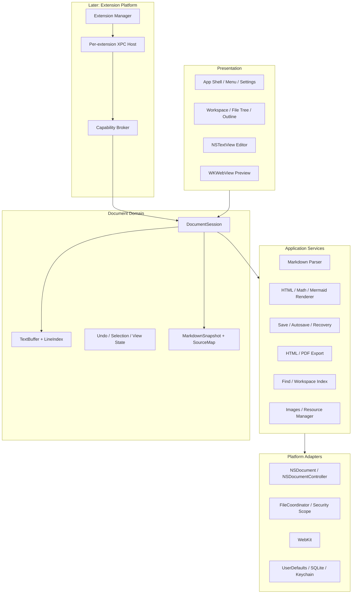
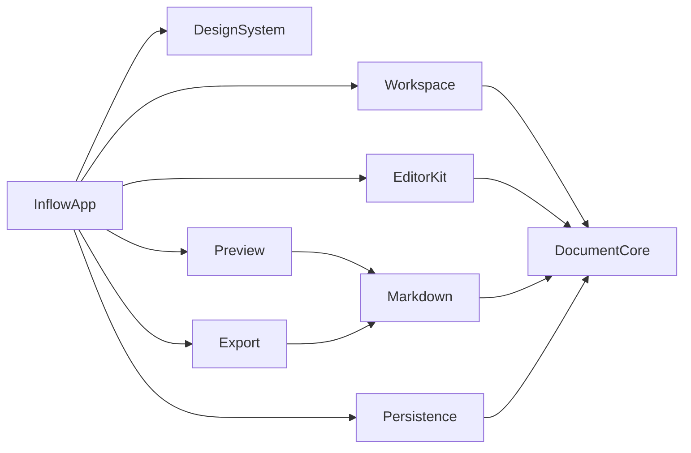
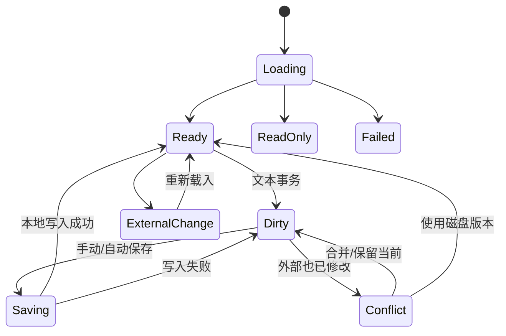
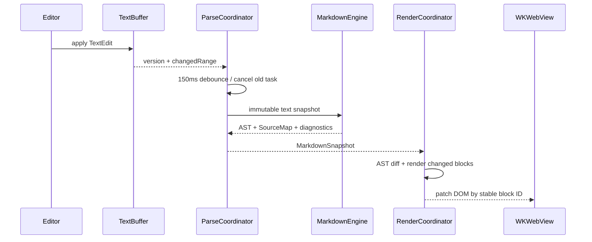

# Inflow 产品技术方案

- 文档版本：v1.0
- 更新日期：2026-08-17
- 状态：工程设计基线
- 目标平台：Apple Silicon，macOS 14+
- 当前本机环境：Xcode 26.6（开始开发前需要接受 Xcode License）

## 阅读指南

- 架构决策：读取第 1–6 节。
- 编辑、解析和预览：读取第 7–10 节。
- 文件可靠性：读取第 11–12 节。
- 工作区、资源和导出：读取第 13–16 节。
- 扩展与 AI 预留：读取第 17–18 节；详细实现再进入扩展目录。
- 工程执行：读取第 19–29 节，尤其是第 25 节实施阶段与第 27 节风险。

## 1. 方案目标

本方案将 PRD 转换为可实施的 macOS 工程架构，优先保证：

1. Markdown 源码始终是文档事实来源。
2. 本地保存、自动保存和异常恢复不能因预览、插件或网络失败而受影响。
3. 编辑、即时渲染、分栏和预览共享同一文档模型与源码位置映射。
4. 核心能力完全离线，所有 JavaScript、CSS、字体和渲染资源随应用打包。
5. 首个版本建立可演进的解析、渲染与扩展边界，但不提前实现完整插件市场和 AI 生态。
6. 10,000 行、约 1 MB Markdown 文档仍能流畅输入、保存和基础预览。

## 2. 已确认约束

| 项目 | 决策 |
| --- | --- |
| CPU | 仅 Apple Silicon，不提供 x86_64 构建 |
| 系统 | macOS 14 Sonoma 及以上 |
| 分发 | Developer ID 签名、Apple 公证、独立安装包 |
| Mac App Store | 暂不分发 |
| 沙盒 | 启用 App Sandbox，使用用户选择文件权限和安全作用域书签 |
| 网络 | Core 默认不联网；远程图片由用户开启；后续连接器限域代理 |
| PDF 深色主题 | 保持深色页面背景和对应前景色 |
| CLI | 不属于编辑器本体 |
| AI | 后续扩展生态能力，不作为 Core 依赖 |
| 插件 | 后续分阶段开放，第三方代码进程外运行 |

## 3. 总体架构

采用分层、模块化单体作为 Core，插件运行时另设隔离进程。



## 4. 技术栈

### 4.1 原生应用

- Swift 6 并发模型，开启严格并发检查。
- SwiftUI：工具栏、设置、侧栏、状态视图、恢复中心和普通业务界面。
- AppKit：`NSDocument`、`NSWindowController`、菜单响应链和文本编辑器。
- TextKit 2 优先：文本布局、选择、输入法、拼写和可访问性；若某些大文档场景表现不稳定，局部回退到 TextKit 1 适配器，不改变上层接口。
- WebKit：离线预览、Mermaid、数学、代码渲染和 PDF 输出。
- JavaScriptCore：未来扩展 Host 的脚本运行时，不用于 Core 编辑器业务逻辑。

### 4.2 Markdown 与 Web 资源

- Swift Markdown 0.8.0：Core CommonMark/GFM AST、源码范围和结构遍历。
- Mermaid 11.15.0：随应用固定版本打包，渲染 `mermaid` 围栏块。
- KaTeX 0.18.1：Core 的快速行内/块级数学渲染；更完整 LaTeX 交由后续 Domain Pack。
- 代码着色：随应用打包的轻量高亮库，语言按需注册。
- 自研 AST-to-HTML Renderer：控制源码 ID、安全清洗、主题 token 和导出一致性。

所有依赖锁定精确版本和校验值，不引用 `main` 分支，不从 CDN 加载。升级依赖时运行统一 Markdown、Mermaid、公式和导出快照测试。

### 4.3 本地存储

- 用户文档：用户选择位置的 `.md` / `.markdown`。
- 偏好：`UserDefaults`，由类型安全 `SettingsStore` 封装。
- 恢复索引、本地版本和工作区索引：系统 SQLite3，封装在内部持久化模块。
- 快照正文：Application Support 中按文档 ID 保存的压缩 blob，SQLite 只存元数据。
- 账号凭据：后续连接器/AI 使用 macOS Keychain。
- 临时导出：系统临时目录中的任务目录，成功后原子移动到目标位置。

## 5. 工程结构

建议建立一个 Xcode Workspace 和多个本地 Swift Package：

```text
Inflow/
├── Inflow.xcworkspace
├── Apps/
│   ├── InflowApp/
│   └── InflowExtensionHost/          # 后续阶段
├── Packages/
│   ├── InflowDocumentCore/
│   ├── InflowEditorKit/
│   ├── InflowMarkdown/
│   ├── InflowPreview/
│   ├── InflowPersistence/
│   ├── InflowWorkspace/
│   ├── InflowExport/
│   ├── InflowExtensions/             # 后续阶段
│   └── InflowDesignSystem/
├── Resources/
│   ├── Web/
│   ├── Themes/
│   ├── Fonts/
│   └── Samples/
├── Tests/
│   ├── Fixtures/
│   ├── Golden/
│   └── Performance/
└── docs/
```

模块依赖方向：



规则：业务模块不能反向依赖 App；DocumentCore 不依赖 AppKit/WebKit；Web 资源只能由 Preview/Export 加载；文件写入只能经过 Document/Persistence 服务。

## 6. 文档架构

### 6.1 选择 NSDocument

使用 `NSDocument` + `NSDocumentController`，而不是只使用 SwiftUI `DocumentGroup`。原因：

- 原生处理 New/Open/Save/Save As/Close、edited 状态和 responder chain。
- 支持安全保存、文件协调、多窗口、系统撤销和外部文件变化。
- 更容易精确控制自动保存、未命名草稿、只读文档和窗口恢复。
- 可以由 `NSHostingController` 承载 SwiftUI 界面，同时保留 AppKit 文档生命周期。

### 6.2 核心对象

```swift
@MainActor
final class MarkdownDocument: NSDocument {
    let session: DocumentSession
    // read/write, window controllers, save state bridge
}

@MainActor
final class DocumentSession: ObservableObject {
    let documentID: DocumentID
    let buffer: TextBuffer
    let undoCoordinator: UndoCoordinator
    let viewState: DocumentViewState
    let pipeline: DocumentPipeline
}
```

`MarkdownDocument` 只负责 AppKit 生命周期和文件接口；`DocumentSession` 负责当前内存状态；解析、预览、恢复和导出通过服务对象运行。

### 6.3 文档状态



保存状态和未来同步状态严格分离。窗口标题中的 edited 标记只代表本地文件状态。

## 7. 文本模型与编辑器

### 7.1 TextBuffer

`TextBuffer` 是唯一可编辑源码容器，初期使用 `NSMutableAttributedString`/`NSTextStorage` 兼容结构并封装为稳定协议。它维护：

- UTF-16 offset 与 Swift `String.Index` 的转换。
- 增量 `LineIndex`：行号、行起止、offset-to-line。
- 单调递增 `documentVersion`。
- 文本事务和变更范围。
- 当前字符编码与换行符信息。

所有来自格式命令、预览点击、AI 或插件的写入都转换为：

```swift
struct TextEdit: Sendable {
    let range: UTF16Range
    let replacement: String
}

struct WorkspaceEdit: Sendable {
    let baseVersion: UInt64
    let label: String
    let edits: [TextEdit]
}
```

一次 `WorkspaceEdit` 原子执行并注册为一次 Undo。

### 7.2 EditorView

`NSViewRepresentable` 包装自定义 `MarkdownTextView: NSTextView`：

- 使用系统输入法、文本选择、拖放、拼写、VoiceOver 和查找栏基础能力。
- 自定义 command handling 支持 Tab/Shift-Tab、格式快捷键和 `⌘1`–`⌘4`。
- 高亮属性不写入文档模型，也不进入 Undo。
- 只对变更行及受影响语法范围重新着色；代码围栏等跨行结构向前后扫描到稳定边界。
- 大文件或持续输入时降低高亮优先级，永不阻塞字符输入和保存。

### 7.3 即时渲染编辑

P1 在同一 TextBuffer 上增加 `RenderedEditorLayout`，不使用 WebView `contenteditable`：

- 非当前块隐藏或弱化 Markdown 标记。
- 标题、引用、列表、代码和表格通过 TextKit 属性与附件视图呈现。
- 光标进入结构块时恢复必要标记。
- 任务复选框、表格控件只产生 TextEdit，不直接改变 AST。
- 不可视化的扩展节点降级为源码块。

这一阶段必须先完成 round-trip 测试：可视操作前后的源码可预测、无损、可一次撤销。

## 8. Markdown 解析与源码映射

### 8.1 Pipeline



### 8.2 MarkdownSnapshot

```swift
struct MarkdownSnapshot: Sendable {
    let documentVersion: UInt64
    let ast: MarkdownAST
    let sourceMap: SourceMap
    let headings: [HeadingNode]
    let links: [LinkNode]
    let diagnostics: [Diagnostic]
    let contentHash: ContentHash
}
```

每个块级节点生成稳定 ID：优先由节点类型、源码范围附近内容 hash 和父路径推导。编辑导致 offset 移动时，通过相邻块匹配复用旧 ID，减少 DOM 全量刷新。

### 8.3 解析策略

- P0 使用后台全量 parse，输入 debounce 150 ms，旧任务取消。
- 解析输入是不可变 String 快照，绝不在后台访问 NSTextStorage。
- 先验证 1 MB/10,000 行目标；如果全量 parse P95 超标，再增加块级分段缓存，不在首期引入第二套 Parser。
- SourceRange 统一转换到 UTF-16 offset，供 NSTextView、WebView 和诊断共享。
- 核心 GFM AST 之后预留 Syntax Registry；插件只能增加节点，不能替换 Core Parser。

## 9. 预览与渲染

### 9.1 WKWebView 配置

- 使用非持久化 `WKWebsiteDataStore`。
- 只加载应用内置 HTML shell 和自定义 `inflow-resource://` scheme。
- 禁止任意导航、新窗口、下载、摄像头、麦克风和剪贴板访问。
- Content Security Policy 默认 `default-src 'none'`，仅放行内置 style/script/image/font scheme。
- 远程图片关闭时不产生 HTTP 请求；开启后通过 Core 图片代理加载，不直接让文档 HTML 自由联网。
- 原始 HTML 经过白名单清洗，移除 script、事件属性、危险 URL 和 iframe。

### 9.2 HTML Renderer

自研 AST visitor 生成语义 HTML：

- 每个块包含 `data-node-id`、`data-source-start`、`data-source-end`。
- 标题包含稳定 slug 和源码位置。
- 主题使用 CSS token，浅色/深色共享布局规则。
- 表格、代码和图表在容器内横向滚动。
- 图片 URL 统一经 ResourceResolver 解析。

普通段落可以使用局部 DOM patch；主题、正文宽度和完整解析配置变化时允许全量替换，并在替换前后恢复语义锚点。

### 9.3 Mermaid

- 围栏语言为 `mermaid` 时产生 `DiagramNode`。
- 使用内容 hash + Mermaid 版本 + 主题作为缓存 key。
- 在 Web 内容进程中异步渲染 SVG，设置单块超时和输出大小限制。
- 禁止 Mermaid 配置中的外部链接或不安全 HTML。
- 失败时显示源码位置、简短错误和“在编辑器中定位”。

### 9.4 数学

- Core 支持 `$...$`、`$$...$$` 和转义美元符号。
- Parser 先识别数学节点，KaTeX 只负责渲染，不参与全文 Markdown 解析。
- 宏默认使用安全白名单并限制递归。
- 错误公式显示源码和诊断，其他节点继续渲染。
- 完整 LaTeX/TikZ 属于后续 Academic Domain Pack。

## 10. 模式切换与定位

### 10.1 模式状态

`DocumentViewState` 保存：

- `mode`: source / split / preview / renderedEditing。
- 编辑器 selection 和可见字符范围。
- 预览顶部 node ID 与节点内相对比例。
- 分栏比例、正文宽度和焦点区域。

切换模式先捕获语义锚点，再构造目标布局，最后恢复焦点和位置。

### 10.2 点击标题定位源码

1. WebView 通过 message handler 发送 node ID。
2. SourceMap 解析 UTF-16 source range。
3. 必要时从预览切换为分栏。
4. NSTextView 滚动到标题行中央并设置插入点。
5. 校验事件携带的 documentVersion；过期事件丢弃。

### 10.3 编辑器到预览滚动同步

- 编辑器滚动后找出可见区域顶部和底部最近块级节点。
- 使用 SourceMap 得到相应 DOM node ID。
- 在两个锚点之间按源码位置插值。
- 用户主动滚动预览时设置 1 秒 suppression window。
- 设置关闭后不发送同步事件。

P1 再实现预览到编辑器的反向同步，使用相同锚点模型，避免两个方向递归触发。

## 11. 文件、保存与恢复

### 11.1 打开

- 由 `NSDocumentController` 处理 Finder、Open Panel 和应用打开事件。
- 支持 UTF-8/UTF-8 BOM；记录并保留 BOM 与主换行风格。新文档为无 BOM + LF；混合换行保存前提示并统一为主风格。其他编码只读且禁止覆盖，转换在 P1 提供。
- 读取时记录文件资源标识、修改时间、大小和内容 hash 作为 `FileRevision`。
- 同一 canonical URL 只打开一次。

### 11.2 保存

- `NSDocument` 获取指定 documentVersion 的不可变 UTF-8 Data 快照。
- 保存前比较磁盘 `FileRevision`；若磁盘已变化且内存也 Dirty，进入冲突流程。
- 使用 `NSDocument` safe write，不依赖目标路径形态；系统可能提供临时写入 URL。
- 成功后只有当当前 buffer version 等于写入 version 才清除 edited 状态；保存期间的新输入继续保持 Dirty。
- 保存失败保留 buffer 和恢复快照，显示重试/另存为。

### 11.3 自动保存

- `NSDocument.autosavesInPlace = true`。
- `NSDocumentController.autosavingDelay` 由设置映射为 0.5/1/2/5 秒。
- 用户关闭自动保存时，禁止 in-place autosave，但恢复快照仍运行。
- 应用 resign active 时请求保存。关闭行为严格执行 PRD 5.1.4：自动保存关闭时 dirty 文档必须询问；开启时等待保存，失败后询问；未命名非空文档始终询问；“不保存”清除会话快照。

### 11.4 恢复快照

恢复由独立 `RecoveryService` 负责，不能只依赖自动保存：

```text
Application Support/Inflow/Recovery/
├── index.sqlite
└── blobs/
    └── <document-id>/<snapshot-id>.bin
```

快照包含：

- schemaVersion、documentID、source、contentHash。
- file URL bookmark、最近成功 FileRevision。
- documentVersion、时间、是否未命名。
- selection、mode、scroll anchors 和窗口状态。
- cleanShutdown、expiresAt；Save As 只迁移书签和 revision，不更换 documentID。

策略：

- 变更后最迟 5 秒写入，使用后台 actor 串行化。
- 相同内容 hash 不重复写 blob。
- 正常保存后保留一个短期确认快照，确认应用稳定后清理。
- 启动时扫描未关闭 session；原文件已改变时以未命名副本恢复。
- 恢复索引损坏时可从 blob header 重建。

### 11.5 外部修改

通过 NSDocument/FilePresenter 回调和 revision 校验处理：

- 内存无修改：自动重新载入，保持语义位置。
- 内存有修改：暂停自动保存并进入三方比较，只提供保存副本、重新载入、明确覆盖。
- 明确覆盖前在同目录创建带时间戳冲突副本并二次确认；副本失败即禁止覆盖。
- 文件被删除：保留内存文档并暂停自动保存，只允许另存为或经二次确认重建。
- 权限丢失：转只读，允许另存。

## 12. 本地版本历史

P3 建立与 Recovery 分离的 VersionStore：

- Recovery 用于崩溃保护，不能关闭。
- VersionStore 用于用户浏览，可关闭和设置容量。
- 保存成功和重大结构操作后创建版本。
- 小版本存增量 delta，周期性存完整 checkpoint。
- 默认保留 30 天或 500 MB，以先到者为准。
- 恢复旧版本实际创建一个可撤销 TextEdit，不绕过当前文档模型。

## 13. 查找、替换与工作区

### 13.1 当前文档

- P0 使用 NSTextFinder 或自定义 FindCoordinator 接入系统查找栏；纯预览发起查找固定切到分栏。
- 支持字面值、大小写、当前/全部替换。
- 替换全部预先计算不重叠 ranges，并作为一个 WorkspaceEdit。
- P1 加入正则、选择范围和结果预览。

### 13.2 工作区

P1 引入 `WorkspaceSession`：

- 根目录必须由用户选择并保存 security-scoped bookmark。
- 文件树使用异步目录枚举，不读取隐藏/排除目录。
- 索引只保存相对路径、标题、mtime、size 和 token，不复制正文。
- 文件变更经 FSEvents/文件协调通知后增量更新。
- 全文替换必须先展示 diff，逐文件安全保存并支持事务报告；不承诺跨多个文件的系统级原子性。

## 14. 图片与资源

`ResourceResolver` 统一处理预览、导出和资源检查：

- 相对路径基于当前 Markdown 文件目录。
- 未命名文件粘贴图片时先保存文档或暂存到受控草稿附件区。
- 粘贴/拖放图片按设置复制到附件目录，再以相对路径插入 Markdown。
- 文件名冲突使用稳定后缀，不覆盖已有附件。
- 远程图片默认不加载；开启后经限域/限大小代理获取。
- 资源移动先建立引用变更计划，用户确认后修改文件和 Markdown；失败时报告已完成/未完成步骤并尽量回滚。

### 14.1 本地链接导航

`LinkResolver` 将 Markdown 链接解析为受控目标：

```swift
enum LinkTarget: Sendable {
    case anchor(HeadingAnchor)
    case markdownFile(ScopedURL, anchor: HeadingAnchor?)
    case localResource(ScopedURL)
    case externalWeb(URL)
    case blocked(reason: LinkBlockReason)
}
```

解析流程：

1. 对 URL 做 percent-decoding 和路径标准化，但不跟随未经验证的符号链接越出授权根目录。
2. 相对路径以当前文档目录为基准，工作区内路径以 security-scoped root 校验。
3. 单文件授权不足时，由 `ScopeAuthorizationCoordinator` 首次请求包含目录并持久化书签；拒绝状态按目录记忆，不自动重复提示。
4. `#fragment` 使用 PRD 5.14 固定的 `gfm-0.29` slug；Parser、预览、导出和导航共享同一实现。
5. Markdown 目标交给 `NSDocumentController`/WorkspaceSession 打开，加载完成后通过 SourceMap 定位标题。
6. 非 Markdown 文件只有在授权范围内才交给 `NSWorkspace` 打开。
7. HTTP/HTTPS 交给系统浏览器；危险 scheme、可执行目标和越权路径返回 blocked。

`NavigationCoordinator` 为每个窗口维护前进/后退栈：

```swift
struct NavigationLocation: Sendable {
    let documentID: DocumentID
    let scopedURL: ScopedURL?
    let nodeID: NodeID?
    let sourceOffset: Int?
    let relativePosition: Double
}
```

导航事件携带 documentVersion。目标文档或 AST 尚未就绪时等待对应 MarkdownSnapshot；版本过期则重新按锚点解析，找不到时回退到文件顶部并显示提示。

WebView 链接点击由 navigation delegate 拦截，不允许页面自行导航。编辑器中的 `⌘`+单击先通过语法树确认鼠标位置确实位于 LinkNode，避免用正则误识别普通文本。

## 15. 导出

### 15.1 统一 RenderProfile

预览和导出共享：

```swift
struct RenderProfile: Sendable, Codable {
    let theme: ThemeID
    let colorScheme: ColorScheme
    let contentWidth: Double
    let markdownDialect: MarkdownDialect
    let mermaidEnabled: Bool
    let mathEnabled: Bool
    let remoteImagesAllowed: Bool
}
```

### 15.2 HTML

- 从 MarkdownSnapshot 生成完整 HTML。
- 内联主题 CSS、代码样式、数学所需样式和已渲染 SVG。
- 自包含 HTML 必须内联字体、CSS、本地图片、数学和 Mermaid 结果；远程图片关闭时使用占位，开启时内联成功结果，失败先汇总供继续或取消；100 MiB 为硬上限。
- 不包含运行时脚本，不依赖 CDN。
- 在目标同卷创建隐藏临时文件，验证后通过文件协调原子替换；禁止跨卷移动结果。

### 15.3 PDF

- 创建独立离屏 WKWebView，加载与预览相同的完成 HTML。
- 等待字体、图片、公式和 Mermaid readiness barrier。
- P0 仅通过 `WKWebView.createPDF` 生成 PDF Data。
- 深色 profile 写入明确的页面背景和 `print-color-adjust: exact` 等打印样式，不切换浅色主题。
- P0 固定 A4、20 mm 四边距和 100% 缩放，并实现 PRD 5.12 的分页规则；P1 加可配置纸张、边距、页眉页脚和元数据。
- 导出超时或节点失败时列出问题，由用户选择继续或取消，不生成半成品目标。

## 16. 设置系统

`SettingsStore` 将偏好定义为类型安全 key：

- 全局默认：UserDefaults。
- 工作区覆盖：Application Support 中的 WorkspaceSettings，不污染用户目录。
- 文档临时状态：DocumentViewState，不写入 Markdown。
- 插件设置：按 extension ID 隔离，后续纳入权限系统。

设置变更通过 AsyncStream/Observation 发布。编辑字号等直接更新 UI；Parser 或渲染设置产生新的 pipeline generation，取消旧任务后重建。

## 17. 扩展系统落地

扩展详细设计以 `EXTENSION_SYSTEM_DESIGN.md` 为准。本工程的预留点：

- `SyntaxRegistry`：围栏、块指令和后续受限行内节点。
- `CommandRegistry`：格式和编辑事务命令。
- `DiagnosticRegistry`：统一问题模型。
- `RendererRegistry`：受限 HTML/SVG/声明式输出。
- `ExporterRegistry`：单篇导出。
- `SidebarRegistry`：声明式原生 UI。
- `ConnectorRegistry`：保存后事件和远端候选版本。
- `AICapabilityRegistry`：Provider、Action、Context 和 Tool。

P0 只定义内部协议和官方实现，不加载第三方包。直到文档事务、权限 Broker、XPC Host、崩溃隔离和签名验证完成后才开放 SDK。

### 17.1 XPC Host

- 每个可执行扩展独立进程。
- JavaScriptCore 运行 TypeScript 编译后的 JS。
- 无 Node、DOM、Shell、FFI 和直接网络。
- XPC 消息携带 extensionID、API version、deadline、cancellation 和 schema-validated payload。
- 扩展对文档只读快照，写入必须提交 baseVersion WorkspaceEdit。

### 17.2 插件市场

Core 只包含可选市场界面和安装管理器：

- 双签名、SHA-256、兼容范围和撤回列表。
- 高权限连接器/AI Provider 只允许官方市场安装。
- 市场离线不影响编辑与已安装扩展。
- 新权限、域名或账号范围触发重新授权。

## 18. AI 接入预留

AI 不写入 P0 Core 业务，只预留稳定协议：

- `DocumentSnapshot`：不可变、带 documentVersion。
- `ContextEnvelope`：用户可检查的选区/文档/文件上下文。
- `TextPatch`：可预览、拒绝、接受和撤销。
- `ToolProposal`：结构化建议，Core 校验后再执行。
- `ModelProvider`：本地或限域远程模型，凭据由 Broker 代理。

System Policy、权限和工具列表只由 Core 产生。文档和外部数据都视为不可信上下文，不能通过提示内容扩大权限。

## 19. 并发模型

| 组件 | 隔离方式 |
| --- | --- |
| NSDocument、DocumentSession、TextBuffer UI bridge | `@MainActor` |
| ParseCoordinator | actor + cancellable Task |
| RenderCoordinator | actor；DOM 操作切 MainActor |
| RecoveryService | actor，串行磁盘写入 |
| WorkspaceIndexer | actor，限并发文件读取 |
| ExportCoordinator | actor，每文档单任务 |
| Extension Manager/Broker | actor + XPC |

规则：

- 主线程不执行 Markdown parse、HTML 生成、索引、压缩或导出。
- 任何异步结果提交前校验 documentVersion/pipeline generation。
- 新任务取消旧任务；取消不是错误，不显示通知。
- 保存快照创建应快速复制当前字符串，不等待预览。

## 20. 错误模型与日志

定义用户可理解的 `InflowError`：

- fileRead、fileWrite、permission、externalConflict。
- parse、render、mermaid、math、export。
- recovery、workspaceIndex、extension。

每个错误包含用户消息、技术原因、恢复动作和隐私安全的 diagnostic ID。使用 `os.Logger` 分类日志：document、editor、render、storage、export、extension。不得记录正文、完整路径、凭据和远端响应正文。

## 21. 安全设计

- App Sandbox + Hardened Runtime + Developer ID + Notarization。
- WebView CSP、scheme handler、navigation delegate 和内容清洗。
- Markdown 原始 HTML 默认不可信。
- 文件访问仅限用户选择文件/工作区及应用容器。
- security-scoped access 成对 start/stop，长任务由 Lease 管理。
- 恢复 blob 使用文件保护和随机不可猜名称；索引不记录正文。
- 插件包阻止路径穿越、符号链接、压缩炸弹和未签名更新。
- 网络、Keychain、剪贴板和工作区访问通过 Capability Broker。
- AI/连接器不获得恢复数据和未经选择的工作区内容。

## 22. 可访问性与本地化

- 原生 NSTextView 提供文本和选区 VoiceOver 基础。
- 模式、保存、同步、诊断不能只用颜色表达。
- 预览 HTML 使用语义 heading/list/table/code 标签。
- WebView 与编辑器间提供明确焦点快捷键。
- 所有扩展声明式 UI 由 Core 注入 VoiceOver 和键盘行为。
- 字符串全部进入 String Catalog；首发简体中文，架构预留英文。
- 支持 Increase Contrast、Reduce Motion 和系统外观切换。

## 23. 测试方案

### 23.1 单元测试

- TextBuffer offset、LineIndex、事务和 Undo。
- Markdown AST、SourceMap、slug、重复标题和扩展节点。
- FileRevision、保存状态机和冲突判定。
- Recovery schema、快照去重、清理和索引重建。
- ResourceResolver 路径与安全边界。
- RenderProfile 和 HTML 清洗。

### 23.2 Golden Tests

统一 fixture 同时产出：

- AST JSON。
- SourceMap JSON。
- 安全 HTML。
- 浅色/深色预览截图。
- PDF 页面截图。

更新依赖或主题时必须人工审核 golden diff。

### 23.3 UI 测试

- 新建、打开、保存、另存、关闭和外部修改。
- `⌘1`–`⌘4`、查找替换、格式命令和焦点。
- 点击重复标题准确定位。
- 滚动同步与用户主动滚动 suppression。
- 恢复中心、只读、保存失败和冲突流程。
- 深色 PDF 导出。

### 23.4 故障注入

- 磁盘满、权限撤销、目标删除、外部覆盖。
- parse/render/JS 超时和 Web 内容进程崩溃。
- 恢复写入中断、SQLite 损坏和旧 schema。
- 导出取消和临时目录清理失败。
- 后续扩展 Host 崩溃、超限和签名撤回。

### 23.5 性能测试

基准设备 Apple M1/8 GB：

- 冷启动到可输入 ≤ 2 秒。
- 1 MB/10,000 行打开 ≤ 2 秒。
- 输入到预览 P95 ≤ 300 ms。
- 模式切换 P95 ≤ 150 ms。
- 输入主线程卡顿不得超过 100 ms。
- 典型 1 MB 文档内存目标 ≤ 300 MB。

测试 fixture 包括长段落、大量标题、表格、代码、公式、Mermaid 和混合中文输入。

## 24. CI/CD 与发布

虽然产品不提供 CLI，工程自身仍需要构建流水线：

- PR：Swift format/lint、单元测试、Package tests、基础 UI smoke。
- Main：完整 UI、golden、性能趋势和依赖许可证扫描。
- Release：Archive、签名、Notarization、staple、DMG/ZIP、Gatekeeper 验证。
- 只构建 `arm64`，CI 和发布机必须为 Apple Silicon。
- 生成 SBOM、第三方许可证清单和 Web 资源版本清单。
- P0 使用官网手动更新；首次自动更新发布前创建签名更新器 ADR，不与 Core 业务耦合。

## 25. 分阶段实施

### T0：工程与风险原型

- Xcode Workspace、本地 Packages、测试和签名配置。
- NSTextView 10,000 行输入/高亮原型。
- swift-markdown 解析与 SourceRange 基准。
- WKWebView DOM patch、标题定位和 PDF 深色导出原型。
- NSDocument 自动保存、外部修改和恢复原型。

退出条件：五项原型达到性能/可靠性最低指标，关键技术无阻塞。

### T1：P0 文档内核

- New/Open/Save/Save As/Close、多窗口。
- TextBuffer、Undo、基础高亮、查找替换。
- RecoveryService 和外部冲突。
- 设置与三种模式框架。

### T2：P0 预览与扩展语法

- GFM HTML、主题、分栏、纯预览。
- 标题定位、编辑到预览滚动同步。
- Mermaid、数学。
- 本地链接、相对资源目录授权与固定标题 slug。
- HTML/PDF 导出。

### T3：P0 稳定与发布

- 故障注入、性能、VoiceOver、安全和本地化。
- 签名、公证、安装包和手动更新入口。
- MVP 验收文档全部通过。

### T4：Typora 迁移能力

- 即时渲染编辑 `⌘4`。
- 工作区、文件树、标签、大纲、全文搜索。
- 表格 UI、任务列表、Smart Paste、图片资源。
- 脚注、TOC、YAML、Alerts、代码着色、主题和专注写作。

### T5：领先能力

- 文档健康中心、渲染档案、本地版本和资源管家。
- 双向滚动同步、增强导出和可移植文档包。

### T6：扩展生态

- Extension Host、Broker、SDK、市场。
- 语法和 Domain Pack。
- AI Provider/Action/Context/Tool。
- GitHub/云存储连接器。

## 26. ADR 清单

工程初始化时建立 `docs/adr/`，至少记录：

1. AppKit NSDocument + SwiftUI 混合架构。
2. TextKit 2 与回退策略。
3. swift-markdown 作为 Core Parser。
4. WKWebView 作为预览和 PDF 渲染器。
5. KaTeX/Mermaid 离线资源选择。
6. SQLite + blob 的恢复存储。
7. arm64-only 与 macOS 14 deployment target。
8. App Sandbox、签名、公证和更新方案。
9. JavaScriptCore + XPC 扩展运行时。
10. Syntax Registry 不允许替换 Core Parser。

## 27. 主要风险与验证

| 风险 | 影响 | 首个验证 |
| --- | --- | --- |
| TextKit 2 大文档高亮 | 输入卡顿 | T0 构建 1 MB 中文/代码混合基准 |
| swift-markdown 全量解析 | 预览延迟 | 测量 P50/P95，必要时做块缓存 |
| SourceRange 与 UTF-16 映射 | 定位错误 | 重复标题、Emoji、组合字符测试 |
| WebView DOM patch | 闪烁/位置漂移 | 稳定 ID 与语义锚点原型 |
| NSDocument 与自定义自动保存 | 重复保存/状态错乱 | 保存中继续输入、失败和外部变化测试 |
| 深色 PDF 背景 | 导出结果不一致 | `createPDF` 的 A4/深色/分页 fixture 快照 |
| App Sandbox 相对图片 | 授权失效 | 文件/目录书签与重启测试 |
| JavaScriptCore 外部扩展 | 公证/安全限制 | T6 前独立签名原型，不影响 P0 |
| 即时渲染 round-trip | 源码损坏 | 每个结构的可逆属性测试 |

## 28. 开发前置条件

1. 在开发机接受 Xcode 26.6 License；当前命令行构建因此被阻止。
2. 创建 Apple Developer ID Application/Installer 证书和公证凭据。
3. 确认 Bundle ID、Team ID 和最终最低系统版本。
4. 复核 Swift Markdown 0.8.0、Mermaid 11.15.0、KaTeX 0.18.1 与 P1 代码高亮库的许可证。
5. T0 开始前将已冻结的 CommonMark/GFM 规范与依赖版本及校验值写入 `RenderManifest`。

## 29. 交付判定

技术方案落地完成的标志不是“所有模块已经创建”，而是：

- P0 用户路径通过 PRD 验收。
- 保存和恢复故障测试无正文丢失。
- 统一 AST 能支撑预览、定位、导出和后续扩展。
- 核心在断网、无扩展和无账号状态下完整工作。
- 所有外部依赖可离线构建并有许可证记录。
- arm64 签名、公证安装包通过 Gatekeeper。

## 30. 技术依据

- [Apple NSDocument](https://developer.apple.com/documentation/appkit/nsdocument)
- [Apple：Developing a Document-Based App](https://developer.apple.com/documentation/appkit/developing-a-document-based-app)
- [Apple WKWebView createPDF](https://developer.apple.com/documentation/webkit/wkwebview/createpdf(configuration:completionhandler:))
- [Apple JavaScriptCore](https://developer.apple.com/documentation/javascriptcore)
- [Swift Markdown](https://github.com/swiftlang/swift-markdown)
