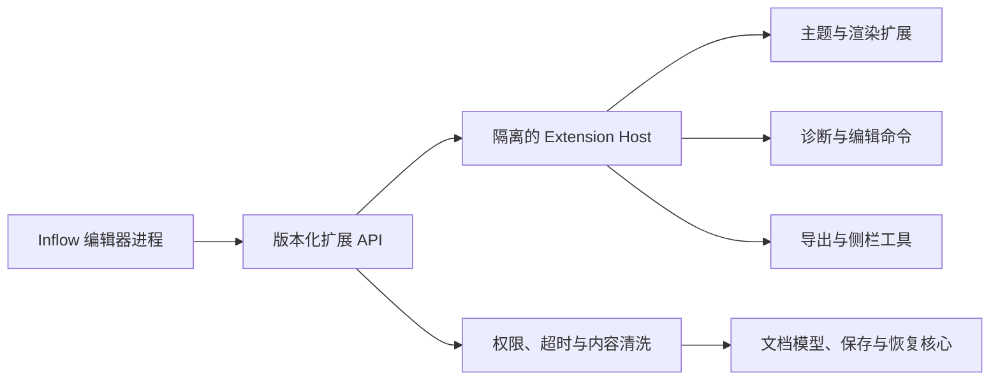

# Inflow 扩展能力规范

- 文档版本：v1.0
- 更新日期：2026-08-17
- 目标用户：熟悉 Swift、JavaScript 或 Web 技术的高级开发者
- 计划阶段：E1–E2 提供实验性 SDK，E5 稳定 API

完整技术架构、运行时、市场和同步设计见 [扩展系统总体设计](./SYSTEM_DESIGN.md)，长期生态与 AI 接入模型见 [Inflow 扩展生态战略](../../product/ECOSYSTEM_STRATEGY.md)，Markdown 扩展解析规则见 [Markdown 语法扩展设计](./SYNTAX_EXTENSION_API.md)。本文保留产品级能力边界和开发者接口摘要。

## 阅读指南

- 首先读取第 1–3 节，确认目标能力是否允许插件化。
- 确认可开放后，按类型读取第 2 节对应子章节。
- 权限、分发和开发体验分别读取第 6–8 节。
- 需要进程、API、市场或同步细节时再进入系统总体设计。

## 1. 目标

Inflow 的扩展系统用于让高级开发者适配专业写作场景，同时保持编辑器本体轻量、离线和可靠。

扩展系统必须满足：

1. 没有扩展时，Inflow 仍是功能完整的 Markdown 编辑器。
2. 扩展崩溃、超时或升级失败不能导致编辑器崩溃、内容丢失或无法保存。
3. 扩展默认没有文件、网络、剪贴板、进程执行或文档写入权限；网络只对经审核的连接器和远程 AI Provider 通过结构化 `network.services` Broker 授权。
4. 每项敏感能力必须在安装时声明，并在首次使用时由用户授权。
5. 扩展 API 版本化，旧扩展失效时提供明确原因，而不是静默异常。
6. Markdown 源码始终由 Inflow 核心持有，扩展通过受控事务提出修改。

## 2. 可扩展能力

### 2.1 主题扩展

- 提供编辑器配色、预览 CSS、代码配色和打印样式。
- 主题只能包含声明式资源，不允许 JavaScript。
- 导入前检查 CSS、字体和远程资源；远程资源默认拒绝。
- 主题异常时自动回退到内置主题。

这是风险最低的扩展类型，应当最先开放。

### 2.2 Markdown 语法与渲染扩展

- 注册新的围栏代码块语言，例如 `plantuml` 或领域专用图表。
- 注册块级或行内语法，但必须提供解析规则、源码范围和渲染结果。
- 渲染结果使用清洗后的 HTML/SVG 或受限视图描述，不能注入任意脚本。
- 必须提供纯文本降级结果，确保未安装扩展时文档仍可读。
- 扩展语法应使用明确命名空间或标准围栏，避免污染普通 Markdown。

首版扩展 API 不允许替换核心 CommonMark/GFM 解析器，只允许在明确扩展点增加能力。

### 2.3 文档诊断扩展

- 读取当前文档的只读语法树、标题、链接、资源及源码范围。
- 返回诊断级别、消息、源码位置和可选修复建议。
- 修复建议必须以文本差异提交，由用户确认并可撤销。
- 支持工作区级诊断，但只能访问用户明确授权的工作区。

适用场景包括写作规范、术语检查、Front Matter 校验和企业文档规则。

### 2.4 格式与编辑命令

- 在格式菜单、命令面板或编辑器上下文菜单注册命令。
- 命令接收选区和受限文档上下文，返回一组文本编辑操作。
- 所有文本编辑作为单个撤销事务执行。
- 扩展不能直接控制光标之外的 UI，也不能绕过只读或冲突状态。

适用场景包括自定义 Callout、引用格式、文本转换和专用模板插入。

### 2.5 导出扩展

- 接收当前文档的只读 Markdown、经过清洗的渲染树或临时资源包。
- 返回导出文件数据或在授权目录内写入单个结果。
- 用户必须从“导出”菜单主动调用，扩展不能后台自动导出。
- 网络导出、批量发布和持续集成不属于编辑器扩展；应由独立生态工具完成。

### 2.6 侧栏工具

- 可注册受限侧栏，例如术语表、引用管理或自定义大纲。
- 使用 Inflow 提供的声明式 UI 组件，不能嵌入任意网页。
- 只能在用户打开后运行，关闭侧栏后停止计算。
- 不能改变主窗口结构、覆盖编辑器或展示广告。

### 2.7 连接器扩展

连接器是独立于普通插件的高权限扩展类型，面向云存储、GitHub 等可选同步场景。它不是 Inflow 核心能力，只能由用户主动从可信插件市场安装。

- Inflow 永远先完成本地原子保存，再向连接器发布“已保存版本”事件。
- 连接器只能同步用户明确选择的文件或工作区，不能扫描其他目录。
- 连接器不得拦截 `⌘S`、延迟本地保存、修改恢复快照或把云端状态冒充成本地保存状态。
- 上传失败不影响本地文件，界面分别显示“已保存到本地”和“云端待同步/同步失败”。
- 下载远端变更后，连接器提交候选版本，由 Inflow 核心完成外部修改检查、差异展示和冲突解决。
- 连接器统一调用 `submitRemoteCandidate(baselineID, remote)`。双方修改但文本范围不重叠时，Core 可三方自动合并、通知用户并写入版本历史；重叠文本、删除、重命名和二进制冲突必须人工确认并保留候选版本。
- 卸载或停用连接器后，本地文档、附件和版本历史保持完整可用。

GitHub 连接器至少支持：选择仓库与分支、限定工作区子目录、拉取、提交和推送、提交信息模板、冲突预览。它不在编辑器内提供完整 Git 客户端，不包含分支管理、Rebase、Issue 或 Pull Request 工作台。

通用云存储连接器至少支持：授权文件夹、增量上传/下载、附件同步、删除保护、离线队列和冲突副本。若用户直接使用 iCloud Drive、Dropbox 等系统同步文件夹，Inflow 应继续按普通本地文件处理，不要求安装连接器。

## 3. 永不开放的核心能力

以下能力不提供插件钩子：

- 替换文件保存、原子写入、自动保存和冲突检测逻辑。
- 读取异常恢复快照或其他文档的未保存内容。
- 修改核心撤销栈、文件权限或安全作用域书签。
- 在编辑器进程内加载动态库或执行第三方原生代码。
- 拦截键盘输入、系统密码、全局剪贴板或其他应用内容。
- 静默联网、启动任意进程、执行 Shell 命令或安装其他软件；只有经审核的连接器和远程 AI Provider 可通过 Broker 访问清单声明的 HTTPS 域名。
- 替换内置安全清洗器或放宽预览 WebView 安全策略。
- 隐藏保存错误、诊断、权限提示或扩展身份。

CLI 明确不作为插件类型，也不会通过“终端扩展”进入编辑器。

## 4. 运行架构

- Inflow 主进程只维护 UI、文档模型、撤销、保存和恢复。
- 非主题扩展运行在独立 Extension Host 中，通过 XPC 或等价进程间通信调用。
- 一个扩展崩溃时优先只终止该扩展实例；连续崩溃后自动禁用。
- 每次调用设置时间、内存和输出大小限制。预览渲染可以取消，文本修改必须原子提交。
- 扩展返回的 HTML、SVG、CSS、文件路径和文本编辑必须由核心再次验证。

## 5. 扩展包

扩展包统一使用单文件 `.inflowx` ZIP；目录结构、Manifest Schema、内容哈希清单与签名算法只有 [系统设计第 5–6 节](./SYSTEM_DESIGN.md#5-扩展包格式) 一份规范。签名覆盖规范化文件哈希清单，签名目录自身不进入被签内容。

- `identifier` 全局唯一且安装后不可更改。
- `engines.extensionApi` 指定兼容的 Inflow 扩展 API。
- `contributes` 声明扩展点，未声明的能力不可调用。
- `permissions` 使用最小权限；安装界面用自然语言解释用途。
- 生产环境扩展需要开发者签名。开发者模式允许本地未签名扩展，但持续显示状态标识。

## 6. 权限模型

| 权限 | 默认 | 说明 |
| --- | --- | --- |
| `document.read` | 需授权 | 读取当前文档或结构化语法树 |
| `document.edit` | 需授权 | 提交可撤销的文本编辑事务 |
| `selection.read` | 需授权 | 读取当前选区 |
| `workspace.read` | 需授权 | 读取当前用户已授权工作区 |
| `export.write` | 每次确认 | 写入用户在保存面板选定的目标 |
| `clipboard.read` | 每次确认 | 只在用户触发命令后读取 |
| `network.services` | 仅审核连接器/远程 AI Provider 可申请 | 只允许 Broker 访问清单列出的 HTTPS 域名；安装及新增域名时单独确认 |
| `credentials.use` | 仅审核连接器/远程 AI Provider 可申请 | 凭据由 Inflow 本地应用写入 Keychain，Broker 代为使用；扩展不能读取或导出令牌 |
| `sync.workspace` | 仅审核连接器可申请 | 接收已保存版本并提交远端候选版本，不获得恢复快照 |
| `process.execute` | 永不开放 | 禁止执行命令或启动子进程 |

用户可以在“设置 > 扩展”查看、撤销权限、停用和卸载扩展。撤销权限立即终止相关任务。

## 7. 开发者体验

- 提供独立 Inflow Extension SDK、类型定义、示例和扩展校验工具。
- 开发者模式提供日志、性能、权限调用和渲染输出检查，但不显示用户文档恢复数据。
- 提供固定测试文档和无界面测试宿主，开发者无需访问 Inflow 私有实现。
- API 使用语义化版本。废弃接口至少保留一个稳定大版本，并提供迁移文档。
- 官方示例只覆盖安全、单一用途的扩展，避免示范“超级插件”。

## 8. 发布与安装

E1–E2 支持开发者模式包和本地签名低权限包。E3 市场只提供免费公开扩展，用户可匿名浏览安装，仅发布者需要账号；官方连接器和示例 AI Provider 在 E4 验证。第三方高权限扩展、付费、用户许可证账号和企业身份到 E5 才开放。

安装流程：

1. 校验包结构、签名、API 版本和危险资源。
2. 展示开发者、功能、权限和数据访问范围。
3. 用户确认后复制到应用容器中的扩展目录。
4. 在隔离宿主中首次启动，不要求重启编辑器。
5. 异常时回滚安装并保留可理解的错误日志。

扩展更新默认手动完成。未来的自动更新也必须显示权限变化；新增权限时必须重新授权。

## 9. 验收标准

1. 恶意或崩溃扩展不能导致当前文档内容丢失或原文件损坏。
2. 禁用所有扩展后，核心编辑、保存、恢复、预览和导出完全可用。
3. 未授权扩展无法读取当前文档、工作区、剪贴板或任意文件。
4. 任意扩展修改都能以一次 `⌘Z` 完整撤销。
5. 渲染扩展超时后只显示对应内容块的降级结果。
6. 卸载扩展不删除文档内容；专有语法仍以普通 Markdown 源码显示。
7. 普通扩展无法发起网络请求；所有扩展均无法执行 Shell 命令或加载进程内动态库。
8. API 版本不兼容时扩展不会启动，并显示具体兼容范围。
9. 除已授权连接器外，扩展无法发起网络请求；连接器无法访问未声明域名或未授权工作区。
10. 连接器离线、崩溃或认证失效时，本地保存和关闭文档仍正常完成。
11. 同步冲突不会静默覆盖任一版本，用户可查看差异并保留本地、远端或合并结果。

## 10. 推荐开放顺序

1. 主题扩展：声明式、低风险，验证安装与版本模型。
2. 诊断扩展：只读优先，验证源码范围和权限模型。
3. 格式命令：引入受控文本事务和撤销。
4. 围栏渲染：引入隔离渲染、超时和内容清洗。
5. 单篇导出与声明式侧栏：在安全模型稳定后开放。
6. 插件市场与连接器：账号、权限、审查、冲突模型和撤回机制成熟后最后开放。

不建议首批开放通用插件 API。先用少量明确扩展点建立边界，再根据真实开发者需求扩展。
