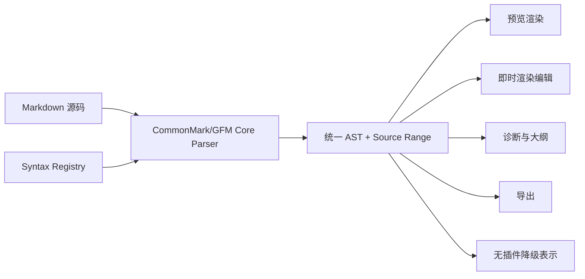

# Inflow Markdown 语法扩展设计

- 文档版本：v1.0
- 更新日期：2026-08-17
- 状态：扩展 API 设计基线

## 阅读指南

- 判断某种语法能否扩展：读取第 1–3、13–14 节。
- 实现 Parser/AST/Renderer：读取第 4–9 节。
- 实现编辑与诊断：读取第 7、10–12 节。
- 设计专业领域包或 LaTeX：直接读取第 16–17 节。

## 1. 目标

允许开发者通过插件增加 Markdown 语法，例如 PlantUML、提示块、定义列表、属性块、特定脚注、学术引用或领域专用组件，同时保证：

- CommonMark/GFM 核心语法始终稳定。
- 未安装插件时，源码仍然可读且不会丢失。
- 源码、预览、即时渲染编辑和导出使用同一语法树。
- 插件之间的语法冲突可检测、可解释、可关闭。
- 扩展崩溃或超时只影响对应节点。

## 2. 解析管线



Core Parser 仍由 Inflow 维护。扩展通过 Syntax Registry 注册明确的扩展点，不能提供另一个完整 Markdown Parser，也不能在解析前任意改写全文。

## 3. 语法扩展等级

### Level 1：围栏代码块

示例：

````markdown
```plantuml
Alice -> Bob: Hello
```
````

扩展注册语言标识、别名、渲染器和诊断器。围栏内容仍是标准 Markdown 代码块，未安装扩展时自然降级为源码，是最安全、最先开放的类型。

### Level 2：块级指令

建议使用明确、可降级的指令语法：

```markdown
:::warning 注意
这是警告内容。
:::
```

扩展声明指令名称、参数 Schema、是否允许嵌套 Markdown 和渲染节点。指令名必须包含注册命名空间或通过市场获得唯一名称。

### Level 3：标准扩展节点

包括定义列表、脚注变体、属性块、学术引用等。扩展只能从 Inflow 预先定义的标准扩展槽中选择，提供匹配规则和 AST 节点数据，不能改变核心标题、列表、链接或代码围栏的含义。

### Level 4：行内语法

示例可能包括高亮、变量、术语引用和自定义内联组件。行内语法最容易与强调、链接、代码和公式冲突，因此仅允许：

- 明确且非歧义的起止定界符。
- 有长度和回溯限制的声明式规则。
- 不覆盖核心 Markdown 定界符优先级。
- 提供转义、纯文本回退和序列化规则。

首个扩展 API 不开放任意正则表达式驱动的全文行内解析。

## 4. 注册清单

```json
{
  "contributes": {
    "syntax": [
      {
        "schemaVersion": 1,
        "id": "com.example.callout",
        "kind": "blockDirective",
        "names": ["example:callout"],
        "nodeType": "directiveBlock",
        "attributesSchema": "schemas/callout-attributes.schema.json",
        "fallback": "source",
        "capabilities": {
          "preview": true,
          "instantEditing": true,
          "export": true,
          "diagnostics": true
        }
      }
    ]
  }
}
```

`SyntaxContributionSchema v1` 的稳定协议等价于：

```ts
interface SyntaxContributionV1 {
  schemaVersion: 1;
  id: string;
  kind: "fencedBlock" | "blockDirective" | "standardNode" | "inlineDelimiter";
  names: string[];
  nodeType: "fence" | "directiveBlock" | "definition" | "reference" | "inlineComponent";
  attributesSchema: string;
  fallback: "source" | "innerMarkdown" | "codeFence";
  capabilities: { preview: boolean; instantEditing: boolean; export: boolean; diagnostics: boolean };
  references?: { defines?: string[]; uses?: string[]; namespace: string };
  conflicts?: string[];
}
```

每项扩展语法必须声明：

- 全局唯一 ID。
- 语法等级与定界符或指令名称。
- AST 节点 Schema。
- 源码回退策略。
- 支持预览、即时编辑、导出和诊断中的哪些能力。
- 与其他语法扩展的已知冲突。
- 引用定义或引用使用角色；所有 ID 解析必须交给 Core `ReferenceRegistry`。

## 5. 统一 AST

扩展节点使用受控结构：

```ts
interface ExtensionSyntaxNode {
  type: "extension";
  extensionId: string;
  syntaxId: string;
  sourceRange: Range;
  contentRange?: Range;
  attributes: Record<string, JSONValue>;
  children: SyntaxNode[];
  rawSourceHash: string;
}
```

- `sourceRange` 必须精确映射原文，用于点击定位、滚动同步和诊断。
- `attributes` 必须符合插件清单声明的 Schema。
- `children` 只能包含核心或已注册扩展节点。节点实例由 Core 按 `SyntaxContributionSchema v1` 创建和持有，扩展不能注入任意 AST 对象。
- AST 是只读派生数据，不能成为新的文档保存格式。

跨插件定义与引用统一进入 Core-owned `ReferenceRegistry`。Registry 以文档、命名空间、规范化 ID 和源码顺序建立索引，处理重复定义、未解析引用、跨扩展依赖、重命名诊断与导出锚点；扩展只能声明 node 的 `definesReference`/`usesReference` 字段，不能维护并行引用数据库或自行决定冲突优先级。

## 6. 渲染接口

扩展可以返回：

- 受限 HTML 片段。
- 受限 SVG。
- Inflow 声明式内容树。
- 渲染错误和源码诊断。

结果必须经过安全清洗，不允许脚本、事件属性、任意导航、远程资源或 WebView 权限提升。渲染超时后显示原始源码和错误，不阻塞其他内容。

同一个 AST 节点用于预览和导出，避免“编辑器中正常、导出后不同”。主题通过设计 Token 传入，扩展不能假设固定颜色。

## 7. 即时渲染编辑

要在 `⌘4` 即时渲染编辑模式中获得完整编辑体验，插件必须额外提供：

- 节点的可编辑字段 Schema。
- 字段到源码范围的映射。
- 字段修改后的确定性序列化结果。
- 插入、删除、复制和粘贴行为。
- 空节点与非法节点的显示方式。

未提供这些能力时，节点在即时渲染模式中显示为“源码块编辑器”，仍可编辑，但不会伪装成完整可视化组件。

扩展不能直接修改编辑器 View。所有更改仍通过版本化文本事务提交。

## 8. 冲突解决

### 8.1 注册冲突

- 两个扩展不能注册相同的全局语法 ID。
- 围栏语言别名重复时，用户选择默认处理扩展。
- 块级指令优先使用带命名空间名称，例如 `vendor:diagram`。
- 行内定界符与核心语法冲突时拒绝激活。

### 8.2 文档级启用

用户可以为整个应用或单个工作区启用语法扩展。文档可选使用 YAML Front Matter 声明推荐扩展：

```yaml
---
inflow:
  extensions:
    - com.example.callout@^1
---
```

该声明只是依赖提示，不能自动下载、安装、启用或授予权限。打开文档时，Inflow 可以提示缺少扩展，用户可忽略并继续查看源码。

### 8.3 确定性

相同源码、扩展版本、配置和主题必须产生相同 AST 与渲染结果。解析顺序由 Core 根据语法等级和稳定规则决定，插件安装顺序不能改变结果。

## 9. 兼容与降级

每种语法必须提供以下回退之一：

- `source`：显示完整原始源码。
- `codeBlock`：按普通围栏代码块显示。
- `children`：忽略容器，只渲染内部标准 Markdown。
- `plainText`：展示不带扩展效果的文本。

插件卸载、禁用、不兼容或崩溃不会删除扩展语法。源码仍按原样保存。

复制内容时默认复制原始 Markdown；用户可以选择复制渲染后的纯文本或 HTML。

## 10. 诊断与格式化

语法扩展可以提供：

- 未闭合定界符、非法参数和无效引用等诊断。
- 节点内部的补全候选。
- 格式化建议和安全修复。
- 大纲条目、符号和文档健康信息。

格式化只能返回文本差异，不能在保存时静默重写。自动格式化必须由用户在设置中明确开启，并作为可撤销事务执行。

## 11. API 示例

```ts
import { syntax } from "@inflow/extension-api";

export function activate() {
  syntax.registerFenceRenderer("plantuml", {
    async render(node, context) {
      return {
        kind: "svg",
        content: await renderPlantUML(node.content),
        sourceRange: node.sourceRange
      };
    },
    fallback: "codeBlock"
  });
}
```

示例中的 `renderPlantUML` 只能使用扩展包内代码和资源。P0–E4 禁止语法渲染扩展联网；E5 如重新评估，必须新增明确扩展类型和权限，不能复用连接器或 AI Provider 权限。

## 12. 性能限制

- 解析注册规则必须能在 Core 中以线性或近线性方式执行。
- 单个围栏渲染默认 2 秒超时。
- 行内规则禁止无界回溯。
- 语法节点数量、嵌套深度和输出大小有上限。
- 解析阶段不能为每个节点跨进程同步调用插件；Core 根据声明规则先构造节点，再异步调用渲染器。
- 结果按源码哈希、扩展版本、配置和主题缓存。

## 13. 安全边界

- 扩展不能替换核心 Parser。
- 扩展不能预处理或改写全文后再交给 Parser。
- 扩展不能改变已有核心节点含义。
- 扩展不能执行文档中携带的脚本。
- 语法参数不能被解释为文件路径、命令或任意 URL，除非另有明确权限。
- 原始 HTML、SVG 和 CSS 均再次清洗。

## 14. 开放顺序

1. 围栏代码块渲染。
2. 带命名空间的块级指令。
3. Inflow 预定义的标准扩展节点。
4. 具备确定性序列化的即时编辑组件。
5. 受限行内语法。

先不开放任意 Parser 插件、全文预处理器或自定义 Markdown 方言替换。

## 15. 验收标准

1. 未安装插件时扩展语法源码完整可读、可编辑、可保存。
2. 插件崩溃只影响对应扩展节点，其他文档继续渲染。
3. 扩展节点的预览点击定位和滚动同步准确。
4. 预览与导出使用相同 AST 和渲染结果。
5. 语法冲突在启用阶段被发现，并提供明确选择。
6. 插件安装顺序不影响解析结果。
7. 即时编辑修改能生成确定源码，并可一次撤销。
8. 恶意语法内容无法执行脚本、任意网络请求或文件访问。

## 16. 专业领域能力包

专业领域扩展通常同时需要多种贡献点。Domain Pack 只是市场元包，列出多个独立签名、独立版本和独立授权的子扩展；元包自身没有运行时代码或权限。安装时逐个展示子扩展权限与分发等级，用户可拒绝可选子项。

领域能力包示例：

- Academic Writing：LaTeX 数学、定理、证明、公式编号、交叉引用、BibTeX 引用和 `.tex` 导出。
- Scientific Notebook：单位、化学式、数据表、实验步骤和图表。
- Legal Writing：条款编号、定义引用、修订标记和引用格式检查。
- Product Documentation：API 引用、Callout、交互示例和文档站点方言检查。
- Publishing：脚注、旁注、题注、分页控制和出版社模板。

Domain Pack 不继承子扩展的最高权限，也不能代替子扩展授权；每个子扩展单独运行、撤权、更新和卸载。需要某子项才能工作的依赖必须在安装前明确，不能静默扩大权限。

## 17. LaTeX 能力包示例

### 17.1 能力分层

Inflow Core 继续内置基础 Markdown 数学：

```markdown
行内公式 $E = mc^2$

$$
\int_a^b f(x)\,dx
$$
```

LaTeX Domain Pack 在此基础上增加：

- 自定义宏和受支持的数学包。
- `equation`、`align`、`cases` 等环境。
- 公式自动编号、标签和 `\ref` / `\eqref` 交叉引用。
- theorem、lemma、proof、definition 等学术环境。
- BibTeX/BibLaTeX 引用和参考文献列表。
- LaTeX 语法诊断、命令补全和悬停说明。
- 将当前 Markdown 文档导出为 `.tex`。
- 可选的论文模板与 Front Matter 字段映射。

### 17.2 推荐 Markdown 表达

数学环境继续采用用户熟悉的 LaTeX 内容：

```markdown
:::equation {#eq:identity}
\begin{align}
  a^2 + b^2 &= c^2 \\ 
  e^{i\pi} + 1 &= 0
\end{align}
:::
```

学术结构使用可降级块级指令：

```markdown
:::theorem {#thm:pythagoras title="Pythagorean theorem"}
For a right triangle, $a^2 + b^2 = c^2$.
:::

As shown in @thm:pythagoras and @eq:identity, ...
```

编号公式使用可降级 `:::equation` 指令；Core 的 `$$` 数学仍严格要求开始/结束分隔符独占行且不携带属性。未安装插件时，公式和定理指令仍以可读源码或内部 Markdown 展示。

### 17.3 宏和包配置

宏可以保存在工作区设置或 YAML Front Matter 中：

```yaml
---
latex:
  macros:
    "\\R": "\\mathbb{R}"
    "\\vect": "\\mathbf{#1}"
  packages:
    - amsmath
    - amssymb
---
```

- 文档声明不能自动下载或执行 LaTeX 包。
- 插件只启用随扩展审核并内置的包白名单。
- 未支持的命令产生诊断，不尝试联网获取依赖。
- 宏展开有递归深度、输出长度和执行时间限制。

### 17.4 完整 LaTeX 片段

对于必须保留完整 LaTeX 的内容，使用围栏：

````markdown
```latex
\begin{tikzpicture}
  % ...
\end{tikzpicture}
```
````

插件可以在隔离 Host 中生成经清洗的 SVG 预览；PDF 只允许作为用户主动触发的导出结果。若插件不支持该环境，则按普通代码块显示。

### 17.5 安全限制

LaTeX 插件不得：

- 开启 `shell-escape` 或执行系统命令。
- 使用 `\input`、`\include` 任意读取磁盘文件。
- 使用 LaTeX 包访问网络或启动进程。
- 写入用户未通过保存面板选择的位置。
- 在主应用进程加载原生 TeX 动态库。

需要完整 TeX 引擎时，E2 仅允许系统设计 E2 已开放的纯 WebAssembly 内容引擎在独立、受限 Host 中运行审核过的固定包集合，并设置 CPU、内存、输出及编译时间上限。不得获得 WASI 文件、网络或进程能力；无法满足约束的 Full LaTeX Renderer 暂不支持。官方独立原生宿主如未来引入，必须另立安全 ADR 和发布阶段。

### 17.6 两种产品模式

- Enhanced Math：轻量模式，覆盖宏、常用环境、编号、引用和学术 Markdown，适合大多数用户。
- Full LaTeX Renderer：E2 仅作为随 Inflow 发布的官方签名 WASM 原型，体积更大并使用固定审核包集合；第三方安装最早在 E5 重新评估。

两种模式共享同一 AST 节点和引用系统，因此用户可以在不改写正文的情况下切换渲染能力。
