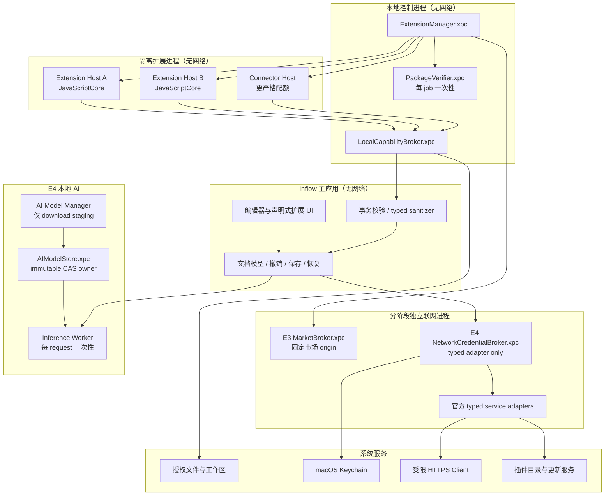
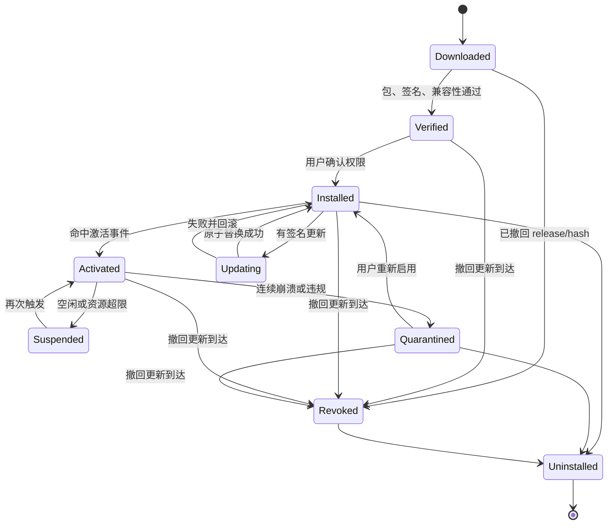
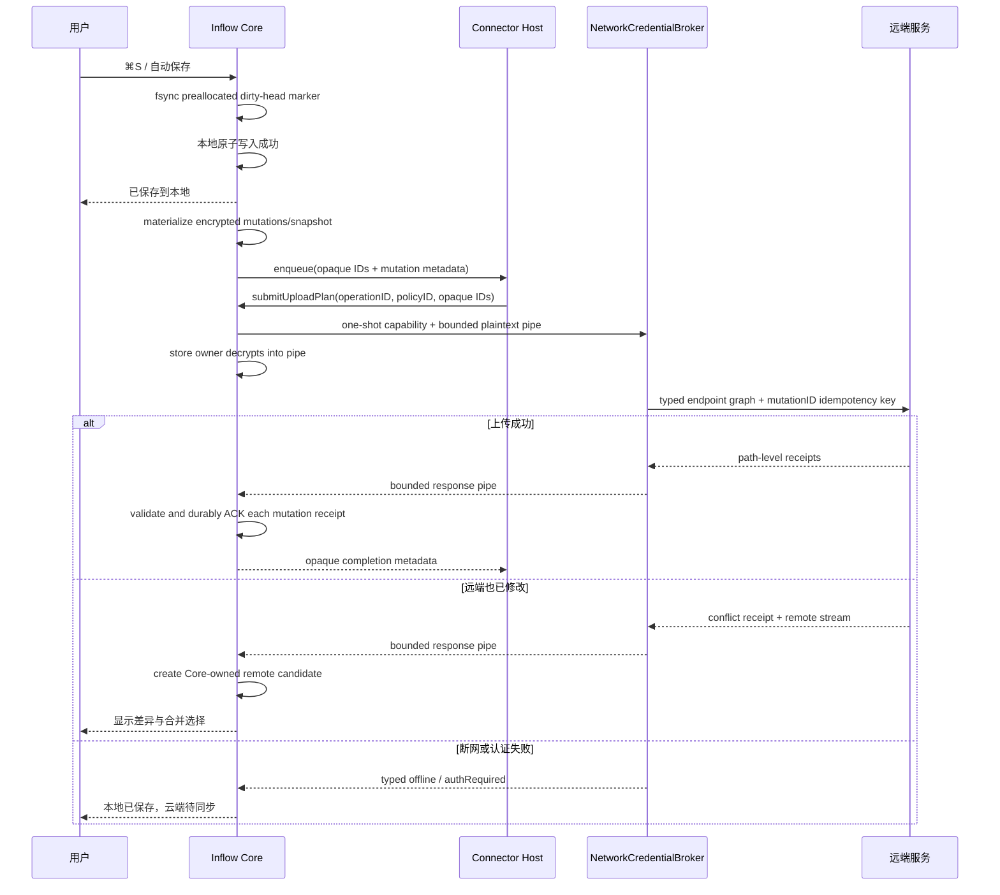

# Inflow 扩展系统总体设计

- 文档版本：v1.1
- 更新日期：2026-08-18
- 状态：Accepted（E1–E4 执行契约）
- 适用平台：Apple Silicon，macOS 14+
- 分发前提：Developer ID 签名、公证、非 Mac App Store

## 阅读指南

- 理解总体架构：读取第 1–4 节。
- 开发扩展：读取第 5–8、14 节。
- 实现平台运行时：读取第 3、7、9–11 节。
- 实现同步或 AI：读取第 12、12A 节。
- 实现市场和治理：读取第 13、16–20 节。
- 语法扩展的 Parser 细节不在本文展开，进入 [语法扩展设计](./SYNTAX_EXTENSION_API.md)。
- 阶段/target、IPC peer、Keychain 与 typed network 的机器权威分别是
  [Phase/Process Matrix](./PHASE_PROCESS_MATRIX.json)、[IPC Trust Matrix](./IPC_TRUST_MATRIX.json)、
  [全局 Keychain Policy](../KEYCHAIN_POLICY.json)、[生态 target 投影](./EXTENSION_KEYCHAIN_PROJECTION.json)
  与 [Typed Adapter Policies](./TYPED_ADAPTER_POLICIES.json)。

## 1. 系统定位

Inflow 扩展系统不是一个“允许插件控制一切”的 IDE 插件框架，而是一组受控扩展点。它的目标是让高级开发者增加专业写作能力，同时保证三个不可破坏的事实：

1. 本地 Markdown 文件是唯一事实来源。
2. 保存、撤销、恢复、冲突处理和安全策略始终属于 Inflow 核心。
3. 未安装、禁用或卸载所有扩展后，编辑器仍然完整可用。

扩展系统分为三个安全等级：

- 普通扩展：主题、诊断、格式命令、围栏渲染、单篇导出、声明式侧栏；默认无网络能力。
- 连接器扩展：云存储或 GitHub 同步；具备受审核、按域名和工作区授权的高权限能力。
- AI 扩展：模型提供商、AI 动作、上下文提供商和受控工具；数据范围、模型、费用及文档写入均需显式控制。

CLI、Shell 自动化、完整 Git 客户端、批量发布和持续集成不属于编辑器扩展。

## 2. 设计原则

### 2.1 最小内核

核心应用只提供稳定文档模型、UI 容器、扩展点、权限代理和生命周期管理。具体扩展不打包进核心；官方扩展和第三方扩展使用同一套公开 API，不保留私有万能接口。

### 2.2 进程外隔离

第三方可执行代码永不进入 Inflow 主进程。每个激活扩展运行在独立 Extension Host 进程中，崩溃只影响该扩展。

### 2.3 代理式权限

扩展不直接获得文件路径、网络套接字、Keychain 对象或系统进程能力。所有敏感操作都向 Inflow Capability Broker 请求，由 Broker 校验权限、用户手势、资源范围和调用预算后代为执行。

### 2.4 声明优先

菜单、设置、主题、侧栏和扩展贡献在清单中声明。只有确实需要计算的部分才运行代码，降低启动成本和攻击面。

### 2.5 源码可逆

扩展对文档的修改必须表示为带版本号的文本编辑事务。核心先检查范围、冲突和只读状态，再一次性提交到撤销栈；扩展无法直接持有或改写文本存储。

### 2.6 离线完整

普通扩展完全离线。连接器不可用时只影响远端同步，不能阻塞打开、编辑、保存、恢复、导出或关闭文档。

## 3. 总体架构



### 3.1 主应用

- 保有当前文档内容、文档版本号、撤销栈、文件协调器和恢复快照。
- 渲染扩展只返回 closed-world `ExtensionContentTreeV1`；Core 校验整棵树与 artifact handle 后才进入预览。
- 声明式 UI 由主应用原生渲染，扩展不能注入 AppKit/SwiftUI View。
- 主应用不等待扩展完成本地保存。

### 3.2 Extension Manager

- 负责发现、安装事务、签名/receipt policy、启用、停用、更新和卸载；不解析 ZIP、JSON、CSS、字体或 SVG。
- 根据激活事件为每个扩展创建一个专属 `ExtensionHostLauncherClient` 和新的 `NSXPCConnection`，从不复用 launcher/client、connection 或 Host；不在应用启动时加载所有扩展。
- 管理 API 兼容性、崩溃计数、隔离状态、权限和资源配额。
- 生成用户可见的扩展健康状态。
- 启动前先签发一次性 `LaunchTicket { extensionHandle, packagePayloadHash, signerClass, grantHash, endpointHash, launchNonce, expiresAt }`。Host hello 后 Manager 从 audit token 取得真实 PID/UID/session/designated requirement，才换发 connection-bound `LaunchCapability`；Capability 绑定上述字段、PID、audit-token digest、专属 endpoint 与 expiry，并在首次成功绑定后消费 Ticket。
- `extensionHandle` 是 Manager 随安装 generation 生成的 opaque runtime identity；Manifest `identifier` 只作已签名 metadata/展示，不进入请求 payload 充当授权身份。Host/Broker 从认证 peer context 取得 handle。
- 运行时必须证明 N 个 active extension handle 对应 N 个不同 PID 和 audit token；Host 拒绝第二个 handle/客户端绑定，同一 PID 出现两个 handle 时 Manager fail closed 并阻断里程碑。不能仅依赖 `NSXPCConnection` 的通常行为推断隔离。

### 3.2.1 一次性 PackageVerifier

每次安装/更新启动一个新的 `PackageVerifier.xpc` 进程，job 完成、超时或失败即终止整棵进程树。
Verifier 只有 source read-only FD、job-private 0700/noexec staging CAS 和只读 public trust snapshot；它
没有 Keychain、Trust Store、用户文档或最终安装目录权限。所有 ZIP、I-JSON/JCS、Schema、CSS、字体、
SVG、WASM import 与静态代码解析都在该 disposable target 内完成。

Verifier 不接收可重开的 source path。它按 FD identity 读包，把验证后的 payload 复制到 job-private
CAS，返回 closed-world `VerificationReceipt { jobID, sourceIdentity, casRootIdentity, packageSHA256,
contentManifestSHA256, payloadEntries[], scanPolicySHA256, trustSnapshotSHA256, issuedAt, expiresAt }` 及 CAS root FD。Manager 只验证 receipt
的 canonical Schema、authenticated XPC peer、single-use job capability、expiry/policy 与市场/本地
trust decision，并把 receipt hash 写入安装事务；Verifier 不持长期或临时签名 key。移动到版本目录前，Manager 通过 CAS root FD 对每个
entry 再算 size/hash 并与 receipt 精确比较，任何变化即丢弃整个 job。最终安装只使用该 FD tree
原子 materialize，不按 payload path 回到下载目录；Verifier 永远没有最终 move 权限。
这里 `expiresAt` 必须严格晚于 `issuedAt` 且 TTL 不超过 5 分钟；`payloadEntries`
必须与 content manifest 的 payload path 集合一一相等，空集、重复 path、缺失/多余 entry、
全零 SHA-256 或 source/CAS identity 不符都使整个 receipt 失效，不允许部分安装。

Receipt 的机器契约为
[`package-verification-receipt-v1.schema.json`](./schemas/package-verification-receipt-v1.schema.json)；
实现不得增加“兼容性”未知字段或用路径替代其中的 resource identity。

### 3.3 Extension Host

- 使用应用内置 JavaScriptCore 运行 ES Module。
- 一个激活扩展对应一个专属 client、connection 和独立 Host 进程；主题扩展无需 Host。
- 不暴露浏览器 DOM、Node.js、文件系统、网络、`eval`、动态模块下载或原生 FFI。
- 只暴露版本化的 `inflow` SDK 对象；底层通过 XPC 与 Broker 通信。
- Host 被终止后可以重建，扩展不得把关键状态只保存在内存。

选择 JavaScript/TypeScript 作为首个 SDK，是为了降低开发门槛并避免加载第三方原生代码。E2 增加审核 WebAssembly 内容引擎，但它使用相同权限代理，不能获得 WASI 文件、网络或进程能力。

#### 3.3.1 E2 WebAssembly 原型 Manifest

E2 仅加载随 Inflow 发布并由 Inflow 官方签名的模块。`runtime.modules[]` 必须声明 `path`、`sha256`、`imports`、`memoryMiB`、`cpuTimeoutMs`、`maxOutputBytes` 和 `readonlyResources[]`。安装器拒绝未声明导入、可变资源路径和超过 128 MiB 内存/2,000 ms CPU/2 MiB 输出的配置；Host 只映射清单内只读资源。模块对公共渲染 API 只能返回 `ExtensionContentTreeV1` 和结构化诊断。Domain Pack 若包含 SVG，必须是 `PackReleaseRecord`/component content manifest 中精确 hash 的只读 asset，由 Core 一次性 sanitizer/postflight 后签发 generation-bound artifact handle，再由 Content Tree 引用；Host 不返回任意 SVG 字节。第三方 WASM 在 E2 不可安装。

### 3.4 Capability Broker

Local Broker 是扩展本地敏感能力入口：

- 从已认证 peer context 取得 `extensionHandle`，校验 signer class、声明权限、grant generation、用户授权和当前用户手势；忽略并拒绝 payload 自报身份。
- 将 `document.read` 限定为当前文档快照，将 `workspace.read` 限定到授权根目录。
- Local Broker 无 Keychain access group 和 network entitlement；服务凭据只由 E4 `NetworkCredentialBroker.xpc` 的专属 access group 使用，令牌不返回 Host/Core。
- E3 `MarketBroker.xpc` 只访问固定市场 origin；E4 `NetworkCredentialBroker.xpc` 只执行已在 [Typed Adapter Policies](./TYPED_ADAPTER_POLICIES.json) 声明的 endpoint graph。不接受扩展提供 URL/method/header；未声明 adapter 默认 disabled。
- 记录敏感调用审计事件，供用户在设置中查看。

所有 listener 必须执行 [IPC Trust Matrix](./IPC_TRUST_MATRIX.json)：designated requirement、Team/
bundle ID、audit token、UID/session、connection challenge、canonical body hash、expiry 和 replay cache。
消息使用 closed-world canonical CBOR envelope，未知字段拒绝；`requestID` 或 TLS 本身不能替代 nonce/
sequence。任何 listener 都不得从 body 中的 `extensionID`、PID、UID 或 audit token 声明授权。

E5 若开放通用 `NetworkServicePolicy`，必须先冻结端口 allowlist、拒绝 loopback/private/link-local/multicast/Unix socket、每次 DNS 解析后 IP 分类、连接时 re-resolve/绑定、防 DNS rebinding、系统/自定义 proxy 规则、逐跳重定向重新授权、跨 origin 清除 Authorization/cookie、TLS/响应/解压预算和 SSRF corpus。在此之前清单域名不能直接变成通用 HTTP 能力。

## 4. 扩展类型

| 类型 | 是否执行代码 | 可修改文档 | 网络 | 分发要求 |
| --- | --- | --- | --- | --- |
| 主题 | 否 | 否 | 否 | 本地签名或市场 |
| 诊断 | 是 | 仅经确认修复 | 否 | 本地签名或市场 |
| 编辑命令 | 是 | 是，可撤销 | 否 | 本地签名或市场 |
| 围栏/语法渲染 | 是 | 否 | 否 | 市场；开发模式可侧载 |
| 单篇导出 | 是 | 否 | 否 | 市场；开发模式可侧载 |
| 声明式侧栏 | 是 | 通过事务 | 否 | 市场；开发模式可侧载 |
| 同步连接器 | 是 | 只能提交远端候选版本 | 受限 | 仅官方市场 |
| AI Model Provider | 是 | 否 | AI Companion 能力通道或受限 HTTPS | E4 仅独立签名、公证的官方 Inflow AI Companion/示例远程 Provider；第三方到 E5 |
| AI Action / Context | 是 | 通过建议事务 | 由 Provider 负责 | 市场；低权限版本可开发模式测试 |
| AI Tool | 是 | 通过确认事务 | 不直接开放 | 仅市场，高权限审核 |

### 4.1 主题

E1 主题只提交 closed Schema 的 design token 值和有限色值/代码配色枚举；Core 把这些值编译进内置
编辑器、预览与打印模板。E1 包不接受 CSS 字节、字体、图片、URL、`@import` 或 JavaScript，未知
token/值直接拒绝，主题损坏时回退内置主题。未来 P2 受限主题包必须另有机器 `ThemePolicy`、隔离字体
解码和负面 corpus；在该 Policy Accepted 前，不能把“主题扩展”解释为任意 CSS 导入。

### 4.2 诊断

接收只读文档快照或增量语法树，返回诊断、源码范围和可选修复。修复先显示差异，提交为单一撤销事务。

### 4.3 编辑命令

在格式菜单、命令面板或上下文菜单注册命令。命令接收选区和只读上下文，返回 `TextEdit[]`，不能直接操作视图和光标事件。

### 4.4 围栏与语法渲染

E2 stable v1 只开放 Core CommonMark 围栏代码块与带命名空间的 block directive。公共 Host 只能返回
[`ExtensionContentTreeV1`](./schemas/extension-content-tree-v1.schema.json) 和结构化诊断，并必须提供
源码/纯文本降级；HTML、SVG、CSS、URL 和路径不属于返回 Schema，直接拒绝。预定义扩展节点和行内
语法属于 v2/Experimental；完整 EBNF、优先级、引用和降级规则见
[Markdown 语法扩展设计](./SYNTAX_EXTENSION_API.md)。

### 4.5 单篇导出

接收当前文档快照和经过授权的资源包，输出一个文件或文件包。只能由用户主动执行，不能监听保存后自动导出。

### 4.6 声明式侧栏

侧栏由 Inflow 原生组件渲染，支持列表、树、文本、图标、按钮、选择器和进度状态。扩展不能嵌入任意网页、广告或覆盖编辑器。

### 4.7 同步连接器

连接器只消费核心产生的“已保存版本”，并向核心提交“远端候选版本”。它不直接改写当前文档。

### 4.8 AI 扩展

AI 不是单一聊天插件，而是分成 Model Provider、AI Action、Context Provider 和 AI Tool。远程 Provider 使用与连接器相同的限域网络代理和 Keychain 凭据模型；模型输出只能成为建议、差异或版本化文本事务，不能直接覆盖正文。完整模型见 [Inflow 扩展生态战略](../../product/ECOSYSTEM_STRATEGY.md)。

## 5. 扩展包格式

文件扩展名为 `.inflowx`，内容为可重复构建的 ZIP：

```text
com.example.terminology.inflowx
├── manifest.json
├── README.md
├── CHANGELOG.md
├── LICENSE
├── icon.png
├── dist/
│   ├── main.js
│   └── main.js.map
├── resources/
│   └── rules.json
├── locales/
│   ├── en.json
│   └── zh-Hans.json
└── META-INF/
    ├── content-manifest.json
    └── signatures/
        ├── developer.sig
        └── market.sig
```

包要求：

- `PackagePolicy v1`：ZIP 最大 50 MiB、解压总量 200 MiB、5,000 entries、单文件 50 MiB、压缩比 100:1、路径 UTF-8 字节 ≤512、层级 ≤20。拒绝 encrypted/data-descriptor ambiguity、重复 ZIP entry、absolute/`..`/NUL、symlink/hardlink/device、NFC 或 Unicode casefold 后重复路径。
- JSON 必须是 UTF-8、无 BOM、I-JSON 子集，拒绝重复 key/NaN/Infinity；签名输入使用 RFC 8785 JCS canonicalization。ZIP 字节本身不作为签名事实来源。
- 所有安全/运行 JSON（Manifest、content manifest、签名 envelope、release/pack record、权限、runtime module）均为 closed-world Schema：`additionalProperties/unevaluatedProperties=false`，未知字段、enum、version 和重复字段一律拒绝，不再区分“未知关键/非关键字段”。唯一可前向保留的位置是显式 `metadata.extensions` map；key 必须是 `x-<reverse-domain>`，总计 ≤16 KiB，仅允许 I-JSON 展示 metadata，仍进入签名，但不得影响代码、权限、路径、URL、hash、依赖、激活或更新。
- 发布包不允许动态依赖；所有运行时代码必须在包内。
- `content-manifest.json` 使用规范 JSON，按 UTF-8 路径字典序列出 payload 文件的路径、字节数和 SHA-256；`META-INF/content-manifest.json` 自身及 `META-INF/signatures/` 不进入列表，签名直接覆盖规范 JSON 字节。安装器只允许“清单逐项列出的 payload + 精确已知的 `META-INF/content-manifest.json`、`META-INF/signatures/developer.sig` 及市场路径下的 `market.sig`”，任何未知 ZIP entry、目录占位、签名文件或尾随数据均拒绝，从而避免摘要自引用与 parser differential。
- 三类安装路径：开发包可无签名且只在持续标识的开发者模式加载；E1 本地签名包使用本地自签发布者证书，首次安装展示 SHA-256 公钥指纹、包 ID 与权限并要求用户确认，后续更新必须由同一密钥签名，密钥变化视为新发布者重新确认，且只允许低权限能力；市场包必须同时含平台认证的开发者签名和市场签名，高权限能力还需类型审核。市场添加 `market.sig` 不改变 payload 哈希或开发者签名。
- 以上解析全部由 3.2.1 的 disposable `PackageVerifier` 完成。Manager 只消费 closed receipt、做 trust decision，并在最终 materialize 前从 private CAS FD tree 重算全部 hash；任何 source/CAS identity 变化都不是“重试”，而是创建新 job。

## 6. Manifest

```json
{
  "manifestVersion": 1,
  "identifier": "com.example.terminology",
  "name": "Terminology Checker",
  "version": "1.2.0",
  "publisher": "example",
  "engines": {
    "inflow": ">=2.0.0 <3.0.0",
    "extensionApi": "^1.1"
  },
  "runtime": {
    "entry": "dist/main.js",
    "type": "javascript"
  },
  "activationEvents": [
    "onLanguage:markdown",
    "onCommand:terminology.check"
  ],
  "contributes": {
    "commands": [
      {
        "id": "terminology.check",
        "title": "Check Terminology"
      }
    ],
    "diagnostics": ["terminology"],
    "syntax": []
  },
  "permissions": [
    "document.read",
    "selection.read"
  ]
}
```

### 6.1 标识和版本

- `identifier` 使用反向域名，全局唯一，发布后不可更换。
- `identifier` 只用于包/市场命名和展示；runtime authority 是 Manager 签发、peer-bound 的 opaque `extensionHandle`，SDK 请求不得携带 `extensionID` 选择身份。
- 扩展和 API 使用语义化版本。
- `engines` 必须给出兼容范围；不兼容扩展不启动。

### 6.2 激活事件

允许：

- `onCommand:<id>`
- `onFence:<language>`
- `onView:<id>`
- `onLanguage:markdown`
- `onWorkspaceOpen`
- `onConnectorSync`

禁止 `onAppLaunch` 和无限制后台激活。工作区激活也只在用户打开已授权工作区后发生。

### 6.3 贡献点

清单可声明 `themes`、`commands`、`diagnostics`、版本化 `syntax`、`fenceRenderers`、`exporters`、`views`、`settings`、`connector`、`aiProvider`、`aiActions`、`contextProviders` 和 `aiTools`。稳定 `SyntaxContributionSchema v1` 只允许 fenced block 与 block directive，完整字段和 fallback 以语法 API 为准；standard node/inline delimiter 为 Experimental，不得进入市场 v1 包。未声明的贡献点不能动态添加。

扩展不能把自定义对象直接插入 Core AST。Parser 只从版本化 Schema 选择 Core-owned `ExtensionSyntaxNode` 变体，并把定义/引用统一登记到 Core `ReferenceRegistry`；Registry 负责命名空间、重复 ID、跨扩展解析、诊断和导出锚点，插件只能提交声明和渲染结果。

## 7. API 模型

### 7.1 通信协议

- Extension Host 与 Broker 使用 XPC 传输具名消息。
- SDK 对开发者暴露 Promise API；wire 使用 closed-world Schema 的 canonical CBOR，不接受多态对象或宽松 Codable fallback。
- 每个请求完整 envelope 为 `{ protocolVersion, requestID, method, deadlineUnixMillis, connectionNonce, sequence, bodySHA256, body }`；listener 验证 canonical envelope hash、严格递增且未使用的 sequence、deadline 与 replay cache。取消是同一连接上的具名、已认证请求，不是可伪造的 body flag。
- `extensionID`、PID、UID、audit token 等自报身份字段在 body 中禁止并按未知字段拒绝。授权身份只来自 audit-token/designated-requirement 验证后的 peer context 与 connection-bound `LaunchCapability`；业务若需指向扩展，使用 Broker 签发、scope-bound 的 opaque handle。
- 大文档不重复传整份文本；使用只读快照句柄和分块读取。
- 主应用不会接受扩展提供的对象引用、闭包或原生句柄。

所有 target/peer/method capability 的允许边见 [IPC_TRUST_MATRIX.json](./IPC_TRUST_MATRIX.json)。新增 listener
或 peer 必须先提升其 `matrixVersion`；未登记 edge 即使双方同 Team ID 也拒绝。

### 7.2 文档快照

```ts
interface DocumentSnapshot {
  documentId: string;
  version: number;
  language: "markdown";
  uri?: ScopedURI;
  getText(range?: Range): Promise<string>;
  getSyntaxTree(options?: TreeOptions): Promise<SyntaxNode[]>;
}
```

快照不可变。扩展完成计算前文档可能继续编辑，因此提交修改时必须携带原始 `version`。

### 7.3 文本事务

```ts
interface WorkspaceEdit {
  documentId: string;
  baseVersion: number;
  label: string;
  edits: TextEdit[];
}

const result = await inflow.documents.applyEdit(edit);
```

核心校验：

- 文档仍然存在且可写。
- `baseVersion` 与当前版本一致；否则返回 `staleDocument`。
- 编辑范围合法、排序稳定且不重叠。
- 修改量未超过单次预算。
- 用户仍授权 `document.edit`。

成功后作为一次撤销操作执行。失败时不应用任何部分修改。

### 7.4 诊断

诊断包含稳定规则 ID、严重性、消息、源码范围、说明链接和可选修复 ID。Inflow 负责去重、展示、过滤和定位，扩展不能自行绘制波浪线。

### 7.5 UI

扩展返回声明式 View Model：

- `Text`、`Icon`、`Button`、`List`、`Tree`、`Progress`、`EmptyState`。
- 用户操作产生带 View ID 的事件，再传回 Host。
- 主应用控制字体、颜色、焦点、VoiceOver 和键盘导航。
- 扩展不能提交任意 HTML 作为侧栏 UI。

## 8. 权限系统

### 8.1 权限分组

| 权限 | 授权粒度 | 用户确认 |
| --- | --- | --- |
| `document.read` | 当前打开文档 | 安装时 |
| `selection.read` | 当前选区 | 安装时 |
| `document.edit` | 当前文档事务 | 安装时，可随时撤销 |
| `workspace.read` | 指定工作区 | 每个工作区首次使用 |
| `workspace.resources` | 指定工作区附件 | 每个工作区首次使用 |
| `clipboard.read` | 单次用户操作 | 每次 |
| `export.write` | 保存面板选择的目标 | 每次 |
| `network.services` | 仅受审连接器/远程 AI Provider 的清单 HTTPS 域名 | 安装时与域名变更时 |
| `credentials.use` | 指定服务账号 | 登录与首次使用时 |
| `sync.workspace` | 指定工作区 | 每个同步配置 |
| `ai.context.selection` | 当前选区 | 每次 Action 或会话授权 |
| `ai.context.document` | 当前文档 | 每次文档或会话授权 |
| `ai.context.workspace` | 用户选择的文件 | 每次任务明确选择 |
| `ai.provider.invoke` | 指定 Provider 与模型 | 首次使用及模型变化时 |
| `ai.tools.propose` | 清单声明的工具 | 安装时；执行副作用时再次确认 |

### 8.2 永不授予

- 任意文件系统访问。
- 任意网络主机或本地网络扫描。
- Shell、子进程、AppleScript、Accessibility 控制。
- 恢复快照、其他应用数据、浏览器 Cookie。
- 导出 Keychain 凭据。
- 加载动态库或运行未打包代码。

### 8.3 权限提示

权限提示必须说明“读取什么、为什么、何时发生、能否关闭”。禁止只显示内部权限名。新增权限的扩展更新必须重新确认；拒绝后保留旧版本或停用扩展。

### 8.4 审计

设置中的“扩展活动”展示最近 30 天的敏感事件：访问工作区、修改文档、导出文件、连接域名、同步上传、凭据失效和权限拒绝。正文和令牌不写入日志。

## 9. 生命周期



### 9.1 安装

1. 下载到隔离临时目录。
2. 验证包结构、内容哈希清单，以及安装路径要求的签名：开发者模式可无签名，本地签名包验开发者签名，市场包验双签名；同时检查撤回状态、API 和系统版本。
3. 静态扫描代码和资源，检查禁用语法、远程依赖和危险内容。
4. 展示贡献点、权限、发布者和数据去向。
5. 用户确认后原子移动到版本目录。
6. 不立即启动，等待激活事件。

### 9.2 激活与停用

- 命令型扩展在用户调用时激活。
- 渲染扩展只在文档出现对应围栏时激活。
- 侧栏扩展只在用户打开侧栏时激活。
- 普通扩展无任务 60 秒后挂起；连接器按同步队列短时运行。
- 退出应用时给扩展最多 2 秒清理非关键缓存，但不等待其保存内容。

### 9.3 更新与回滚

- 更新下载到新版本目录，验证后切换 `current` 指针。
- 旧版本至少保留一次成功启动周期。
- 新版本连续崩溃或迁移失败时自动回滚。
- 权限扩大、发布者变化或签名异常不允许自动更新。

### 9.4 隔离

以下情况自动隔离：

- 10 分钟内崩溃 3 次。
- 连续 5 次超时。
- 输出超过限制或重复提交非法事务。
- 尝试访问未声明能力。

隔离不会卸载扩展或删除其数据，用户可查看原因、导出诊断并选择重新启用。

### 9.5 Revoked 终态

`Revoked` 与可恢复的 `Quarantined` 分开存储。匹配已验签 revocation 的 exact package hash、developer
certificate 或 release sequence 时，Manager 立即撤销 LaunchCapability、终止 Host、crypto-erase
其 extension State，并把该 release 置为不可覆盖终态；UI 不提供“仍然启用/重新信任”。离线时使用
最高已验签 revocation sequence，绝不接受回滚。只有安装 sequence 更高、hash 不同且未撤回的新
`MarketReleaseRecord` 才能恢复该 package ID；它是一次新安装/权限确认，不把旧 release 从 Revoked
改回 Installed。安全撤回不删除用户 Markdown 或 Core-owned 标准导出。

## 10. 资源与性能预算

| 资源 | 普通扩展默认 | 连接器默认 |
| --- | --- | --- |
| Host 内存 | 128 MB | 192 MB |
| 单次前台调用 | 2 秒 | 10 秒 |
| 后台任务 | 不允许 | 单次 60 秒，可续约 |
| 单次返回负载 | 4 MB | 8 MB |
| 持久化状态 | E1/E2 仅 64 KiB declared scalar preferences | 连接器/Provider 无任意 State；只持 opaque operation/session ID |
| 日志 | 5 MB 结构化循环 | 仅 Core-owned 结构化 event ID/计数/错误码，无自由文本和 payload |

围栏渲染和导出可申请长任务令牌，必须显示进度并支持取消。资源限制先节流，再终止 Host；永不阻塞主应用输入线程。

## 11. 状态与数据存储

- `Extension Preferences/State`：E1/E2 只允许 Manifest closed Schema 声明的 boolean、bounded number、enum 或 ≤256 字节的 bounded preference string，总规范编码 ≤64 KiB；禁止自由字符串、array/object/blob、文档派生正文、路径、bookmark、hash、选区或渲染结果。Core 按 installed package + grant generation 隔离并全记录 AEAD 加密，扩展只经 typed getter/setter 访问。
- `Cache`：E1/E2 公共扩展没有持久 cache。Core 自有、含内容的 cache 必须分域加密且可随时删除；Host 内存 cache 随进程终止。
- `Credentials`：服务凭据只存在对应最小 Keychain access group；Host 仅获得 operation-bound opaque Credential ID，Local Broker/Core 不读取 token。
- `Sync Metadata`：文件版本、远端 ETag、提交 SHA、待上传 operation 队列。Core 为每个待上传操作保存加密、不可变的 pending snapshot（正文、资源清单和内容 hash）；扩展只能持有 opaque operation/snapshot/baseline ID，其他正文缓存禁止。

全局机器权威见 [工程 Keychain Policy](../KEYCHAIN_POLICY.json)，本目录
[生态 target 投影](./EXTENSION_KEYCHAIN_PROJECTION.json) 只把该权威映射到具体 target/access group，
不得定义第二套 key lifecycle：Recovery、Workspace Index、Sync、AI session 与 Extension
State 使用不同 KEK；workspace/session/package 使用 wrapped DEK；Workspace Index 使用 `workspace-index-kek` 包装 workspace/authorization-generation 范围 DEK，Recovery journal 的 body、bookmark、
path、hash、window state 和 metadata 作为完整 AEAD record 加密。每个 target 只能声明 Policy 列出的
最小 access group，wildcard/shared Core-Broker group 禁止。

卸载、`Revoked`、document/workspace 权限撤销时立即删除对应 Extension State 密文并 crypto-erase
DEK；同步解绑/Provider 卸载按各域 trigger 删除。不得以“便于重装”为由保留内容类或 grant-bound state。

## 12. 同步连接器设计

### 12.1 数据流



### 12.2 状态机

每个同步工作区拥有独立状态：

- `local-only`：未配置连接器。
- `idle`：本地与远端一致。
- `pending-upload`：本地已保存，等待上传。
- `pending-download`：发现远端新版本，等待核心处理。
- `syncing`：正在传输。
- `conflict`：双方从同一基线产生修改。
- `auth-required`：凭据失效。
- `offline`：网络不可用，队列保留。
- `paused`：用户暂停。
- `error`：非瞬时错误，需要用户操作。

窗口标题只显示本地保存状态；同步状态使用独立图标和文字，不能混为一个“已保存”指示。

每次待同步状态使用 Core-owned `SyncOperation { operationID, snapshotID, baselineID, saveGeneration,
mutations[] }`。每项 mutation 是 closed discriminated schema：

```ts
type RevisionCondition =
  | { kind: "absent" }
  | { kind: "exactRevision"; revision: string };

type SyncMutation =
  | { mutationID: string; kind: "put"; oldPath?: string; newPath: string;
      resourceID: string; contentHash: string; byteCount: number; condition: RevisionCondition }
  | { mutationID: string; kind: "delete"; oldPath: string; newPath?: never;
      resourceID: string; condition: { kind: "exactRevision"; revision: string } }
  | { mutationID: string; kind: "move"; oldPath: string; newPath: string;
      resourceID: string; contentHash: string; condition: { kind: "exactRevision"; revision: string } };

interface SyncOperation {
  schemaVersion: 1;
  kind: "syncOperation";
  operationID: string;
  snapshotID: string;
  baselineID: string;
  saveGeneration: number;
  mutations: SyncMutation[];
}
```

`SyncOperation`、mutation、receipt envelope 和 dirty intent 的唯一 wire/store Schema 为
[`sync-protocol-v1.schema.json`](./schemas/sync-protocol-v1.schema.json)；上面的 TypeScript 只是可读投影。

`mutationID` 是远端 idempotency key；重复请求必须返回同一 receipt，不得二次执行 delete/move。路径是
Core 规范化的 workspace-relative UTF-8 path；Broker 不接受 connector 拼接 URL。未开始上传的同一路径
可 latest-only 合并，但已 in-flight mutation 保留到精确 receipt。

Core/store owner 持有 Sync KEK 并解密 pending snapshot/resource，经 nonce-bound、authenticated、
single-use pipe 按 operation byte/time budget 流给 `NetworkCredentialBroker`；Broker 无文件权限、无 Sync
KEK、不能打开 pending store。响应也经独立 one-shot pipe 直接进入 Core 限额 sink。Connector 只提交
`UploadPlan { operationID, policyID, expectedPolicyHash, mutationIDs, opaqueAccountHandle }`，读取结构化
status/error/opaque resume token，不能直接接触 plaintext、写 State/Cache 或使用自由日志。

ACK 是路径/Mutation 级：

```ts
interface SyncReceiptEnvelope {
  schemaVersion: 1;
  kind: "syncReceiptEnvelope";
  operationID: string;
  snapshotID: string;
  policyHash: string;
  receipts: Array<{
    mutationID: string;
    status: "applied" | "alreadyApplied" | "conflict" | "rejected";
    oldPath?: string;
    newPath?: string;
    remoteRevision?: string;
    remoteContentHash?: string;
    idempotencyReceipt: string;
  }>;
}
```

Core 校验 operation/snapshot/policy/mutation/path/condition 后，先 durable 写 receipt 再逐项清除已 ACK
payload；`conflict/rejected` 不视为成功，operation 未全部 `applied/alreadyApplied` 前不得整份清除。同
hash 不同路径仍是不同 mutation。Envelope 必须对当次请求的每个 `mutationID`
恰好返回一个 receipt；重复、缺失、额外 ID，或 ID 对应的 old/new path 与已冻结 mutation
不一致时，Core 原子拒绝整个 envelope，不用其中的“成功”子集清除 payload。

磁盘压力下，历史 quota 不能吞掉同步脏事实。每个已授权 workspace 预分配、排除 1 GiB/1,000
operation 历史配额的加密 fixed-size `dirty-head` slot；本地保存前先 fsync
`{workspaceHandle, saveGeneration, state: rescanRequired}`，保存失败则按 generation 对账丢弃，保存成功
后再 materialize 完整 mutations。若 snapshot 因磁盘满无法 materialize，保留/合并 dirty-head、暂停
同步并显著提示，重启或空间恢复后 Core 全量 rescan 授权 workspace 与 baseline 重建 mutation。极端 I/O
故障导致 slot 也不能写时仍允许本地保存，但必须把同步标为 `durability-failed` 且持续提示，绝不显示
idle。默认历史 quota 仍为每工作区 1 GiB/1,000 operations、全应用 5 GiB。

### 12.3 冲突策略

- 不允许无提示的 last-write-wins。
- 文本冲突由核心三方合并：共同基线、本地版本、远端版本。
- 共同基线由 Core 在每次同步成功后保存为按工作区密钥加密的只读快照，连接器只能通过 opaque baseline ID 请求合并，不能直接读取基线正文。基线保留到下一次同步成功后 30 天，或工作区解除同步/用户清除同步数据时立即删除；容量计入工作区同步缓存配额。
- Connector 只能调用 `submitRemoteCandidate(baselineID, remote)`，Core 校验 baseline 所属工作区和候选版本。
- 非重叠文本修改可自动三方合并，完成后通知用户并写入本地版本历史；重叠文本、删除、重命名和二进制冲突必须生成临时候选并人工确认。
- 用户可选择合并、保留本地、保留远端或另存两份。
- 图片等二进制资源冲突默认保留两份并重命名，不能猜测合并。

### 12.4 GitHub 连接器

- 使用 OAuth Device Flow 或系统浏览器授权；令牌进入 Keychain。
- 权限尽量限定到用户选择的仓库。
- 记录基线 commit SHA，推送前使用条件检查。
- 一次同步形成一个可预览提交；默认不自动 Force Push。
- 支持选择分支和工作区子目录，但不提供 Rebase、Issue、PR 或完整 Git 工作台。
- 大文件和附件在安装时明确 GitHub 限制；Git LFS 不作为首版能力。

### 12.5 通用云存储连接器

- 使用服务端版本号或 ETag 做条件写入。
- 支持增量队列、删除墓碑、附件目录和恢复删除。
- 本地删除默认进入远端回收站或延迟删除，不立即永久删除。
- 连接器无法提供版本条件写入时，不得宣称支持安全双向同步，只能提供单向备份模式。

### 12.6 E4 Typed Adapter Network Policy

[TYPED_ADAPTER_POLICIES.json](./TYPED_ADAPTER_POLICIES.json) 是 E4 唯一网络 allowlist，Schema 为
[`typed-adapter-policy-v1`](./schemas/typed-adapter-policy-v1.schema.json)。每个发布 adapter 必须冻结
`adapterID/version → operations → endpointID graph`，以及每 endpoint 的 exact HTTPS origin:443、path
template、method、content type 和 credential scope；正文/远端数据不能提供或覆盖这些值。当前只声明
GitHub sync v1；云存储与远程 AI 在各自 concrete service policy 加入并经 CI/corpus 前均为 disabled，
不能用“官方 adapter”或 Manifest domain 作为通用豁免。

每个 policy 同时冻结：每连接 DNS resolve、A/AAAA 分类与最大答案数、连接到 TLS 完成期间的 IP
binding、TLS 最低版本/system trust/hostname、上传/压缩响应/解压后/ratio/时长/请求数预算、redirect
最大跳数与逐跳 edge。任一跳跨 origin 时先清除 credential/cookie，再按目标 endpoint credential
scope 重新决定；未声明 edge 拒绝。服务端返回 URL 永不直接跟随，只允许 policy 把特定响应字段映射
到既有 endpointID，再以 typed identifiers 重新构造 path；GitHub v1 显式禁止所有 redirect 和 server-
returned URL follow。DNS 命中 unspecified/loopback/private/link-local/multicast/CGNAT/documentation/
benchmark/reserved 或 Unix socket 时拒绝，IPv4-mapped IPv6 先归一化再分类。

Policy JSON、实现的路由表和 release 内 hash 必须一致。测试覆盖 DNS rebinding、双栈答案变化、逐跳
redirect、credential stripping、chunked/错误 Content-Length、gzip/br bomb、慢响应、服务端 URL 注入、
Unicode/path placeholder 注入和 request cancellation。

## 12A. AI 扩展执行模型

### 12A.1 Context Broker

AI 扩展不能自行拼接、读取或发送任意上下文。Context Broker 汇总 Action 输入、Provider 能力和用户批准的数据范围，生成不可变 Context Envelope，其中包含任务、来源范围、用户选择的文件、脱敏结果、目标模型、adapter policy ID/hash 和预计大小。远程 Provider 只返回声明式操作参数；Core 按具体 Typed Adapter Policy 编码 approved Envelope，经一次性流交给 Network Broker，Provider Host 不接触正文。

调用前用户可以检查并排除上下文项。恢复快照、凭据、完整本地路径和扩展日志永不进入 Envelope。

### 12A.2 Provider 协议

Provider 声明模型 ID、能力、上下文长度、流式和结构化输出、本地或远程执行、typed adapter
policy ID、数据保留、训练政策和可验证价格表 generation。远程请求由 Broker 代发，Provider 不读取
真实 API Key；无 concrete policy entry 的 Provider 在 E4 disabled。

E4 本地推理由可选、独立安装、签名并公证的 Inflow AI Companion 提供。`AI Model Manager` 只有
固定模型源网络与 download staging；它不拥有发布后的 model store，也永不获得 Context Envelope、
prompt 或输出。独立禁网 `AIModelStore.xpc` 对 staging FD 重新验签/hash，复制、fsync 并发布
versioned immutable CAS，发布后 Manager 无 inode/namespace 写权。Core 向 Store 申请 expiring read-only
FD lease，再把 lease 与单请求 capability 交给禁网、每 request 独立的 Inference Worker。

Worker/Network Broker 的 response 只能写入 authenticated、bounded、one-shot Core sink。Core 是
response plaintext、解析和 diff 的唯一 owner；它自行形成 Action output，Provider/Worker 不能把 patch
标为受信。完整 ModelStore、设备准入、内存、response 和费用契约以 Accepted
[AI Runtime Manifest](./AI_RUNTIME_MANIFEST.json) 为准。

远程/本地调用前，Core-owned 全局 `AICostLedger` 跨所有窗口原子 reserve worst-case token/cost，余额
不足不发送；完成按 receipt settle，取消/启动失败 release，重复操作幂等并可崩溃恢复。调用 UI 展示
模型、接收方、上下文范围及估算；完成后审计输入/输出 token、供应商费用、模型和时间，最长 30 天且
不记录正文。价格未知必须逐次确认，不能自动连续或推断免费。

### 12A.3 Action 输出

Action 只能返回：

- `Suggestion`：不修改正文的建议。
- `TextPatch`：可预览、接受、拒绝和撤销的差异。
- `NewDraft`：新的未命名 Markdown 草稿。
- `Diagnostics`：进入统一问题面板。
- `ToolProposal`：等待核心校验和用户确认的工具调用。

这些判别对象由 Core 对原始 response 解析后创建；Provider/Worker wire response 只是 untrusted token/
bytes，不能直接提交上述对象或绕过 Core diff/schema/权限校验。

### 12A.4 AI Session Store

AI 会话由 Core-owned `AISessionStore` 保存；SQLite/WAL/blob 全部加密，AI session KEK、per-session
wrapped DEK、nonce/AAD、轮换、备份排除和 crypto-erase 执行
[全局 Keychain Policy](../KEYCHAIN_POLICY.json)、[生态 target 投影](./EXTENSION_KEYCHAIN_PROJECTION.json)
与 [Data Protection Policy](../DATA_PROTECTION_POLICY.md)。
每个会话记录 owner、Provider、模型、时间、expiresAt 和 opaque session ID，默认 TTL 30 天。扩展不能
访问数据库或自由日志；Provider 卸载、AI 撤权、TTL 或清除数据时删除 DEK 和关联记录。

### 12A.5 Prompt Injection 防护

- 文档、网页、引用资料和模型响应全部标记为不可信数据。
- System Policy、权限和工具列表只能由 Inflow Core 生成。
- 内容中的指令不能新增权限、切换 Provider 或批准工具。
- 工具参数按 Schema、资源范围和当前文档版本重新校验。
- 有副作用的工具调用默认逐次确认，扩展不能伪造用户手势。
- 安全测试必须覆盖文档、远程检索内容、工具输出和模型响应中的间接 Prompt Injection，以及跨轮次持久化、编码混淆、伪造系统消息和诱导泄露上下文；测试不得允许内容改变权限、工具清单、费用确认或数据边界。

## 13. 插件市场

E3 的在线市场只经独立 `MarketBroker.xpc`；唯一机器网络权威是
[`MARKET_BROKER_POLICY.json`](./MARKET_BROKER_POLICY.json)，其冻结 `https://market.inflow.app:443`、
exact path/method、DNS/TLS、响应类型和预算，并在 release 中计入 policy hash；拒绝 redirect、
proxy override、服务端返回 URL follow 和其他 origin。每连接重新 DNS 分类并绑定到 TLS 完成，拒绝所有
本地/私有/特殊地址，响应/解压/时长有硬预算。Broker 无插件目录、用户文件、Keychain 或 Extension
State 权限，只把签名 catalog/record/revocation 与 package bytes 经 bounded read-only stream 交给
Main App/Manager；连接器、AI 和普通扩展不能调用该 listener。E3 不借用尚未出现的 E4 Network Broker。

### 13.1 产品结构

市场是可选入口，不影响本地安装的低权限开发扩展。页面只提供：

- 搜索、分类、详情、权限、版本记录和兼容性。
- 已安装、更新和安全状态。
- 发布者身份、隐私说明和支持链接。
- 举报与撤回通知。

不引入广告、推荐信息流、订阅内容或编辑器内社交能力。

### 13.2 信任链

1. 开发者在本地生成 Ed25519 私钥并保存在 Keychain；私钥不上传。平台验证发布者身份和域名控制后，为公钥签发包含 `publisherID`、`keyID`、算法、有效期和包命名空间的 `PublisherCertificate`。
2. 开发者生成包含 `content-manifest.json`、发布者证书链与引用 `keyID` 的 `developer.sig` 的本地签名 `.inflowx` 并上传。
3. 市场验证证书、签名和命名空间，执行自动扫描、权限审查和人工复核。
4. 通过后在签名目录附加 `market.sig`，同时生成 closed-world `MarketReleaseRecord`，绑定 package/content-manifest hash、developer certificate hash、audit level、channel、最低 build、状态和 package 单调 `releaseSequence`，并写入透明发布日志；不改变 payload 哈希清单。
5. 客户端验证每个 payload 哈希、规范清单、发布者证书链、对应安装路径所需签名、release record、最高已知 sequence/checkpoint 和撤回列表。

`MarketReleaseRecord` 的机器 Schema 为
[`market-release-record-v1.schema.json`](./schemas/market-release-record-v1.schema.json)。记录 RFC 8785
JCS 字节由市场 Ed25519 detached signature 签名。`Released` 才可新装；`Withdrawn` 停止新装但不强制
停止既有 hash；`Revoked` 进入 9.5 不可用户覆盖的终态。相同或更低 sequence、hash/certificate/audit/
channel 任一不匹配、未知 status/field 均拒绝。

密钥轮换优先由旧密钥和平台共同认证新 `keyID`；私钥丢失时必须经身份复核、冷却期和公开安全通知后由平台签发替代证书。发布者转移要求原发布者、新发布者和平台三方确认，并在客户端更新前展示身份变化。证书到期、撤销和包级撤回应进入同一透明日志。开发者模式可使用自签名证书和 TOFU，但必须持久显示未认证警告，且不能据此进入市场或获得高权限。

E1 的本地签名信任完全离线：用户确认的指纹按 publisher/package namespace 存入本地 Trust Store，不要求 Inflow 账号或平台证书。E1 只解锁主题与只读诊断；编辑命令到 E2 才可启用。它不能申请网络、凭据、同步、AI Tool 或其他高权限。E3 迁移到市场时必须用平台认证证书重新签名；客户端将其视为身份升级，展示旧/新指纹及平台证书并由用户确认一次，不静默继承本地 TOFU 信任。

连接器必须人工审核；普通主题和低权限扩展可以采用自动审核加抽查。

### 13.3 审核规则

- 功能必须与清单描述一致。
- 权限必须最小化；连接域名必须由发布者控制或属于声明的服务。
- 禁止下载后执行代码、混淆审核逻辑、采集文档正文用于分析或广告。
- 若必须传输文档，应在权限页说明目的、范围、保留期和删除方式。
- 隐私政策变化或新增域名触发重新审核和用户授权。

### 13.4 更新

- 低权限且不增加权限的补丁版本可自动更新。
- 新增权限、域名或账号范围必须人工确认。
- 连接器更新先灰度发布，异常率超过阈值自动停止分发。
- 安全撤回把 exact release/certificate 置为 `Revoked` 并立即终止运行，不允许用户重新启用；不能删除用户文档或扩展产生的标准 Markdown。

### 13.5 市场服务最小 API

下表是 [Market Broker Policy](./MARKET_BROKER_POLICY.json) 的可读投影；冲突时 JSON 为准，
未先提升 `policyVersion` 不得增加 origin、endpoint、method 或预算。

- `GET /catalog`：分页目录与兼容性。
- `GET /extensions/{packageID}`：详情与版本。
- `GET /extensions/{packageID}/versions/{version}/download`：同一固定 origin 直接返回 package stream，不返回可跟随 URL。
- `GET /revocations`：签名与版本撤回列表。
- `POST /reports`：用户举报。

目录响应、Market/Pack ReleaseRecord 和撤回列表都必须签名，客户端缓存最高 sequence/checkpoint 与
最后可信结果。Domain Pack 不能只交付版本范围：市场按具体 build/API cohort 求解后生成
[`PackReleaseRecord v1`](./schemas/pack-release-record-v1.schema.json)，精确绑定 pack/publisher/sequence、
resolver、每个 component version/package/content hash/publisher key/role、每个 SVG/PNG asset 的
exact path/hash/byteCount 和 resolution hash；客户端只
安装该已验签 resolution，不重新求解。市场离线不会影响未撤回的已安装扩展运行。
同一 record 内 `packageID` 不得重复，同一 component 内 `assetPath` 不得重复；
全零 hash、空 components、重复组件/资产键或 resolution hash 不匹配均原子拒绝。

E3 初始市场是官方/邀请制 curated marketplace：发布者注册、公钥登记、上传和审核状态可由人工运营工具完成，不对任意第三方开放自助上传。对第三方开放前必须补齐版本化控制面 API（publisher/key register/rotate/recover、upload、scan/review status、release/withdraw）、透明日志 inclusion/consistency proof，以及签名 checkpoint `{treeSize,rootHash,issuedAt,expiresAt,sequence}`。客户端持久化最高 sequence/treeSize，拒绝回滚、过期 checkpoint、无 inclusion proof 的 release/revocation；应用 release manifest 也必须单调签名。上述门槛未通过时不得把 E3 描述为开放市场。

## 14. 开发者平台

### 14.1 SDK

发布 TypeScript 包 `@inflow/extension-api`：

- 类型定义和文档注释。
- Manifest JSON Schema。
- 文档、诊断、命令、渲染、导出、UI 和连接器 API。
- 测试桩和确定性时钟。

### 14.2 开发工具

开发工具不内置 CLI 到 Inflow 编辑器中。它们作为独立的 Inflow Extension DevKit 提供：

- 创建模板和本地构建。
- Manifest、权限和包结构校验。
- 运行无界面测试宿主。
- 生成签名和发布包。
- 提交市场审核。

编辑器只提供“开发者模式”和“加载本地扩展”界面，不提供终端或脚本执行能力。

### 14.3 开发者模式

- 仅允许侧载普通扩展，连接器不可侧载。
- 窗口持续显示开发模式标识。
- 展示扩展日志、激活原因、调用耗时、内存和权限请求。
- 支持重新加载 Host，不重启主应用。
- 测试文档权限与真实工作区权限分离。

### 14.4 API 治理

- API 使用独立版本，不与应用版本强绑定。
- 稳定 API 遵循语义化版本；删除接口至少跨一个主版本弃用。
- 实验 API 只能用于开发模式和官方测试扩展，不能进入市场稳定频道。
- 新扩展点必须经过安全、性能、可访问性和无扩展降级评审。
- 官方扩展不得使用第三方不可用的私有接口。

## 15. 用户界面

### 15.1 设置 > 扩展

- 已安装扩展列表、启用状态、版本、发布者和健康状态。
- 权限与最近活动。
- 自动更新开关、回滚、停用和卸载。
- 每个连接器的账号、工作区、同步方向和暂停状态。

### 15.2 插件市场

- 默认不在编辑器首页推荐插件。
- 用户主动打开市场后才加载在线目录。
- 安装按钮旁显示权限摘要，连接器必须突出显示将传输哪些内容。
- 详情页明确区分“由 Inflow 官方发布”和“第三方发布”。

### 15.3 状态展示

- 扩展错误使用非阻断通知，不能覆盖保存错误。
- 文档诊断集中在问题面板，不让每个扩展创建独立弹窗。
- 同步状态独立于本地保存状态。
- 被隔离扩展显示原因、最后崩溃时间和恢复操作。

## 16. 安全威胁与应对

| 威胁 | 主要应对 |
| --- | --- |
| 恶意扩展读取全部磁盘 | 无直接文件 API；Broker 限定文档和工作区 |
| 偷取 GitHub Token | 凭据留在 Keychain；Broker 代发请求 |
| 偷传文档 | 普通扩展无网络；连接器限域名、范围和审计 |
| 任意代码执行 | 无 Node、Shell、FFI、动态下载；独立 Host |
| XSS 或预览逃逸 | 公共输出仅 closed Content Tree；exact-hash SVG asset 经 Core sanitizer/postflight；CSP 禁脚本 |
| 文档损坏 | 版本化文本事务、原子应用、一次撤销 |
| 供应链攻击 | 双签名、内容摘要、透明日志、撤回列表 |
| 更新提权 | 新权限与域名必须重新授权 |
| 资源耗尽 | 每扩展进程、内存/时间/负载预算和隔离 |
| 同步覆盖 | 条件写入、三方合并、禁止静默覆盖 |

## 17. 可观测性与隐私

- 默认不向 Inflow 服务上传扩展运行遥测。
- 崩溃报告由用户选择发送，并在发送前展示包含的扩展 ID、版本、调用栈和系统信息。
- 文档正文、路径、账号、令牌和同步内容不进入崩溃报告。
- 市场可以收集下载计数，但不把已安装列表与用户身份绑定。
- 本机日志有容量和期限限制，用户可一键清除。

## 18. 测试策略

### 18.1 SDK 合约测试

- 每个 API 的成功、拒绝、超时、取消和版本不兼容。
- 文本事务的过期版本、重叠范围和大规模修改。
- Manifest Schema 与旧版本迁移。

### 18.2 安全测试

- 包路径穿越、压缩炸弹、签名替换和依赖投毒。
- PackageVerifier source/CAS identity 替换、receipt replay/expiry、最终 move 前 hash 变化及安装目录/Keychain 沙箱拒绝。
- 未授权文件、网络、Keychain、剪贴板和进程访问。
- 所有 listener 的 designated requirement/audit token/UID/session/nonce/sequence/body hash/expiry/replay 组合负面 corpus。
- Content Tree 未知字段/超预算/伪造 handle，以及 exact-hash SVG asset 注入与 WebView 导航。
- 恶意连接器域名跳转、DNS 重绑定和令牌导出。

### 18.3 故障测试

- Host 崩溃、死循环、内存超限和输出超限。
- 安装、更新和数据迁移中断后的回滚。
- Revoked 与 Quarantined 分流、离线 revocation sequence 回滚及旧 hash 重新启用尝试。
- 断网、认证过期、远端限流和服务端错误。
- 本地与远端同时修改、删除和重命名。
- Sync reserve slot/dirty-head、put/delete/move 幂等 receipt、逐路径 ACK 中断和磁盘满重建。
- AI model publish/lease/GC 竞态、跨窗口 cost reserve/settle 崩溃恢复及不同物理内存准入。

### 18.4 兼容性测试

- 扩展 API 的 N、N-1 稳定版本。
- macOS 14 及后续支持系统。
- 大文档、大工作区和多扩展同时激活。
- 无扩展、扩展全部禁用和市场离线状态。

## 19. 分阶段实施

阶段能力、分发等级、进程和 entitlement 的唯一机器事实来源为 [Phase/Process Matrix JSON](./PHASE_PROCESS_MATRIX.json)；[Markdown](./PHASE_PROCESS_MATRIX.md) 只是可读投影。本设计各章节描述目标机制，不得据此提前开放某能力；E2 官方 WASM、E3 curated 市场、E4 typed 网络/AI 和 E5 第三方高权限门槛均以矩阵为准。

## 20. 上线门槛

扩展平台公开前必须同时满足：

1. 扩展崩溃、死循环和内存超限不会影响主应用保存及恢复。
2. 权限绕过和包路径穿越安全测试全部通过。
3. 所有文档修改均可一次撤销，过期事务不会部分执行。
4. 普通扩展无法直接访问网络、文件系统、Keychain 或进程执行。
5. 市场包可验证开发者签名、市场签名、摘要和撤回状态。
6. 市场离线时已安装扩展和编辑器核心功能正常工作。
7. 连接器断网或认证失效不阻塞本地保存。
8. 同步冲突测试中静默覆盖次数为零。
9. 扩展权限、活动、故障和同步状态对用户可见。
10. 禁用所有扩展后，文档源码保持完整可读。
11. N 个 active extension handle 的运行证据为 N 个不同 Host PID/audit token，且 IPC replay/expiry/body-hash 负面测试通过。
12. PackageVerifier 每 job 一次性，不能访问安装目录/Keychain；CAS 在最终 move 前的 re-hash 替换测试为零绕过。
13. E2 公共渲染输出只有 Content Tree；HTML/SVG/CSS、未知字段和伪造 artifact handle 均 fail closed。
14. E3 MarketBroker fixed-origin/Revoked 与 E4 typed adapter endpoint graph 的机器 policy/负面 corpus 均通过。
15. Sync 逐 mutation receipt/dirty-head 恢复，以及 AI immutable ModelStore/global ledger/8 GB 准入均有崩溃与并发证据。

## 21. 已确定的关键决策

| 决策 | 结论 |
| --- | --- |
| 运行位置 | 每扩展专属 client/connection/Host；N handles 必须观测到 N distinct PID/audit token |
| 首个运行时 | JavaScriptCore + TypeScript SDK |
| 原生第三方代码 | 禁止加载到应用或 Host |
| UI | 原生声明式组件，不允许任意网页侧栏 |
| 文档修改 | 版本化、原子、可撤销文本事务 |
| 网络 | 普通扩展禁止；E3 MarketBroker 固定 origin；E4 连接器/远程 AI 仅走机器声明的 typed endpoint graph |
| 凭据 | 每服务专属 Broker 最小 Keychain access group，Host/Core 不读取或导出 token |
| 分发 | 开发包仅开发者模式；低权限本地签名包可侧载；高权限扩展仅市场且需类型审核 |
| 市场 | 可选、无广告、离线不影响编辑 |
| 本地保存 | 永远优先且不受连接器阻塞 |
| CLI | 不属于编辑器扩展系统 |

## 22. 后续需要原型验证

1. JavaScriptCore Host 在 128 MB 内存预算下处理大文档语法树的性能。
2. XPC 分块快照和增量语法树的序列化成本。
3. SwiftUI/AppKit 中声明式扩展侧栏的组件边界和可访问性。
4. Content Tree 表达能力，以及 PackReleaseRecord exact-hash SVG asset sanitizer 对领域图表的兼容性。
5. GitHub 三方合并、重命名检测和附件同步的冲突体验。
6. Developer ID + Hardened Runtime 下外部扩展包、独立 Host 与动态脚本解释的签名及公证验证。
