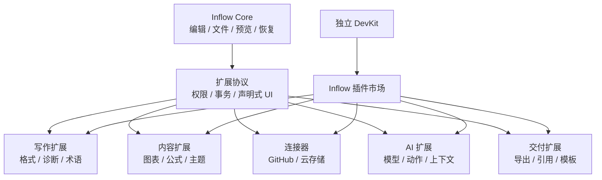
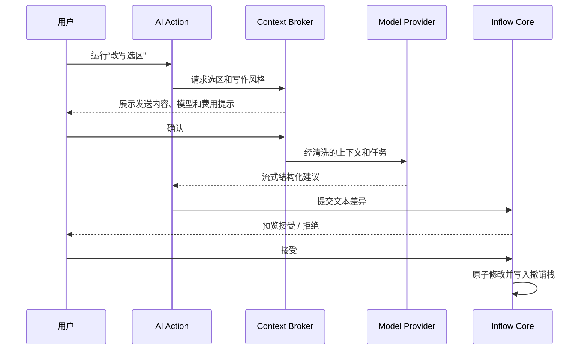

# Inflow 扩展生态战略

- 文档版本：v1.0
- 更新日期：2026-08-17
- 状态：产品与平台基线

## 阅读指南

- 理解生态定位和边界：读取第 1–2 节。
- 讨论 AI：读取第 5–8 节。
- 讨论市场和治理：读取第 9–12 节。
- 讨论领域扩展：读取第 15 节并进入语法扩展设计。
- 运行时和安全实现见 [扩展系统总体设计](../engineering/extensions/SYSTEM_DESIGN.md)。

## 1. 生态定位

Inflow 的长期定位是“以 Markdown 文档为核心的本地创作平台”：

- Inflow Core：可靠、纯粹的编辑器和稳定扩展底座。
- Inflow Extensions：主题、写作、渲染、诊断、导出和工作流能力。
- Inflow Connectors：用户主动选择的云存储、GitHub 和外部数据连接。
- Inflow AI：可替换的模型、上下文和 AI 写作能力，不绑定单一供应商。
- Inflow DevKit：扩展开发、测试、签名和发布工具，不进入编辑器本体。

生态的价值不是让主应用拥有最多菜单，而是让用户只安装自己需要的能力，让开发者可以围绕标准 Markdown 构建垂直工具。

## 2. 生态边界

### 编辑器本体必须内置

- Markdown 源码模型、即时渲染、预览和基础语法。
- 文件、工作区、保存、撤销、恢复、冲突和本地版本。
- 基础搜索、大纲、图片引用和 PDF/HTML 导出。
- 扩展管理、权限、故障隔离和声明式 UI 容器。

### 适合扩展

- 行业写作规则、术语、模板、图表、主题和特定导出。
- 引用管理、内容检查和垂直工作流。
- 云存储、GitHub 等同步连接器。
- 本地或远程 AI 模型提供商。
- 改写、总结、翻译、审校等 AI 动作。
- 工作区知识检索和受控 AI 工具。

### 必须保持独立产品

- CLI、CI/CD 和无界面批处理。
- 完整 Git 客户端和代码托管工作台。
- CMS、博客或社交平台管理后台。
- 多人实时协作服务。

## 3. 生态角色

| 角色 | 责任 |
| --- | --- |
| Inflow 团队 | Core、SDK、审核规则、签名根、市场和安全响应 |
| 扩展开发者 | 最小权限实现、隐私说明、兼容性和用户支持 |
| 服务提供商 | 连接器或模型服务的可用性、计费和数据处理说明 |
| 用户 | 选择扩展、授予权限、选择数据范围和承担第三方服务费用 |
| 安全研究者 | 漏洞报告、恶意扩展举报和生态审计 |

## 4. 市场分类

1. 写作与编辑：格式、模板、翻译、术语、学术和技术写作。
2. 图表与内容：图表、公式、代码、媒体和 Markdown 方言。
3. 检查与质量：规范、断链、安全、可访问性和兼容性。
4. 主题与外观：主题、代码配色和打印样式。
5. 引用与研究：文献、脚注、引用格式和知识来源。
6. 导出与交付：特定单篇格式和文档包装。
7. 存储与同步：GitHub、云盘和企业存储。
8. AI 模型：本地模型或远程模型供应商。
9. AI 工作流：总结、编辑、审校、研究和垂直领域助手。

高权限类别必须显著标识“将读取文档”“将内容发送到网络”“可能产生第三方费用”等信息。

## 5. AI 扩展模型

AI 能力拆成四类，避免每个插件重复实现账号、上下文和编辑逻辑。

### 5.1 Model Provider

- 本地 Provider 连接设备上的本地模型服务或未来受控本地推理宿主。
- 远程 Provider 连接用户选择的云模型 API。
- 声明模型列表、上下文长度、结构化输出、流式响应和价格元数据。
- API Key 由 Inflow Keychain 保存，Provider 通过 Broker 代发请求。
- Provider 不能自行决定读取哪个文档或工作区。

### 5.2 AI Action

Action 定义改写选区、调整语气、总结、翻译、审校、解释公式等任务。它声明需要的输入、模型能力、输出 Schema 和可修改范围。输出默认进入差异预览，不直接覆盖正文。

### 5.3 Context Provider

上下文可以来自当前选区、当前文档、用户选择的工作区文件、大纲、链接、Front Matter、诊断结果或引用管理扩展。每次运行由 Inflow 生成最终清单，用户可预览和排除内容；扩展之间不能私下交换正文。

### 5.4 AI Tool

- 模型只能提出调用，Inflow 根据权限和当前用户意图执行。
- 写入操作必须展示差异并由用户确认。
- 创建、删除、移动文件默认逐次确认。
- Tool 不能执行 Shell、AppleScript、任意 HTTP 或控制其他应用。
- 文档和远端内容均视为不可信输入，不能通过提示内容提升权限。

## 6. AI 数据与隐私

- AI 默认关闭；没有安装 Provider 时不显示残缺 AI 工作区。
- 本地模型明确显示“数据不离开设备”。
- 远程模型说明接收方、域名、内容范围、保留和训练策略。
- 上下文范围为仅选区、当前文档或用户选择的工作区文件。
- 永不默认发送恢复快照、未打开文件、凭据、完整路径或活动日志。
- 发送前可隐藏 Front Matter 字段、链接参数、邮箱和自定义敏感模式。
- Inflow 首期不代理收费或抽取 Token 费用，用户使用供应商账号。
- AI 会话默认本地保存，可选择不保存、关闭时清除或设置期限。

## 7. AI 结果安全

- 文本结果以差异、建议卡或新草稿展示。
- Markdown 结果解析校验后应用，避免破坏围栏、表格和 Front Matter。
- 文件操作显示影响列表和目标路径。
- 工具参数由 Inflow 验证，不信任模型生成的路径。
- System Policy、权限和工具列表只能由 Core 生成。
- 自动连续执行默认禁止；有副作用步骤需要确认。

## 8. 扩展组合

- 通过能力接口发现服务，例如 `model.text-generation`、`context.citations`。
- Action 声明能力要求，用户选择兼容 Provider。
- Provider 可被多个 Action 复用。
- 引用管理扩展可以贡献 Context Provider，但不能直接调用任意模型。
- 缺少能力时说明需要哪类扩展，不自动安装。
- 只允许依赖稳定能力和最低 API 版本，禁止循环依赖。

## 9. 商业与市场原则

- 市场基础搜索和安装不要求购买 Inflow 云服务。
- 免费、一次性付费、订阅和自带 API Key 可作为未来模式，但必须披露。
- Inflow 首期不托管第三方模型调用、不代售 Token、不接触 API Key。
- 付费扩展不能获得更高技术权限。
- 排名优先考虑质量、稳定性、权限克制和兼容性，不出售竞价排名。
- 官方与第三方扩展明确区分，但使用同一公开 API。

## 10. 生态治理

- 发布者身份、开发者签名、市场签名和透明版本记录。
- 自动扫描、权限差异审核和高权限人工审核。
- AI/连接器必须提供隐私政策、数据流和账号删除方式。
- 支持安全撤回、更新回滚和用户举报。
- 被撤回扩展不能删除用户文档和标准 Markdown 内容。
- 弃用扩展应提供数据导出和替代方案，避免生态锁定。

## 11. API 层次

| API 层 | 稳定性 | 面向对象 |
| --- | --- | --- |
| Core Document API | 最稳定 | 快照、事务、选区、语法树 |
| Contribution API | 稳定 | 命令、诊断、渲染、导出、侧栏 |
| Connector API | 高审查 | 同步、限域网络、凭据代理 |
| AI Capability API | 高审查 | Provider、Action、Context、Tool |
| Experimental API | 不保证 | 开发者预览，不允许稳定市场发布 |

## 12. 路线图

- Ecosystem 0：Extension Host、权限 Broker、事务、签名和内部扩展。
- Ecosystem 1：主题、诊断、命令、围栏渲染、侧栏和本地侧载。
- Ecosystem 2：插件市场、发布者、审核、更新和撤回。
- Ecosystem 3：Model Provider、AI Action、Context Broker 和本地会话。
- Ecosystem 4：GitHub 与云存储连接器、同步和三方合并。
- Ecosystem 5：第三方 AI Provider、Context Provider、受控 Tool、付费和企业私有目录。

## 13. 成功指标

- 无扩展时的启动、编辑和保存性能不明显退化。
- 扩展导致的主应用崩溃和文档损坏为零。
- AI 正文静默改写为零，所有修改可拒绝和撤销。
- 连接器同步冲突静默覆盖为零。
- API 升级时，95% 活跃扩展有明确兼容状态。
- 用户可以理解每个扩展读取了什么、连接了哪里、修改了什么。

## 14. 总原则

Inflow 的生态应扩大“用户能够用 Markdown 完成什么”，而不是扩大“Inflow 默认替用户做什么”。扩展可以强大，但所有数据访问、联网、费用和写入都必须可见、可撤销、可停用。

## 15. 领域能力包

生态除单一功能插件外，还支持 Domain Pack。领域包把一组标准扩展点组合为完整专业体验，例如 Academic Writing Pack 可以同时贡献 LaTeX 环境、定理、交叉引用、BibTeX、诊断、补全和 `.tex` 导出。

领域包不是拥有额外权限的“超级插件”。每项贡献仍独立声明、可关闭、可降级，并经过同样的审核和资源限制。语法与 LaTeX 示例见 [Markdown 语法扩展设计](../engineering/extensions/SYNTAX_EXTENSION_API.md)。
