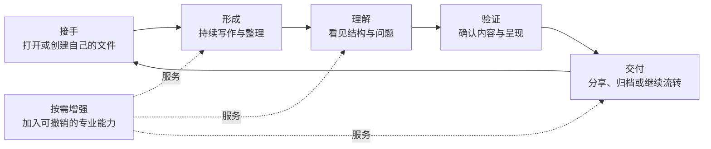

# Inflow 产品设计总览

| 项目 | 内容 |
| --- | --- |
| 文档编号 | PRD-OVERVIEW-001 |
| 版本 | v1.2 |
| 状态 | 已批准 |
| 审批人 | 产品负责人 |
| 批准日期 | 2026-09-01 |
| 负责人 | 产品团队 |
| 更新日期 | 2026-09-01 |
| 适用阶段 | 全产品周期 |

## 1. 产品定义

Inflow 是面向长期 Markdown 资产的本地优先写作工作台。它帮助用户直接接手自己的文件，在不中断的写作流中形成内容、理解结构、验证结果并完成交付；当用户需要专业能力时，这些能力可以安全加入，也可以被完整移除。

Inflow 不以“又一个 Markdown 编辑器”定义自己。编辑只是入口，真正的产品对象是一条可持续的可信写作链：

> 接手文件 → 形成内容 → 理解结构 → 验证结果 → 交付成果 → 继续演进

## 2. 核心用户问题

长期使用 Markdown 的用户经常面对五类割裂：

1. 文件属于用户，但保存、恢复和外部变化的状态并不总是清楚；
2. 源码编辑、即时反馈和完整阅读被拆成不同工具或不同上下文；
3. 文档结构存在于标题、链接、资源和语法中，却缺少可理解、可行动的整体视角；
4. 预览看似正确，但导出时可能对应旧内容、缺失资源或产生不可解释的差异；
5. 专业能力越强，越容易要求账号、上传内容、改变格式或让用户失去退出路径。

Inflow 的机会不是堆叠更多入口，而是消除这些断点，让用户始终知道“我在编辑什么、现在处于什么状态、结果来自哪份内容、离开后还能否继续使用”。

## 3. 产品价值主张

| 体验支柱 | 核心承诺 | 用户获得的结果 |
| --- | --- | --- |
| 文件可信 | 用户自己的本地 Markdown 始终是可持有、可迁移的内容事实 | 敢于长期写作，不担心静默丢失、覆盖或被平台锁定 |
| 写作流连续 | 不同工作方式围绕同一内容和同一语义位置协作 | 在精确编辑、快速反馈和沉浸阅读之间切换而不丢上下文 |
| 结构理解 | 文档组织、引用和问题都能回到可操作的位置 | 长文档不再只是文本流，而是可导航、可检查、可修复的结构 |
| 可验证交付 | 预览与交付对应明确的当前内容和资源选择 | 分享或归档前可以确认“所见、所写、所得”一致 |
| 安全扩展 | 专业能力可按需加入，权限和影响清楚，退出后核心内容仍完整 | 获得高级能力而不交出文件所有权和基本控制权 |

## 4. 核心体验闭环

闭环中的每一步都继承同一份内容事实。用户不应因为切换工作方式、等待结果或使用可选能力而面对第二份无法解释的正文。

## 5. 完整产品功能域

完整产品由七个面向用户的功能域组成：

1. **文件与文档**：新建、打开、保存、恢复、外部变化处理和文档身份管理；
2. **写作与编辑**：精确编辑、快速格式化、查找替换、撤销重做和多种写作方式；
3. **阅读与呈现**：分栏反馈、沉浸阅读、主题、排版和内容定位；
4. **结构与导航**：大纲、链接、资源、工作区、搜索和文档关系理解；
5. **质量与交付**：内容检查、交付前确认、HTML/PDF 输出和可分享成果；
6. **个性化与包容性**：外观、字号、快捷方式、辅助使用和清晰状态表达；
7. **专业能力生态**：领域表达、诊断、连接服务和智能辅助等可选能力。

各功能域的完整边界见[产品功能架构](./03-产品功能架构.md)。

## 6. 产品边界

### Inflow 核心负责

- 直接使用标准 Markdown 和本地关联资源；
- 单篇与普通文件夹项目写作的完整日常体验；
- 内容状态、恢复选择和外部变化的清晰表达；
- 源码、结构、阅读结果和交付成果之间的一致性；
- 可选能力的发现、授权、影响说明、停用和退出体验。

### Inflow 不成为

- 必须登录或必须联网才能写作的内容服务；
- 用专有格式取代 Markdown 的封闭知识库；
- 博客后台、内容管理系统或社交发布平台；
- 完整的代码托管、项目管理或多人实时协作产品；
- 能够静默读写任意内容、无限自动执行的通用自动化平台；
- 某个既有编辑器界面、术语和操作顺序的复刻品。

相邻能力只有在能强化可信写作链、保持退出路径并形成清晰用户闭环时，才进入产品范围。

## 7. 产品体验总规则

1. **先说明事实，再提供操作。** 保存、恢复、冲突、导出和外部能力都先让用户看懂当前状态。
2. **同一内容，多种视角。** 不同写作与阅读方式不创建彼此竞争的内容版本。
3. **用户意图优先。** 可能改变文件、覆盖内容、发送数据或产生费用的行为必须由用户明确发起或确认。
4. **结果可以追溯。** 用户能够理解当前呈现和最终成果基于什么内容与选择。
5. **增强能力可退出。** 停用可选能力后，标准 Markdown、附件和核心写作仍可继续。
6. **错误不伪装成功。** 无法完成时给出清楚状态、保留用户成果并提供安全下一步。
7. **克制胜过堆叠。** 新入口必须减少用户完成任务的阻力，而不是展示产品拥有多少功能。

## 8. 产品版本模型

| 产品版本 | 核心价值闭环 | 用户认知 |
| --- | --- | --- |
| 个人首版（内部验证版） | 在产品负责人自己的 Mac 和真实 Markdown 项目上跑通最小项目写作闭环 | “我可以打开自己的项目，在目录树和即时渲染编辑中连续写作，并可靠保存与导出” |
| 公共预览版（后续、待独立决策） | 在个人验证通过后补齐公开分发、兼容与支持合同 | “其他用户可以获得、安装并理解这一预览产品的边界” |
| 成长版 | 高级项目写作与工作区管理 | “我可以搜索、同时打开并重组大量相关文档” |
| 专业版 | 专业表达、迁移兼容与质量控制 | “复杂内容也能保持标准、可理解和可交付” |
| 成熟版 | 结构洞察与可信能力生态 | “文档可以持续演进，同时保持所有权和控制权” |

版本之间是价值递进，不是对竞品清单的逐项补齐。当前里程碑是个人首版，不代表已经形成公开版本；公开预览的版本号、分发方式和门槛在个人验证通过后另行决策。详细顺序见[版本路线图](./06-版本规划/01-版本路线图.md)，个人首版承诺见[个人首版范围](./06-版本规划/02-首发版本范围.md)。

## 9. 产品成功判断

Inflow 的成功不以功能数量为核心，而以用户能否持续完成可信写作链判断：

- 用户愿意把真实、长期的 Markdown 文件交给 Inflow；
- 用户能在不同工作方式间连续写作，而不是反复重建上下文；
- 用户能发现结构问题并回到源内容完成修正；
- 用户交付前能够确认内容与结果一致；
- 用户在离线、停用可选能力或更换工具后仍拥有完整内容；
- 产品在错误和异常情境下仍诚实表达状态，并保护用户已有成果。

当前里程碑是否可供产品负责人日常使用，以[产品验收标准](./06-版本规划/03-产品验收标准.md)为准；该判断不等于公开发布批准。

## 10. 文档关系

- 为什么做以及如何取舍：读[产品愿景与原则](./01-产品愿景与原则.md)。
- 为谁做以及在哪些场景使用：读[目标用户与使用场景](./02-目标用户与使用场景.md)。
- 完整产品包含什么：读[产品功能架构](./03-产品功能架构.md)。
- 何时交付什么：读[版本路线图](./06-版本规划/01-版本路线图.md)。
- 个人首版明确承诺什么：读[个人首版范围](./06-版本规划/02-首发版本范围.md)。
- 什么结果才算达标：读[产品验收标准](./06-版本规划/03-产品验收标准.md)。
