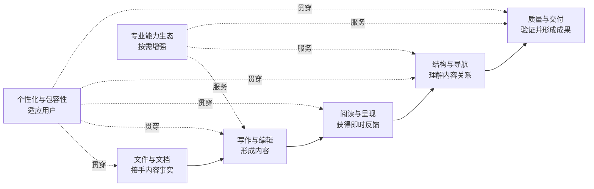

# Inflow 产品功能架构

| 项目 | 内容 |
| --- | --- |
| 文档编号 | PRD-ARCH-001 |
| 版本 | v1.0 |
| 状态 | 待评审 |
| 负责人 | 产品团队 |
| 更新日期 | 2026-08-19 |
| 适用阶段 | 全产品周期 |

## 1. 文档目的

本文从用户价值而非界面菜单出发，定义 Inflow 完整产品由哪些能力组成、各能力如何协作，以及哪些相邻需求不属于产品边界。

本架构描述成熟产品全貌，不表示所有能力都在首发版本交付。版本归属以[版本路线图](./06-版本规划/01-版本路线图.md)为准，首发承诺以[首发版本范围](./06-版本规划/02-首发版本范围.md)为准。

## 2. 架构主线：可信写作链

七个功能域不是七个孤立页面。它们共同服务“接手—形成—理解—验证—交付”的连续任务，并共享以下产品事实：当前文档是谁、用户正在修改什么、哪些变化尚未处理、最终成果对应什么内容。

## 3. 功能域总览

| 编号 | 功能域 | 用户目标 | 核心价值 |
| --- | --- | --- | --- |
| F-01 | 文件与文档 | 安心接手、保存并恢复自己的内容 | 文件可信 |
| F-02 | 写作与编辑 | 高效、精确且可撤销地形成内容 | 写作流连续 |
| F-03 | 阅读与呈现 | 在不离开当前内容的情况下理解表达效果 | 写作流连续、结构理解 |
| F-04 | 结构与导航 | 看见文档组织、关系和问题并快速行动 | 结构理解 |
| F-05 | 质量与交付 | 确认内容完整并生成可复核成果 | 可验证交付 |
| F-06 | 个性化与包容性 | 让产品适应不同偏好与使用能力 | 贯穿五大支柱 |
| F-07 | 专业能力生态 | 按需获得领域、连接与智能能力 | 安全扩展 |

## 4. F-01 文件与文档

### 用户目标

用户能直接创建或打开标准 Markdown，始终理解文件状态，在正常、异常和外部变化情境下保住已有成果。

### 完整能力

- 新建空白文档并立即开始写作；
- 从用户选择的位置打开现有 Markdown；
- 手动保存、自动保存、另存和复制文档；
- 展示清楚、不过度打扰的修改与保存状态；
- 处理只读、权限不足、目标不存在或内容已变化等情况；
- 在异常中断后发现、比较和处置可恢复内容；
- 识别同一文档，避免重复打开造成无意覆盖；
- 在移动或另存时说明对本地资源关系的影响；
- 最近文档、重新打开和窗口恢复；
- 本地版本浏览、比较与恢复。

### 边界

- 不要求导入应用资料库才能编辑；
- 不用“同步成功”替代“本地保存成功”；
- 可恢复内容是保护层，不得反向阻止用户保存自己的文件；
- 未命名内容在用户选择位置前，不假装已成为普通文件。

## 5. F-02 写作与编辑

### 用户目标

用户能以适合当前任务的方式精确编辑 Markdown，并对每次修改保持理解和控制。

### 完整能力

- 源码编辑、实时预览和即时渲染编辑；
- 标题、强调、列表、任务、引用、代码、表格、链接与图片的常用输入；
- 撤销、重做、选择、复制、粘贴、拖放和格式化；
- 查找、替换、跳转和当前匹配反馈；
- 语法提示、括号与围栏辅助、缩进和自动延续；
- 多光标、行操作和面向长文档的高效编辑；
- 图片插入、命名、引用方式和替代文本维护；
- 中文、英文和混合内容的自然输入；
- 字数、字符数及其他不打扰写作的轻量反馈。

### 边界

- 所有编辑方式修改同一份 Markdown 内容；
- 结构化操作必须产生可理解、可撤销的源文本变化；
- 不为了视觉效果写入只有 Inflow 能理解的隐藏内容；
- 自动修改不得越过用户当前意图或破坏未选择范围。

## 6. F-03 阅读与呈现

### 用户目标

用户能在写作中获得及时、稳定的表达反馈，也能进入完整阅读视角检查最终效果。

### 完整能力

- 源码与呈现并列的分栏体验；
- 纯预览中的沉浸阅读体验；
- 写作与阅读位置之间的对应和同步；
- 标题、段落、列表、表格、代码、公式、图表和本地图片的呈现；
- 主题、代码配色、内容宽度和缩放；
- 链接与标题导航，并能安全回到源位置；
- 内容变化后的及时反馈，以及等待时的清晰状态；
- 在文档过大或内容异常时保持基本可读和可继续写作。

### 边界

- 呈现结果是对当前 Markdown 的解释，不是可独立漂移的第二份正文；
- 文档内容不能借由呈现界面静默获得应用控制权；
- 外部链接和本地资源操作必须符合用户明确意图；
- 视觉丰富度不能优先于内容安全、输入连续和结果可解释。

## 7. F-04 结构与导航

### 用户目标

用户能理解一篇或一组文档如何组织、相互引用和持续演进，并快速回到需要行动的位置。

### 完整能力

- 当前文档大纲、层级关系和快速跳转；
- 标题、链接、本地资源、脚注和引用的结构视角；
- 源内容与呈现内容的双向定位；
- 文件夹工作区、文件树、多文档和最近位置；
- 文件名、正文和结构条件的跨文档搜索；
- 重命名、移动和删除前的引用影响提示；
- 断链、缺失资源、重复标题和层级问题的发现；
- 文档关系、来源和演进脉络的进一步洞察。
- 迁移前预检内容、结构、链接、资源与元数据差异，并提供可退出的副本流程；

### 边界

- 工作区直接尊重用户现有文件夹，不变成封闭知识库；
- 导航结果必须能回到真实文件和明确位置；
- 结构洞察用于解释和辅助决策，不在用户不知情时改写内容；
- 单篇写作不依赖先建立工作区。

## 8. F-05 质量与交付

### 用户目标

用户在分享、归档或移交之前，能够确认内容、资源、结构和最终成果处于期望状态。

### 完整能力

- 交付前检查标题结构、异常链接、缺失图片和不兼容表达；
- 对问题说明位置、影响和可采取的行动；
- 确认将要交付的当前内容与表达选择；
- 导出可独立打开的 HTML；
- 导出适合分享和归档的 PDF；
- 选择主题、页面与代码呈现等交付选项；
- 目标已存在或在确认后变化时重新征得决定；
- 交付完成后显示结果位置和可继续操作；
- 后续支持面向专业场景的模板与交付形式。

### 边界

- 不把发布到博客、内容平台或社交网络作为核心导出的一部分；
- 不用过期内容或过期确认覆盖已有成果；
- 最终成果不能无说明地暴露本地路径、私密信息或交互能力；
- 交付失败不改变用户的原始 Markdown。

## 9. F-06 个性化与包容性

### 用户目标

不同偏好、输入方式和辅助需求的用户，都能清楚、舒适地完成核心写作链。

### 完整能力

- 浅色、深色和跟随系统外观；
- 字号、行高、内容宽度、缩放和编辑辅助；
- 写作方式、窗口布局与高频选择的合理记忆；
- 平台常用快捷方式和可发现的菜单入口；
- 完整键盘操作、清晰焦点和辅助阅读说明；
- 高对比度、减少动态效果及放大后的可用性；
- 中文、英文和混合内容下的一致表达；
- 状态、警告和错误不只依赖颜色传达。

### 边界

- 默认选择优先帮助新用户完成核心任务，而不是展示配置数量；
- 个性化不能改变文件语义或造成预览与交付分叉；
- 记忆用户选择不能覆盖单个文档明确保存的状态；
- 辅助使用不是后续装饰，而是核心场景的组成部分。

## 10. F-07 专业能力生态

### 用户目标

用户能为特定任务增加专业表达、质量检查、外部连接或智能辅助，同时保持对内容、数据和费用的控制。

### 完整能力

- 发现、了解、启用、停用和移除可选能力；
- 清楚展示提供者、用途、内容范围、外部连接和可能费用；
- 领域语法、主题、诊断、引用、模板和专用交付；
- 用户主动选择的存储与协作服务连接；
- 本地或远程智能辅助，以及修改前的差异预览；
- 能力异常时隔离影响并回到核心体验；
- 授权回顾、撤销和相关数据清理；
- 停用后保留标准 Markdown 的可读降级结果。

### 边界

- 可选能力不得接管打开、保存、恢复、撤销和冲突决定；
- 不允许静默读取其他文档、连接外部服务或修改正文；
- 缺少某项能力时，应说明降级结果，而不是让文档整体不可用；
- 高级能力不得成为首发单篇写作闭环的前置条件。

## 11. 跨功能域体验规则

### 11.1 同一内容事实

文件、编辑、呈现、结构检查和交付必须明确围绕同一当前内容工作。任何结果在内容变化后都不得假装仍是最新事实。

### 11.2 同一语义位置

用户从源码进入呈现、从大纲进入正文、从问题进入修正位置时，应尽可能保持同一语义对象，而不是只同步粗略页面位置。

### 11.3 状态可理解

保存、恢复、外部变化、检查、导出和可选能力使用一致的表达原则：说明发生了什么、影响什么、用户有哪些安全选择。

### 11.4 用户确认不过期

用户对覆盖、发送、修改或费用作出的同意只适用于当时看见的对象和范围；对象变化后必须重新确认。

### 11.5 核心体验可独立

完全离线、未启用任何可选能力、只打开单篇文档时，创建、编辑、保存、恢复、阅读和交付仍形成完整闭环。

### 11.6 可逆与可退出

模式切换可返回，编辑可撤销，可选能力可停用，标准文件可由其他工具继续使用。产品不以制造退出成本证明价值。

## 12. 功能价值层级

| 层级 | 包含能力 | 成立条件 |
| --- | --- | --- |
| 信任基础 | 文件与文档、基本个性化与包容性 | 用户敢于接手和保存真实文件 |
| 写作闭环 | 写作与编辑、阅读与呈现 | 用户能持续形成并检查一篇内容 |
| 理解与交付 | 结构与导航、质量与交付 | 用户能发现问题并交付当前成果 |
| 规模成长 | 工作区、多文档和跨文档关系 | 单篇体验不被破坏，多篇内容仍直接可持有 |
| 专业延伸 | 专业表达、连接和智能辅助 | 能力按需加入、影响可见、退出后内容完整 |

低层价值没有成立前，不应依靠高层功能掩盖缺口。

## 13. 新功能纳入规则

新功能进入本架构前必须满足：

1. 对应[目标用户与使用场景](./02-目标用户与使用场景.md)中的明确任务，或提供经过评审的新用户问题；
2. 能说明它连接、缩短或保护可信写作链的哪一环；
3. 归属于一个主功能域，并说明对其他功能域的影响；
4. 定义用户可观察的成功结果、失败状态和退出路径；
5. 不仅以竞品已有、内部偏好或展示价值作为理由；
6. 经版本规划确认进入时点，不自动扩大首发范围。

## 14. 完整产品的边界判断

当七个功能域都达到以下结果时，可认为 Inflow 形成成熟完整产品：

- 用户从单篇到工作区都直接拥有标准 Markdown；
- 不同写作、阅读和导航方式保持内容与上下文连续；
- 文档结构与关系能够被理解、检查和采取行动；
- 从日常写作到专业交付都能复核当前结果；
- 个性化和辅助使用覆盖完整核心任务；
- 专业能力能够形成丰富生态，但不拥有核心文件生命周期；
- 用户随时可以离线、停用能力或更换工具而保有完整成果。

## 15. 文档关系

- 上位价值取舍：[产品愿景与原则](./01-产品愿景与原则.md)。
- 用户与任务依据：[目标用户与使用场景](./02-目标用户与使用场景.md)。
- 能力阶段归属：[版本路线图](./06-版本规划/01-版本路线图.md)。
- 当前交付边界：[首发版本范围](./06-版本规划/02-首发版本范围.md)。
- 专业迁移体验：[迁移与兼容](./04-功能设计/08-迁移与兼容.md)。
- 用户结果判断：[产品验收标准](./06-版本规划/03-产品验收标准.md)。
- 返回总览：[产品设计总览](./00-产品设计总览.md)。
