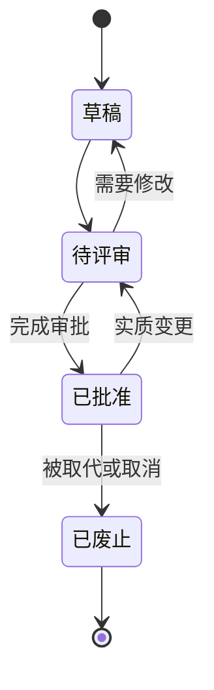

# Inflow 文档管理规范

| 项目 | 内容 |
| --- | --- |
| 文档编号 | PM-DOC-001 |
| 版本 | v1.0 |
| 状态 | 待评审 |
| 负责人 | 项目管理团队 |
| 更新日期 | 2026-08-19 |
| 适用阶段 | 全项目生命周期 |

## 1. 适用范围

本规范适用于 Inflow 文档库中的产品设计、产品规格、市场与迁移研究、规格附录、产品验收定义、项目管理、决策和变更记录。当前 `文档/` 只保存这些人可阅读的 Markdown 文档。

本规范管理文档的结构和权威，不用文档状态代替产品实际验收结果。

## 2. 目录编号

### 2.1 编号格式

- 正式一级目录使用 `NN-中文领域` 格式，`NN` 为两位数字。
- 一级目录下的主题组使用 `NN-中文主题` 格式，只表示阅读顺序，不表示优先级或版本阶段。
- `00` 固定用于当前目录的说明、导航或总览。
- `01`–`89` 用于正式主题；`90`–`98` 可用于迁移、兼容或临时专项；`99` 只用于当前领域的已废止索引或归档入口。
- 已发布的编号不因排序美观而重用；需插入新主题时使用空缺号或在后续追加。

### 2.2 编号与文档 ID

物理路径编号用于阅读和组织；文档 ID 用于稳定引用和变更追踪。移动文档时：

- 文档 ID 保持不变。
- 更新所有本地链接和变更记录。
- 若主题语义实质改变，不仅是移动，则应创建新文档 ID 并显式取代旧文档。

## 3. 文件命名

- 使用 `NN-中文主题.md`。
- 产品附录使用 `附录X-中文主题.md`，其中 `X` 为不重复的大写英文字母；附录所在主题目录仍使用两位数字编号。
- 名称描述文档的权威职责，避免“其他”“补充”“最新”“终版”等无法长期维护的词。
- 产品主文档不以竞品名命名；竞品名只允许出现在明确的市场或迁移研究附录中。
- 文件名不包含版本号、状态或日期；这些信息放在文档头和变更记录中。

## 4. 文档头

每份正式文档在主标题后必须包含：

| 字段 | 格式 | 规则 |
| --- | --- | --- |
| 文档编号 | 领域缩写-主题-序号 | 稳定且唯一，不因移动重命名 |
| 版本 | `v主版本.次版本` | 首版为 v1.0，不使用“final” |
| 状态 | 草稿 / 待评审 / 已批准 / 已废止 | 只使用四种受控值 |
| 负责人 | 角色或团队 | 对内容准确性和复审负责 |
| 更新日期 | `YYYY-MM-DD` | 只在实质变更时更新 |
| 适用阶段 | 明确产品或项目范围 | 不用模糊的“未来”或“最终” |

可根据需要增加审批人、取代文档、下次复审日期或保密级别，但不得删除基础字段。

专项文档还必须通过文档头中的“权威范围”和“关联文档”，或独立的“权威关系”章节，使读者能够定位本文负责的产品语义及其上位、同级引用。无需在每份文档重复全库通用的冲突阻断与修正规则。

## 5. 文档状态与转移

- 草稿可在负责人范围内快速迭代，但不得被引用为发布基线。
- 待评审文档不再无限扩展范围；新增重大主题时退回草稿。
- 已批准文档只能在关联变更记录、决策记录和必要评审齐全时进行实质修改，修改期间状态回到待评审。
- 已废止文档保留标题、文档编号、废止原因、废止日期和取代去向，不在原文上继续增加新规范。

## 6. 版本规则

- **主版本增加**：权威边界、文档责任、核心语义、范围或用户合同存在不兼容变化。
- **次版本增加**：在不改变上位语义的情况下增加新场景、完整边界、改善验收或澄清重要含义。
- 纯格式、错字和不改变含义的链接修复可不提升版本，但仍要进入变更记录的“编辑性修正”汇总。
- 不使用三位修订号将实质产品变更包装成普通修补。

## 7. 权威关系

### 7.1 全局继承与唯一责任

[文档中心](../00-文档中心.md)的权威关系、[项目管理说明](./00-项目管理说明.md)的权威链与本规范共同构成全库通用规则，并由每份正式文档自动继承。专项文档只需按第 4 节提供“权威范围”和“关联文档”，或在“权威关系”章节集中说明专项责任；未逐篇重复全局冲突语句，不表示可以绕过该规则。

相同字段不得在多份文档同时宣称为唯一权威。其他文档为阅读便利保留链接或摘要时，应能定位权威源；发生产品语义、范围、默认值、状态、例外或验收冲突时，候选基线与发布均被阻断，先确认责任文档，再通过必要的产品决策和变更记录正式修订所有受影响文档。任何文档都不得以层级、更新时间或措辞更具体为由静默覆盖另一份文档。

### 7.2 产品正文、附录与研究

- 产品正文决定用户问题、产品行为、范围、阶段和验收。
- 被产品规格明确委托的附录，决定所委托字段的默认值、取值范围、选项集、状态转移和例外。
- 附录不能创建新功能、改变产品阶段或放宽上位产品边界。
- 市场研究与竞品证据不是产品范围权威，不得直接将样本产品的功能、术语、界面、默认值或交互转写为 Inflow 规格。

## 8. 引用与链接

- 仓库内文档使用相对链接，链接文字表达文档用途，不只显示路径。
- 引用具体规则时使用章节链接或稳定需求/决策 ID，不依赖会变动的行号作为永久标识。
- 外部证据记录来源、发布者、访问日期和适用范围；失效链接不得继续支撑关键决策。
- 重命名或移动文件后，本地链接检查必须通过。

## 9. 变更与评审

以下变更必须同时更新[产品决策记录](./02-产品决策记录.md)和[变更记录](./03-变更记录.md)：

- 产品定位、用户群、原则或反目标。
- 功能新增、移除、阶段调整或验收改变。
- 用户默认选择、权限、数据去向、费用或退出路径。
- 权威文档调整、附录委托、例外或被取代关系。

只有编辑性修正时，可以不创建产品决策，但仍在变更记录中汇总。

## 10. 评审清单

文档从草稿进入待评审前，负责人确认：

- [ ] 文档编号唯一，文档头字段完整。
- [ ] 文档头中的权威范围、关联文档或权威章节足以定位本文的专项责任。
- [ ] 上位权威、同级映射和下位附录关系可追溯；全局冲突规则不要求逐篇重复。
- [ ] 市场或竞品材料只作为证据，未直接定义产品范围。
- [ ] 所有默认值和范围只有一个权威位置，附录委托已明示。
- [ ] 本地链接可达，外部证据有日期和适用范围。
- [ ] 用户可见结果、边界、失败退路和验收方法完整。
- [ ] 必要的产品决策和变更记录已创建。

## 11. 废止与归档

- 废止文档时，先创建或指向取代文档，再将状态改为已废止。
- 取代文档显示它取代的文档 ID，变更记录说明迁移影响。
- 不删除支撑历史决策的文档；若不得不删除敏感内容，保留不含敏感信息的文档编号、时间、原因和取代关系。

## 12. 规范职责

- 本文是文档编号、命名、头字段、状态、版本、权威层次和评审的项目规范。
- [项目管理说明](./00-项目管理说明.md)提供导航和概览，不重复本文的细节规则。
- [产品决策记录](./02-产品决策记录.md)保留决策理由，[变更记录](./03-变更记录.md)保留时间线；它们都不改写本文的管理规则。
