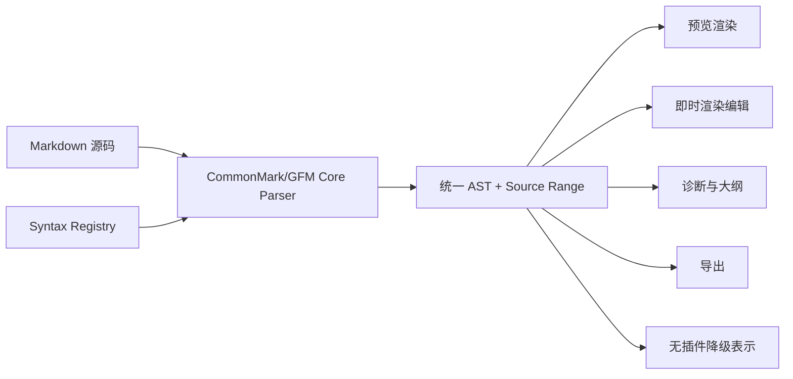

# Inflow Markdown 语法扩展设计

- 文档版本：v1.1
- 更新日期：2026-08-18
- 状态：Accepted（Syntax v1）
- 机器 Schema：[SyntaxContributionSchema v1](../../../机器校验/技术/扩展/数据模式/语法贡献第一版模式.json)、[Extension Content Tree v1](../../../机器校验/技术/扩展/数据模式/扩展内容树第一版模式.json)

## 阅读指南

- 判断某种语法能否扩展：读取第 1–3、13–14 节。
- 实现 Parser/AST/Renderer：读取第 4–9 节。
- 实现编辑与诊断：读取第 7、10–12 节。
- 设计专业领域包或 LaTeX：直接读取第 16–17 节。

## 1. 目标

允许开发者通过插件增加 Markdown 语法，例如 PlantUML、提示块、定义列表、属性块、特定脚注、学术引用或领域专用组件，同时保证：

- CommonMark/GFM 核心语法始终稳定。
- 未安装插件时，源码仍然可读且不会丢失。
- 源码、预览、即时渲染编辑和导出使用同一语法树。
- 插件之间的语法冲突可检测、可解释、可关闭。
- 扩展崩溃或超时只影响对应节点。

## 2. 解析管线



Core Parser 仍由 Inflow 维护。扩展通过 Syntax Registry 注册明确的扩展点，不能提供另一个完整 Markdown Parser，也不能在解析前任意改写全文。

## 3. 语法扩展等级

### Level 1：围栏代码块

示例：

````markdown
```plantuml
Alice -> Bob: Hello
```
````

扩展注册语言标识、别名、渲染器和诊断器。围栏内容仍是标准 Markdown 代码块，未安装扩展时自然降级为源码，是最安全、最先开放的类型。

### Level 2：块级指令

建议使用明确、可降级的指令语法：

```markdown
:::warning 注意
这是警告内容。
:::
```

扩展声明指令名称、参数 Schema、是否允许嵌套 Markdown 和渲染节点。指令名必须包含注册命名空间或通过市场获得唯一名称。

### Level 3：标准扩展节点（v2/Experimental）

包括定义列表、脚注变体、属性块、学术引用等。扩展只能从 Inflow 预先定义的标准扩展槽中选择，提供匹配规则和 AST 节点数据，不能改变核心标题、列表、链接或代码围栏的含义。

### Level 4：行内语法（v2/Experimental）

示例可能包括高亮、变量、术语引用和自定义内联组件。行内语法最容易与强调、链接、代码和公式冲突，因此仅允许：

- 明确且非歧义的起止定界符。
- 有长度和回溯限制的声明式规则。
- 不覆盖核心 Markdown 定界符优先级。
- 提供转义、纯文本回退和序列化规则。

首个扩展 API 不开放任意正则表达式驱动的全文行内解析。

## 4. 注册清单

```json
{
  "contributes": {
    "syntax": [
      {
        "schemaVersion": 1,
        "id": "com.example.callout",
        "kind": "blockDirective",
        "names": ["example:callout"],
        "nodeType": "directiveBlock",
        "contentMode": "markdownBlocks",
        "attributesSchema": "schemas/callout-attributes.schema.json",
        "fallback": "innerMarkdown",
        "capabilities": {
          "preview": true,
          "instantEditing": true,
          "export": true,
          "diagnostics": true
        },
        "referenceBindings": [
          {
            "bindingID": "com.example.callout.label",
            "role": "definition",
            "attribute": "id",
            "namespace": "com.example.callout",
            "normalization": "nfc-case-sensitive"
          }
        ],
        "semanticContributions": [
          {
            "semanticKind": "Label",
            "role": "parser",
            "apiVersion": 1,
            "priority": 50,
            "compatibility": "^1.0"
          }
        ]
      }
    ]
  }
}
```

[语法贡献第一版模式.json](../../../机器校验/技术/扩展/数据模式/语法贡献第一版模式.json) 是唯一机器权威。
稳定协议是判别联合，而不是允许任意字段组合的单一接口：

```ts
interface SyntaxContributionCommonV1 {
  schemaVersion: 1;
  id: string;
  names: string[];
  capabilities: { preview: boolean; instantEditing: boolean; export: boolean; diagnostics: boolean };
  semanticContributions?: SemanticContributionV1[];
  conflicts?: string[];
}

interface FencedBlockContributionV1 extends SyntaxContributionCommonV1 {
  kind: "fencedBlock";
  nodeType: "fence";
  contentMode: "raw";
  fallback: "codeFence";
}

interface BlockDirectiveContributionV1 extends SyntaxContributionCommonV1 {
  kind: "blockDirective";
  nodeType: "directiveBlock";
  contentMode: "raw" | "markdownBlocks";
  attributesSchema?: string;
  fallback: "source" | "innerMarkdown";
  referenceBindings?: ReferenceBindingV1[];
}

interface ReferenceBindingV1 {
  bindingID: string;
  role: "definition" | "reference";
  attribute: string;
  namespace: string;
  normalization: "nfc-case-sensitive";
}

interface SemanticContributionV1 {
  semanticKind: "MathEnvironment" | "Label" | "Reference" | "Citation" | "Theorem" | "Bibliography";
  role: "parser" | "renderer" | "diagnostic" | "editor" | "exporter";
  apiVersion: 1;
  priority: number; // 0...100
  compatibility: string;
}

type SyntaxContributionV1 = FencedBlockContributionV1 | BlockDirectiveContributionV1;
```

v1 只稳定开放 fenced block 与带命名空间的 block directive。fenced block 完全复用 Core
CommonMark 围栏识别，只按 info string 的首个 token 选择 renderer；扩展不能声明新的 fence
delimiter。`standardNode`、`inlineDelimiter` 和 `markdownInline` 不在 v1 Schema 中，市场包出现即拒绝。

每项扩展语法必须声明：

- 全局唯一 ID。
- 语法等级与定界符或指令名称。
- AST 节点 Schema。
- 源码回退策略。
- 支持预览、即时编辑、导出和诊断中的哪些能力。
- 与其他语法扩展的已知冲突。
- 如产生引用，按 `ReferenceBindingV1` 声明 definition/reference；所有 ID 解析交给 Core `ReferenceRegistry`。
- 如提供学术语义，按 `SemanticContributionV1` 声明 Core-owned slot 和 provider role。

### 4.1 Block directive v1 词法与 EBNF

以下语法是规范，不接受“接近此格式”的容错解析。`json-object` 直接引用 RFC 8259 JSON
object grammar，并进一步限制为单行 UTF-8 I-JSON、无重复 key、无 BOM/NaN/Infinity、最大
8 KiB；属性名和值随后必须通过该 contribution 的 closed-world `attributesSchema`。
未声明 `attributesSchema` 的 directive 不接受 `json-object`；attribute Schema 本身也必须
`additionalProperties=false`，未知 attribute 不进入 fallback renderer。

```ebnf
directive-block = opener, line-end, body, closer ;
opener          = indent, marker, directive-name,
                  [ one-or-more-space, json-object ], optional-space ;
closer          = indent, marker, optional-space ;
indent          = 0*3(" ") ;
marker          = 3*8(":") ;
directive-name  = namespace, ":", local-name ;
namespace       = lower-alpha, 1*95(lower-alpha | digit | "." | "-") ;
local-name      = lower-alpha, 0*31(lower-alpha | digit | "-") ;
line-end        = "\n" | "\r\n" | end-of-file ;
```

配对和嵌套规则：

- opener 的 marker 长度记为 `N`；closer 必须只有恰好 `N` 个冒号、无名称和属性。
- 顶层通常使用 `N=3`。嵌套 directive 的 `N` 必须严格大于直接父级，最大为 8，因而深度上限为 6；同长或更短 marker 在 body 中是普通文本。
- `markdownBlocks` body 按相同规则递归解析；`raw` body 除寻找精确 closer 外不解析 Markdown。
- opener 名称必须紧跟 marker，属性前至少一个 ASCII space；不支持自由标题尾缀，标题写入 JSON 的 `title` 字段。
- 行首 `\:::` 永不识别为 directive；反斜杠属于原始 source range，并按 CommonMark 转义规则展示。raw body 中也用该方式表达看似 closer 的文字。

CommonMark 优先级冻结为：先剥离合法 block quote/list container prefix，再识别 Core fenced/indented
code 与 HTML block；这些 Core 节点内部永不识别 directive。随后识别 directive opener，最后才开始/续接
普通 paragraph。Core heading、thematic break、list、link、code fence 和 HTML 的既有含义不可被 contribution
覆盖；扩展安装顺序不参与优先级。

错误恢复是确定的：非法名称/JSON opener 与孤立 closer 按普通源码行处理；未知但语法有效的名称形成
Core-owned `UnknownDirective` 并保持完整 source range；属性 Schema 失败形成 `InvalidDirectiveAttributes`，
不调用 renderer；未闭合、超过深度或内层未闭合的 region 形成 `InvalidDirective`，整段使用 `source`
fallback 并产生单一诊断。Parser 不猜测 closer、不跨越 Core container 边界补配，也不丢弃任何字节。

## 5. 统一 AST

扩展节点使用受控结构：

```ts
interface ExtensionSyntaxNode {
  type: "extension";
  syntaxId: string;
  sourceRange: Range;
  contentRange?: Range;
  attributes: Record<string, JSONValue>;
  children: SyntaxNode[];
  rawSourceHash: string;
  referenceBindings: ResolvedReferenceBinding[];
  semanticKinds: CoreSemanticKindV1[];
}
```

- `syntaxId` 由 Core 的已认证 provider registry 写入；payload 不携带 `extensionID` 作为身份。展示所需的包标识由 Core 根据连接绑定另行附加只读 provenance。
- `sourceRange` 必须精确映射原文，用于点击定位、滚动同步和诊断。
- `attributes` 必须符合插件清单声明的 Schema。
- `children` 只能包含核心或已注册扩展节点。节点实例由 Core 按 `SyntaxContributionSchema v1` 创建和持有，扩展不能注入任意 AST 对象。
- `referenceBindings` 只由 Core 依据 Manifest 的 `ReferenceBindingV1` 和已验证 attribute 派生；`semanticKinds` 只来自已激活的 `SemanticContributionV1`。Host 返回值不能自行增加、删除或改写二者。
- AST 是只读派生数据，不能成为新的文档保存格式。

跨插件定义与引用统一进入 Core-owned `ReferenceRegistry`。Registry 以文档、`namespace`、NFC 后仍
大小写敏感的 ID 和源码顺序建立索引，处理重复定义、未解析引用、跨扩展依赖、重命名诊断与导出
锚点。Manifest、AST 和 SDK 只使用 `ReferenceBindingV1`/`referenceBindings`；旧的
`references`、`definesReference`、`usesReference` 字段一律作为未知字段拒绝。

## 6. 渲染接口

E2 公共渲染接口只接受 Core 定义的
[`ExtensionContentTreeV1`](../../../机器校验/技术/扩展/数据模式/扩展内容树第一版模式.json) 或结构化错误/诊断。
Host 不得返回 HTML、SVG、CSS、URL、data URI、文件路径或 WebView 配置；这些类型不属于
`ExtensionContentTreeV1`，出现即整棵结果拒绝。Core 使用原生组件或自己的固定 serializer 渲染树，
扩展只能选择 Schema 中的节点、语义 tone 和设计 token。

`artifact` 节点只引用 Core 当次 generation 签发的 `artifactHandle`。Handle 必须来自一次性 Core
helper 已完成格式解析、尺寸/像素/字节预算和 postflight 的 PNG，或 `PackReleaseRecord` 精确绑定
path/hash/byteCount 的 SVG asset 经 Core 清洗/规范化后形成的 vector artifact；Host 不能自造、跨
generation 复用或用路径重开。官方 E2 WASM 也不能动态返回 SVG；随后只把 opaque handle 放入
Content Tree。公共扩展永远不能直接把 SVG 放进 DOM；PDF 也只由 Core 消费同一个已规范化 artifact。

每棵树总节点数 ≤4,096、深度 ≤32、规范 CBOR ≤2 MiB、文本合计 ≤1 MiB；artifact 另受全应用
Render/Image governor 管理。任何超限、未知 node/field、无效 handle 或 generation 不匹配均原子拒绝，
显示原始源码和结构化错误，不阻塞其他内容。

同一个 AST 节点与同一棵已验证 Content Tree 用于预览和导出，避免“编辑器中正常、导出后不同”。主题通过设计 Token 传入，扩展不能假设固定颜色。

## 7. 即时渲染编辑

要在 `⌘4` 即时渲染编辑模式中获得完整编辑体验，插件必须额外提供：

- 节点的可编辑字段 Schema。
- 字段到源码范围的映射。
- 字段修改后的确定性序列化结果。
- 插入、删除、复制和粘贴行为。
- 空节点与非法节点的显示方式。

未提供这些能力时，节点在即时渲染模式中显示为“源码块编辑器”，仍可编辑，但不会伪装成完整可视化组件。

扩展不能直接修改编辑器 View。所有更改仍通过版本化文本事务提交。

## 8. 冲突解决

### 8.1 注册冲突

- 两个扩展不能注册相同的全局语法 ID。
- 围栏语言别名重复时，用户选择默认处理扩展。
- 块级指令优先使用带命名空间名称，例如 `vendor:diagram`。
- 行内定界符与核心语法冲突时拒绝激活。

### 8.2 文档级启用

用户可以为整个应用或单个工作区启用语法扩展。文档可选使用 YAML Front Matter 声明推荐扩展：

```yaml
---
inflow:
  extensions:
    - com.example.callout@^1
---
```

该声明只是依赖提示，不能自动下载、安装、启用或授予权限。打开文档时，Inflow 可以提示缺少扩展，用户可忽略并继续查看源码。

### 8.3 确定性

相同源码、扩展版本、配置和主题必须产生相同 AST 与渲染结果。解析顺序由 Core 根据语法等级和稳定规则决定，插件安装顺序不能改变结果。

## 9. 兼容与降级

每种语法必须提供以下回退之一：

- `source`：显示完整原始源码。
- `codeFence`：按普通围栏代码块显示，仅 fencedBlock 可用。
- `innerMarkdown`：忽略 directive 容器，按声明的 contentMode 渲染内部 Markdown，仅 blockDirective 可用。

插件卸载、禁用、不兼容或崩溃不会删除扩展语法。源码仍按原样保存。

复制内容时默认复制原始 Markdown；用户可以选择复制渲染后的纯文本或 HTML。

## 10. 诊断与格式化

语法扩展可以提供：

- 未闭合定界符、非法参数和无效引用等诊断。
- 节点内部的补全候选。
- 格式化建议和安全修复。
- 大纲条目、符号和文档健康信息。

格式化只能返回文本差异，不能在保存时静默重写。自动格式化必须由用户在设置中明确开启，并作为可撤销事务执行。

## 11. API 示例

```ts
import { syntax } from "@inflow/extension-api";

export function activate() {
  syntax.registerFenceRenderer("example-notes", {
    async render(node, context) {
      return {
        treeVersion: 1,
        root: {
          kind: "root",
          children: node.content.split("\n").map(text => ({
            kind: "paragraph",
            children: [{ kind: "text", text }]
          }))
        }
      };
    },
    fallback: "codeFence"
  });
}
```

返回对象必须通过 `ExtensionContentTreeV1`，未知字段或节点整棵拒绝。P0–E4 禁止语法渲染扩展联网；E5 如重新评估，必须新增明确扩展类型和权限，不能复用连接器或 AI Provider 权限。

## 12. 性能限制

- 解析注册规则必须能在 Core 中以线性或近线性方式执行。
- 单个围栏渲染默认 2 秒超时。
- v1 不含行内规则；未来 v2 行内规则仍禁止无界回溯。
- 语法节点数量、嵌套深度和输出大小有上限。
- 解析阶段不能为每个节点跨进程同步调用插件；Core 根据声明规则先构造节点，再异步调用渲染器。
- 结果按源码哈希、扩展版本、配置和主题缓存。

## 13. 安全边界

- 扩展不能替换核心 Parser。
- 扩展不能预处理或改写全文后再交给 Parser。
- 扩展不能改变已有核心节点含义。
- 扩展不能执行文档中携带的脚本。
- 语法参数不能被解释为文件路径、命令或任意 URL。
- 公共 Host 只返回 `ExtensionContentTreeV1`；HTML/SVG/CSS/URL/path 字段不是“先接受再清洗”，而是在 Schema 边界直接拒绝。
- Core-owned 官方内容引擎的二进制/vector artifact 必须先经过一次性 helper、预算和 postflight，Host 只看见 generation-bound opaque handle。

## 14. 开放顺序

1. 围栏代码块渲染。
2. 带命名空间的块级指令。
3. Inflow 预定义的标准扩展节点（Experimental/v2）。
4. 具备确定性序列化的即时编辑组件。
5. 受限行内语法（Experimental/v2）。

先不开放任意 Parser 插件、全文预处理器或自定义 Markdown 方言替换。

## 15. 验收标准

1. 未安装插件时扩展语法源码完整可读、可编辑、可保存。
2. 插件崩溃只影响对应扩展节点，其他文档继续渲染。
3. 扩展节点的预览点击定位和滚动同步准确。
4. 预览与导出使用相同 AST 和渲染结果。
5. 语法冲突在启用阶段被发现，并提供明确选择。
6. 插件安装顺序不影响解析结果。
7. 即时编辑修改能生成确定源码，并可一次撤销。
8. 恶意语法内容无法执行脚本、任意网络请求或文件访问。
9. v1 corpus 覆盖 delimiter 长度、嵌套、转义、JSON 属性、错误恢复和 CommonMark 优先级，且不同安装顺序 AST hash 一致。
10. Host 返回 HTML/SVG/CSS、未知 tree 字段、伪造/过期 artifact handle 或超预算树均被原子拒绝并降级源码。

## 16. 专业领域能力包

专业领域扩展通常同时需要多种贡献点。Domain Pack 只是市场元包，列出多个独立签名、独立版本和独立授权的子扩展；元包自身没有运行时代码或权限。安装时逐个展示子扩展权限与分发等级，用户可拒绝可选子项。

领域能力包示例：

- Academic Writing：LaTeX 数学、定理、证明、公式编号、交叉引用、BibTeX 引用和 `.tex` 导出。
- Scientific Notebook：单位、化学式、数据表、实验步骤和图表。
- Legal Writing：条款编号、定义引用、修订标记和引用格式检查。
- Product Documentation：API 引用、Callout、交互示例和文档站点方言检查。
- Publishing：脚注、旁注、题注、分页控制和出版社模板。

开发者上传的 Domain Pack authoring metadata 可以声明版本范围，但它不是安装事实。E3 市场必须用
[`PackReleaseRecord v1`](../../../机器校验/技术/扩展/数据模式/领域包发布记录第一版模式.json) 解析完整依赖图，并对每个兼容
cohort 发布一个精确、可重现记录，绑定 `packID`、`publisherID`、单调 `releaseSequence`、channel、
resolver/build/API、每个组件的精确 version、package/content-manifest hash、publisher key、required/
capabilityRole 与 SVG/PNG asset path/hash/byteCount，以及整个 resolution hash。记录的 RFC 8785 JCS 字节由市场 Ed25519 detached signature
签名并写入透明日志；Schema 是 closed-world，未知字段/enum/version 一律拒绝。

安装器只消费和持久化已验签的 `PackReleaseRecord`，不得在客户端按 range 重新求解。逐项展示权限后，
required 任一失败则原子回滚；optional 被拒绝后 pack 标记 `partial` 并记录确切缺失 component hash。
更新必须取得 sequence 更高的新记录并重新确认新增权限；下架 required 子包时 pack 进入 `degraded`，
但不删除文档或其他子包。子包独立签名、授权和运行，Pack 本身没有 payload、代码、权限或 runtime
identity；卸载只删除本次事务引入且未被其他 pack/用户直接引用的确切组件。

### 16.1 Core-owned 学术语义槽

Core 定义版本化 `MathEnvironment`、`Label`、`Reference`、`Citation`、`Theorem`、`Bibliography` 语义槽。节点 identity 由 Core semantic kind + source range + stable node ID 决定，不绑定 renderer 包标识。Parser、renderer、diagnostic、editor 和 exporter 统一通过 `SemanticContributionV1` 声明 role、priority 与 compatibility；旧 `providesSemanticKinds[]` 字段拒绝。同一 kind/role 同时只有一个 active provider，用户切换 renderer 不改写 AST 或源码。所有 label/citation 映射进入统一 `ReferenceRegistry`。

## 17. LaTeX 能力包示例

### 17.1 能力分层

Inflow Core 继续内置基础 Markdown 数学：

```markdown
行内公式 $E = mc^2$

$$
\int_a^b f(x)\,dx
$$
```

LaTeX Domain Pack 在此基础上增加：

- 自定义宏和受支持的数学包。
- `equation`、`align`、`cases` 等环境。
- 公式自动编号、标签和 `\ref` / `\eqref` 交叉引用。
- theorem、lemma、proof、definition 等学术环境。
- BibTeX/BibLaTeX 引用和参考文献列表。
- LaTeX 语法诊断、命令补全和悬停说明。
- 将当前 Markdown 文档导出为 `.tex`。
- 可选的论文模板与 Front Matter 字段映射。

### 17.2 推荐 Markdown 表达

数学环境继续采用用户熟悉的 LaTeX 内容：

```markdown
:::inflow.academic:equation {"id":"eq:identity"}
\begin{align}
  a^2 + b^2 &= c^2 \\ 
  e^{i\pi} + 1 &= 0
\end{align}
:::
```

学术结构使用可降级块级指令：

```markdown
:::inflow.academic:theorem {"id":"thm:pythagoras","title":"Pythagorean theorem"}
For a right triangle, $a^2 + b^2 = c^2$.
:::

:::inflow.academic:reference {"target":"thm:pythagoras"}
:::
```

编号公式使用可降级、带命名空间的 block directive；Core 的 `$$` 数学仍严格要求开始/结束分隔符独占行且不携带属性。未安装插件时，公式和定理指令仍以可读源码或内部 Markdown 展示。`@label`、`\\ref` 等 academic inline syntax 不属于 Syntax v1；E2 原型只能使用 block reference 或 Core 已有链接，在 v2 冻结 delimiter/escape/precedence/source mapping 前不得宣称 Academic Domain Pack 稳定。

### 17.3 宏和包配置

宏可以保存在工作区设置或 YAML Front Matter 中：

```yaml
---
latex:
  macros:
    "\\R": "\\mathbb{R}"
    "\\vect": "\\mathbf{#1}"
  packages:
    - amsmath
    - amssymb
---
```

- 文档声明不能自动下载或执行 LaTeX 包。
- 插件只启用随扩展审核并内置的包白名单。
- 未支持的命令产生诊断，不尝试联网获取依赖。
- 宏展开有递归深度、输出长度和执行时间限制。

### 17.4 完整 LaTeX 片段

对于必须保留完整 LaTeX 的内容，使用围栏：

````markdown
```latex
\begin{tikzpicture}
  % ...
\end{tikzpicture}
```
````

E2 Domain Pack 的 SVG 只能是 `PackReleaseRecord` 精确绑定 path/hash/byteCount 的只读 asset，不接受 Host/WASM 动态返回的任意 SVG。Core 从已验证 package FD 读取该 asset，在一次性 helper 中复核 hash、清洗、规范化并 postflight，签发 generation-bound `artifactHandle`；公共渲染结果只能在 `ExtensionContentTreeV1` 引用该 handle。PDF 只允许 Core 在用户主动导出时消费同一份规范化 vector artifact；组件不能直接输出 PDF。动态 Full LaTeX SVG 最早在另立可重现 artifact 契约后开放；否则按普通代码块显示。

### 17.5 安全限制

LaTeX 插件不得：

- 开启 `shell-escape` 或执行系统命令。
- 使用 `\input`、`\include` 任意读取磁盘文件。
- 使用 LaTeX 包访问网络或启动进程。
- 写入用户未通过保存面板选择的位置。
- 在主应用进程加载原生 TeX 动态库。

需要完整 TeX 引擎时，E2 仅允许系统设计中的官方纯 WebAssembly 内容引擎做内部原型，在独立、受限 Host 中运行审核过的固定包集合，并设置 CPU、内存、输出及编译时间上限。不得获得 WASI 文件、网络或进程能力；公共结果仍只能是 Content Tree 与 PackReleaseRecord exact-hash asset handle，动态 SVG/PDF 不开放。无法满足约束的 Full LaTeX Renderer 暂不支持。官方独立原生宿主如未来引入，必须另立安全 ADR、可重现 artifact 契约和发布阶段。

### 17.6 两种产品模式

- Enhanced Math：轻量模式，覆盖宏、常用环境、编号、引用和学术 Markdown，适合大多数用户。
- Full LaTeX Renderer：E2 仅作为随 Inflow 发布的官方签名 WASM 内部原型，稳定产品仍降级源码/Content Tree，动态图形输出未开放；第三方安装最早在 E5 重新评估。

两种模式消费相同的 Core-owned 学术语义槽和引用系统，因此用户可以在不改写正文的情况下切换 provider；AST 身份不属于 Enhanced 或 Full renderer。
