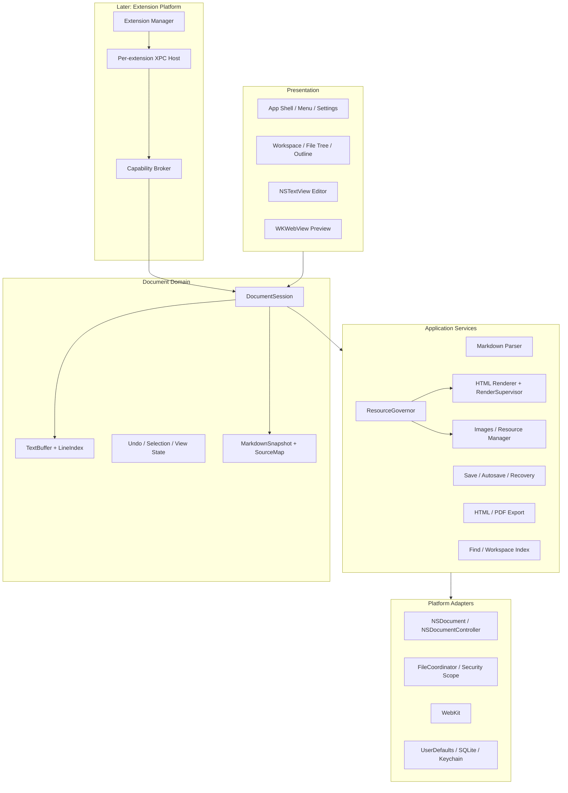
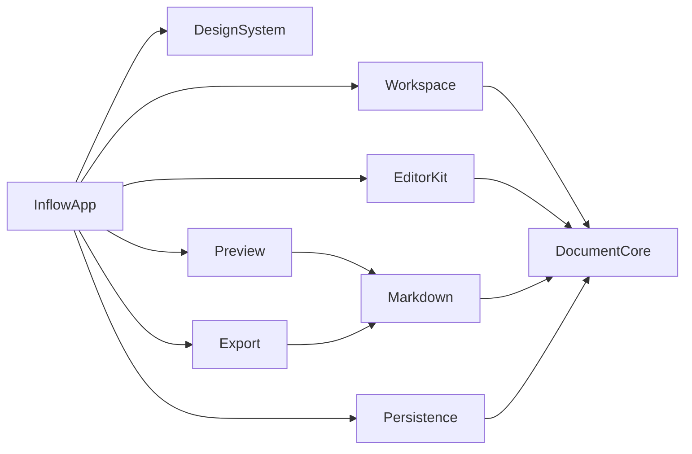
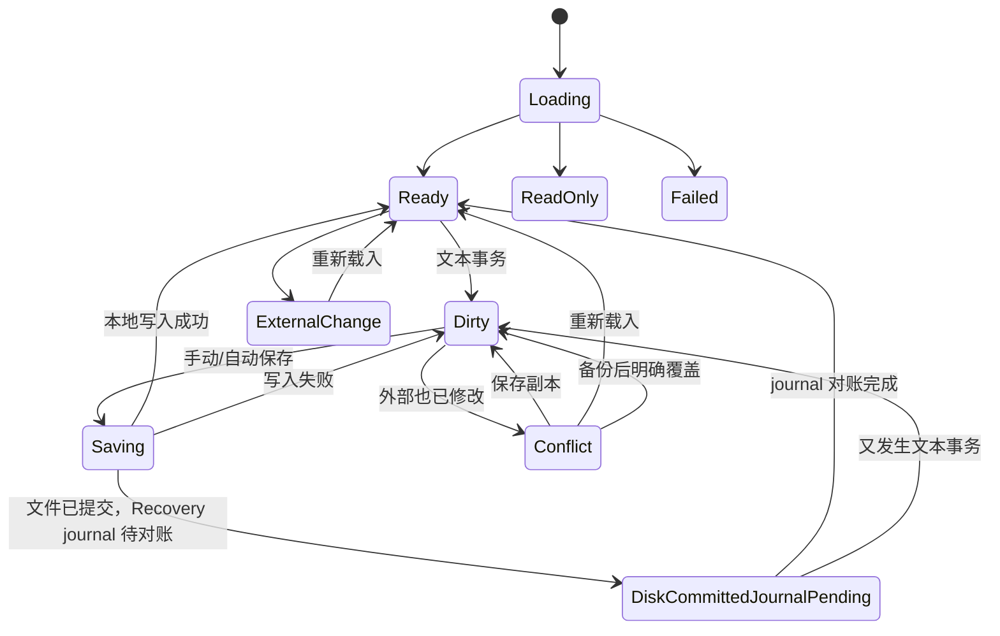
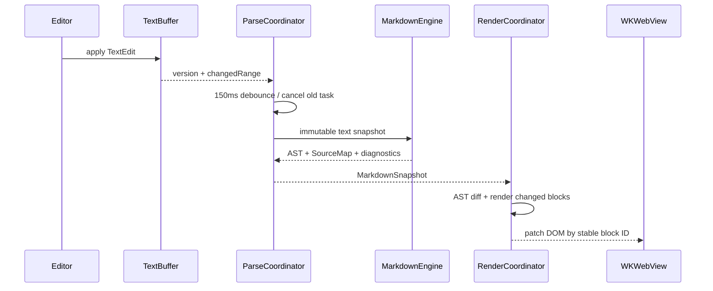

# Inflow 产品技术方案

- 文档版本：v1.1-final
- 更新日期：2026-08-18
- 状态：前置产品/工程契约已定稿；T0 证据门槛仍开放，T1 尚未授权
- 目标平台：Apple Silicon，macOS 14+
- 当前本机环境：Xcode 26.6；`xcodebuild -checkFirstLaunchStatus` 已通过

## 阅读指南

- 架构决策：读取第 1–6 节。
- 编辑、解析和预览：读取第 7–10 节。
- 文件可靠性：读取第 11–12 节。
- 工作区、资源和导出：读取第 13–16 节。
- 扩展与 AI 预留：读取第 17–18 节；详细实现再进入扩展目录。
- 工程执行：读取第 19–29 节，尤其是第 25 节实施阶段与第 27 节风险。

## 1. 方案目标

本方案将 PRD 转换为可实施的 macOS 工程架构，优先保证：

1. Markdown 源码始终是文档事实来源。
2. 本地保存、自动保存和异常恢复不能因预览、插件或网络失败而受影响。
3. 编辑、即时渲染、分栏和预览共享同一文档模型与源码位置映射。
4. 核心能力完全离线，所有 JavaScript、CSS、字体和渲染资源随应用打包。
5. 首个版本建立可演进的解析、渲染与扩展边界，但不提前实现完整插件市场和 AI 生态。
6. 10,000 行、约 1 MB Markdown 文档仍能流畅输入、保存和基础预览。

## 2. 已确认约束

| 项目 | 决策 |
| --- | --- |
| CPU | 仅 Apple Silicon，不提供 x86_64 构建 |
| 系统 | macOS 14 Sonoma 及以上 |
| 分发 | Developer ID 签名、Apple 公证、独立安装包 |
| Mac App Store | 暂不分发 |
| 沙盒 | 启用 App Sandbox，使用用户选择文件权限和安全作用域书签 |
| 网络 | P0 Core 不因文档内容联网；P1 远程图片和后续连接器/AI 使用独立受控能力 |
| PDF 深色主题 | 保持深色页面背景和对应前景色 |
| CLI | 不属于编辑器本体 |
| AI | 后续扩展生态能力，不作为 Core 依赖 |
| 插件 | 后续分阶段开放，第三方代码进程外运行 |

## 3. 总体架构

采用分层、模块化单体作为 Core，插件运行时另设隔离进程。本文是工程执行契约；产品范围、默认行为的用户语义和 P0–P3 DoD 以带稳定 requirement ID 的 PRD 为权威，机器 key、类型、范围、默认值和迁移分别以对应 JSON Schema/Manifest 为权威。Markdown 说明不得覆盖机器契约。



## 4. 技术栈

### 4.1 原生应用

- Swift 6 并发模型，开启严格并发检查。
- SwiftUI：工具栏、设置、侧栏、状态视图、恢复中心和普通业务界面。
- AppKit：`NSDocument`、`NSWindowController`、菜单响应链和文本编辑器。
- TextKit 2 优先：文本布局、选择、输入法、拼写和可访问性；若某些大文档场景表现不稳定，局部回退到 TextKit 1 适配器，不改变上层接口。
- WebKit：离线预览与 `createPDF` 候选路径；不再作为 Mermaid/KaTeX 的 job 隔离边界。
- 非 WebKit render runtime：随包锁定的最小 JS runtime + DOM shim 候选，只用于一次性 Mermaid/KaTeX worker；具体 engine/version/hash 必须由 T0 可终止性、内存和输出一致性原型选定并写入 RenderManifest，本文不在证据前点名实现。
- JavaScriptCore：未来扩展 Host 的脚本运行时，不作为 P0 Render worker 隔离前提；render 与 extension 使用不同 target、签名和 capability profile。

### 4.2 Markdown 与 Web 资源

- Swift Markdown 0.8.0 + swift-cmark 0.8.0：Core AST、源码范围和结构遍历；事实来源、options 和偏差表见 [MarkdownDialectManifest](./核心/Markdown方言清单.md)。
- Mermaid 11.15.0：随应用固定版本打包，渲染 `mermaid` 围栏块。
- KaTeX 0.18.1：Core 的快速行内/块级数学渲染；更完整 LaTeX 交由后续 Domain Pack。
- 代码着色：随应用打包的轻量高亮库，语言按需注册。
- 自研 AST-to-HTML Renderer：控制源码 ID、安全清洗、主题 token 和导出一致性。

所有依赖锁定精确版本和校验值，不引用 `main` 分支，不从 CDN 加载。升级依赖时运行统一 Markdown、Mermaid、公式和导出快照测试。

### 4.3 本地存储

- 用户文档：用户选择位置的 `.md` / `.markdown`。
- 偏好：`UserDefaults`，由类型安全 `SettingsStore` 封装。
- 恢复索引、本地版本和工作区索引：系统 SQLite3，封装在内部持久化模块。
- 快照正文：Application Support 中按文档 ID 保存的压缩 blob，SQLite 只存元数据。
- 账号凭据：后续连接器/AI 使用 macOS Keychain。
- 渲染正文与中间结果：P0 禁止写入任何命名临时文件；只允许进程内存或在应用容器内创建后立即 `unlink`、只以受限 FD 持有的匿名对象，job 结束/强杀即释放。系统临时目录不得出现 Markdown、公式、图表源码或派生明文。
- 最终导出 staging：只包含已经过隐私清洗的最终产物，使用系统提供的目标同卷 replacement directory，postflight 后协调原子替换；不得复用为渲染 scratch。

## 5. 工程结构

建议建立一个 Xcode Workspace 和多个本地 Swift Package：

```text
Inflow/
├── Inflow.xcworkspace
├── Apps/
│   ├── InflowApp/
│   └── InflowExtensionHost/          # 后续阶段
├── Packages/
│   ├── InflowDocumentCore/
│   ├── InflowEditorKit/
│   ├── InflowMarkdown/
│   ├── InflowPreview/
│   ├── InflowPersistence/
│   ├── InflowWorkspace/
│   ├── InflowExport/
│   ├── InflowExtensions/             # 后续阶段
│   └── InflowDesignSystem/
├── Resources/
│   ├── Web/
│   ├── Themes/
│   ├── Fonts/
│   └── Samples/
├── Tests/
│   ├── Fixtures/
│   ├── Golden/
│   └── Performance/
└── 文档/
```

模块依赖方向：



规则：业务模块不能反向依赖 App；DocumentCore 不依赖 AppKit/WebKit；Web 资源只能由 Preview/Export 加载；文件写入只能经过 Document/Persistence 服务。

## 6. 文档架构

### 6.1 选择 NSDocument

使用 `NSDocument` + `NSDocumentController`，而不是只使用 SwiftUI `DocumentGroup`。原因：

- 原生处理 New/Open/Save/Save As/Close、edited 状态和 responder chain。
- 支持安全保存、文件协调、多窗口、系统撤销和外部文件变化。
- 更容易精确控制自动保存、未命名草稿、只读文档和窗口恢复。
- 可以由 `NSHostingController` 承载 SwiftUI 界面，同时保留 AppKit 文档生命周期。

### 6.2 核心对象

```swift
@MainActor
final class MarkdownDocument: NSDocument {
    let session: DocumentSession
    // read/write, window controllers, save state bridge
}

@MainActor
final class DocumentSession: ObservableObject {
    let documentID: DocumentID
    let buffer: TextBuffer
    let viewState: DocumentViewState
    let pipeline: DocumentPipeline
    let committedBase: CommittedBaseSnapshot
}
```

`MarkdownDocument` 只负责 AppKit 生命周期和文件接口；`DocumentSession` 负责当前内存状态；解析、预览、恢复和导出通过服务对象运行。

`documentID` 是应用生成且永久稳定的 UUID，不从路径或 file resource ID 派生。SQLite 维护 `DocumentAlias { canonicalURL, volumeID, resourceID, state: active|retired, firstSeenAt, retiredAt? }`；每个 documentID 恰有一个 active alias，原子替换更新其 resource identity，Save As 将旧 alias 原子转为 retired 并建立新 active alias。原路径后来出现的新文件是新文档；retired alias 只用于冲突诊断和恢复归属，永不自动夺回所有权。

应用级 `DocumentRegistry` actor 以 canonical URL 与 `(volumeID, resourceID)` 双键维护打开所有权和 Save As reservation。同一资源最多属于一个 live `DocumentSession`；路径与 identity 任一命中另一会话即拒绝第二次打开/另存，并聚焦既有窗口。reservation 从 Save As preflight 持有到原生完成回调与 registry postflight 结束。

### 6.3 文档状态



`diskCommittedJournalPending` 是与 Ready/Dirty 正交的 Recovery-protection facet；发生新编辑后本地文档转 Dirty，但该 pending nonce 仍必须对账，不能被新保存覆盖。保存状态和未来同步状态严格分离。窗口标题中的 edited 标记只代表本地文件状态，Recovery 降级使用独立、可访问的状态提示。

## 7. 文本模型与编辑器

### 7.1 TextBuffer

`TextBuffer` 是唯一可编辑源码容器，初期使用 `NSMutableAttributedString`/`NSTextStorage` 兼容结构并封装为稳定协议。它维护：

- UTF-16 offset 与 Swift `String.Index` 的转换。
- 增量 `LineIndex`：行号、行起止、offset-to-line。
- 单调递增 `documentVersion`。
- 文本事务和变更范围。
- 当前字符编码与换行符信息。

所有来自格式命令、预览点击、AI 或插件的写入都转换为：

```swift
struct TextEdit: Sendable {
    let range: UTF16Range
    let replacement: String
}

struct WorkspaceEdit: Sendable {
    let baseVersion: UInt64
    let label: String
    let edits: [TextEdit]
}
```

一次 `WorkspaceEdit` 原子执行并注册为一次 Undo。

`NSDocument.undoManager` 是唯一 Undo 所有者。`TextBuffer` 观察 NSTextStorage、IME marked-text、拼写替换、拖放、粘贴、Finder replace 和程序化事务产生的全部字符 mutation，并为每次有效变化单调增加 `documentVersion`；原生输入不建立第二套 undo。格式命令和扩展编辑必须校验 `baseVersion`、排序并拒绝重叠范围，再以一个 undo grouping 提交。`NSTextFinder` 通过 `FindAdapter` 读写同一 TextBuffer，Replace All 转换为一个 `WorkspaceEdit`，不得绕过版本或重复注册撤销。

### 7.2 EditorView

`NSViewRepresentable` 包装自定义 `MarkdownTextView: NSTextView`：

- 使用系统输入法、文本选择、拖放、拼写、VoiceOver 和查找栏基础能力。
- 自定义 command handling 支持 Tab/Shift-Tab 和格式快捷键；P0 feature flag 只注册 `⌘1`–`⌘3`，P1 才增加 `⌘4`。
- 高亮属性不写入文档模型，也不进入 Undo。
- 只对变更行及受影响语法范围重新着色；代码围栏等跨行结构向前后扫描到稳定边界。
- 大文件或持续输入时降低高亮优先级，永不阻塞字符输入和保存。

### 7.3 即时渲染编辑

P1 在同一 TextBuffer 上增加 `RenderedEditorLayout`，不使用 WebView `contenteditable`：

- 非当前块隐藏或弱化 Markdown 标记。
- 标题、引用、列表、代码和表格通过 TextKit 属性与附件视图呈现。
- 光标进入结构块时恢复必要标记。
- 任务复选框、表格控件只产生 TextEdit，不直接改变 AST。
- 不可视化的扩展节点降级为源码块。

这一阶段必须先完成 round-trip 测试：可视操作前后的源码可预测、无损、可一次撤销。

## 8. Markdown 解析与源码映射

### 8.1 Pipeline



### 8.2 MarkdownSnapshot

```swift
struct MarkdownSnapshot: Sendable {
    let documentVersion: UInt64
    let ast: MarkdownAST
    let sourceMap: SourceMap
    let headings: [HeadingNode]
    let links: [LinkNode]
    let diagnostics: [Diagnostic]
    let contentHash: ContentHash
}
```

每个块级节点生成稳定 ID：优先由节点类型、源码范围附近内容 hash 和父路径推导。编辑导致 offset 移动时，通过相邻块匹配复用旧 ID，减少 DOM 全量刷新。

### 8.3 解析策略

- P0 使用后台全量 parse，输入 debounce 150 ms，旧任务取消。
- 解析输入是不可变 String 快照，绝不在后台访问 NSTextStorage。
- 先验证 1 MB/10,000 行目标；如果全量 parse P95 超标，再增加块级分段缓存，不在首期引入第二套 Parser。
- SourceRange 统一转换到 UTF-16 offset，供 NSTextView、WebView 和诊断共享。
- 核心 GFM AST 之后预留 Syntax Registry；插件只能增加节点，不能替换 Core Parser。

## 9. 预览与渲染

### 9.1 WKWebView 配置

- 使用非持久化 `WKWebsiteDataStore`。
- 只加载应用内置 HTML shell 和自定义 `inflow-resource://` scheme。
- 禁止任意导航、新窗口、下载、摄像头、麦克风和剪贴板访问。
- Content Security Policy 固定包含 `default-src 'none'; base-uri 'none'; form-action 'none'; object-src 'none'; frame-src 'none'`，再按版本化 `SanitizerManifest` 仅放行带 hash 的内置 style/script/image/font scheme；不得使用宽泛 host、`blob:` 或网络来源。
- P0 远程图片只产生占位，不发出 HTTP 请求；受控加载进入 P1。
- P0 raw HTML 全部转义为源码；allowlist 清洗进入 P1。

### 9.2 HTML Renderer

自研 AST visitor 生成语义 HTML：

- 每个块包含 `data-node-id`、`data-source-start`、`data-source-end`。
- 标题包含稳定 slug 和源码位置。
- 主题使用 CSS token，浅色/深色共享布局规则。
- 表格、代码和图表在容器内横向滚动。
- 图片 URL 统一经 ResourceResolver 解析。

普通段落可以使用局部 DOM patch；主题、正文宽度和完整解析配置变化时允许全量替换，并在替换前后恢复语义锚点。

### 9.3 Mermaid 与隔离渲染

- 围栏语言为 `mermaid` 时产生 `DiagramNode`。
- 使用内容 hash + Mermaid 版本 + 主题作为缓存 key。
- Core 将不可变 job envelope 通过经 audit token 校验的 XPC 发送给独立 `RenderSupervisor`；Supervisor 本身无用户文件、Application Support、Keychain、剪贴板和网络权限，只能读取签名包内经 manifest hash 固定的运行时资源。
- Supervisor 为每个 job 启动一个一次性、非 WebKit JS runtime + 最小 DOM shim worker 进程；worker 只从私有内存/匿名 FD 接收输入，返回长度有界的中间树，完成即退出。每个 job 独占 OS 进程；超时、取消或预算越限时按已登记父子 PID 整棵强杀并等待退出确认，禁止复用 realm、线程或 `WKProcessPool`。runtime 的选择只有在 T0 manifest 记录精确版本/hash 和证据后才算冻结。
- `ResourceGovernor` 对 Render/Image/后续 helper 统一发放 job lease，按完整进程树汇总 RSS/CPU/墙钟/输出字节；实行全局上限、每文档 token bucket、轮转公平和 generation 取消。任何子 supervisor 的局部上限都不能越过全局预算。
- WebKit job 隔离路径因 `WKProcessPool` 不再提供预期隔离而 Rejected；若未来重新评估，必须以“每 job 独立客户端进程 + 可归属 PID + 运行时断网 + 整树强杀”另立 ADR，不得恢复为普通 fallback。D05 在真实进程证据归档前保持 Reopened。
- 最终 SVG 必须再次清洗，禁止 `foreignObject`、CSS、外部资源、脚本、事件和导航。
- 失败时显示源码位置、简短错误和“在编辑器中定位”。

### 9.4 数学

- Core 支持 `$...$`、`$$...$$` 和转义美元符号。
- Parser 先识别数学节点；KaTeX 使用与 Mermaid 相同的 Supervisor/一次性非 WebKit JS runtime + 最小 DOM shim worker 协议但独立 job kind，不参与全文 Markdown 解析，超时/内存越限直接终止完整进程树。
- 固定 KaTeX `trust: false`、`strict: error` 与 `SanitizerManifest` 的展开、节点、尺寸和文档预算。
- 错误公式显示源码和诊断，其他节点继续渲染。
- 完整 LaTeX/TikZ 属于后续 Academic Domain Pack。

## 10. 模式切换与定位

### 10.1 模式状态

`DocumentViewState` 保存：

- `mode`: source / split / preview / renderedEditing。
- 编辑器 selection 和可见字符范围。
- 预览顶部 node ID 与节点内相对比例。
- 当前分栏比例和焦点区域；正文宽度来自版本化 Settings Schema，不作为文档状态。

切换模式先捕获语义锚点，再构造目标布局，最后恢复焦点和位置。

### 10.2 点击标题定位源码

1. WebView 通过 message handler 发送 node ID。
2. SourceMap 解析 UTF-16 source range。
3. 必要时从预览切换为分栏。
4. NSTextView 滚动到标题行中央并设置插入点。
5. 校验事件携带的 documentVersion；过期事件丢弃。

### 10.3 编辑器到预览滚动同步

- 编辑器滚动后找出可见区域顶部和底部最近块级节点。
- 使用 SourceMap 得到相应 DOM node ID。
- 在两个锚点之间按源码位置插值。
- 用户主动滚动预览时设置 1 秒 suppression window。
- 设置关闭后不发送同步事件。

P1 再实现预览到编辑器的反向同步，使用相同锚点模型，避免两个方向递归触发。

## 11. 文件、保存与恢复

### 11.1 打开

- 由 `NSDocumentController` 处理 Finder、Open Panel 和应用打开事件。
- 支持 UTF-8/UTF-8 BOM；记录并保留 BOM 与主换行风格。新文档为无 BOM + LF；混合换行在首次编辑前由 `LineEndingDecision` 一次性选择，决定前保持只读并暂停自动保存。无效 UTF-8 不创建 TextBuffer，只显示不支持编码及 Finder 定位/复制原文件/取消；识别与转换在 P1 提供。
- 读取时记录文件资源标识、修改时间、大小和内容 hash 作为 `FileRevision`。
- 同一 canonical URL 只打开一次。

### 11.2 保存

外层事务冻结为方案 A：原生 `NSDocument.save(to:ofType:for:completionHandler:)` 是唯一外层保存入口，`NSDocument` 继续独占 safe-write、change-count token、Save As `fileURL`、FilePresenter 和文件属性迁移。`SaveCoordinator` 永不直接调用 `writeSafely`、`super.writeSafely`、`replaceItemAt` 或 `updateChangeCount`；后续若要采用自管写入，必须用新 ADR 完整替换本节，不能混合两条路径。

```swift
struct SaveEnvelope: Sendable {
    let saveNonce: UUID
    let documentID: DocumentID
    let version: UInt64
    let exactData: Data
    let contentHash: ContentHash
    let targetExpectation: TargetExpectation // absent | exactRevision
    let serialization: SerializationPolicy  // type, encoding, BOM, line ending
}

struct RelativeReferenceImpactPlan: Sendable {
    let documentID: DocumentID
    let sourceVersion: UInt64
    let sourceDirectoryIdentity: ResourceIdentity?
    let targetDirectoryIdentity: ResourceIdentity
    let findings: [RelativeReferenceImpact]
    let dependencyExpectations: [RelativeReferenceDependencyExpectation]
    let dependencySetHash: ContentHash
    let planHash: ContentHash
}

struct RelativeReferenceDependencyExpectation: Sendable {
    let referenceNodeID: NodeID
    let rawReferenceHash: ContentHash
    let oldResolution: ResolutionExpectation // absent | unauthorized | exactResource
    let newResolution: ResolutionExpectation
    let observedParentIdentity: ResourceIdentity
    let observedRevision: FileRevision?
}

struct SaveAsIntent: Sendable {
    let envelope: SaveEnvelope
    let targetURL: URL
    let targetBookmark: Data
    let impactPlan: RelativeReferenceImpactPlan
    let registryReservation: DocumentReservation
}
```

每个 `DocumentSession` 只持有一个 actor `SaveCoordinator`，所有菜单、关闭、自动保存、Save As 和 AppKit action 先进入该 actor。尚未开始且同目标的意图可合并到最高 `minimumVersion`；开始执行时在 MainActor 一次捕获 `SaveEnvelope`，之后物理写入、Recovery 和后验只能引用该 envelope，不得重读变化中的 TextBuffer。

执行顺序是唯一规范：

1. 校验 named/writable/conflict 条件并捕获 `targetExpectation` 作为 preflight。Save As 还须取得 `DocumentRegistry` reservation，生成绑定当前 `sourceVersion`、源/目标目录 identity、每条相对引用的 raw hash 与旧/新解析依赖 expectation 的 `RelativeReferenceImpactPlan` 并完成用户确认；进入原生 save guard 前必须用目录 FD 逐项重新解析。正文版本、目录 identity、保存目标 expectation、依赖文件的存在性/resource identity/revision 或授权结果任一变化，都使计划失效并触发重新分析和确认。
2. 请求 Recovery 为 exactData 建立 protected pending-save slot 并追加 `savePrepared`。成功时进入 protected 模式；Keychain 锁定/失效、Recovery store 损坏、配额资源不足或该追加失败时进入 `recoveryProtectionDegraded(reason)`，明确告警但继续用户文件保存。Recovery 不是 `.md` 写入的 gate。
3. 在紧邻写入的 coordinated target guard 和原生调用之前注册 `SelfWriteGuard { pendingSaveNonce, canonicalTarget, expectedHash, bufferedPresenterEvents }`。从此到 postflight 结束的 FilePresenter 事件只暂存，不得因尚无完成 token 而丢失或误判。
4. 在一个锁/actor 保护、跨线程安全的 `CommitContextStore` 安装 `CommitContext { envelope, operation, reentryToken, recoveryMode, selfWriteGuard }`。context 只能由匹配 nonce、operation、target 和不可伪造 `reentryToken` 的原生写入 override 原子 claim 一次；第二次 claim、无 context 调用或字段不匹配都 fail closed。`data(ofType:)` 只从已 claim context 返回 `exactData`；不得访问 TextBuffer。context 在 completion/postflight 后清除，异常退出由 defer 清除并重放事件。
5. `SaveCoordinator` 切到 MainActor，恰好一次调用 `MarkdownDocument.save(to:ofType:for:completionHandler:)`。该 re-entry token 只允许本次原生调用穿过 action interception，防止 override 再次排队；真正写入仍由 `NSDocument` 内部调用 `writeSafely` 完成。override 只在紧邻 `super.writeSafely` 前复核 expectation/context，不实现第二套 writer。
6. 原生 completion 成功后，协调读取目标并验证 `actualHash == envelope.contentHash`，捕获实际 `FileRevision`。匹配时让 `SelfWriteGuard` 只消费 resource identity/revision/hash 均精确对应本次写入的事件，其余事件按原顺序重放；不匹配则全部重放并进入冲突。原生 completion 失败同样重放全部事件、保留 buffer/Recovery，并提供重试或另存为。
7. 磁盘后验通过后调用统一 `adoptCommittedBase(reason: .save, envelope, actualRevision)`，再追加并 fsync `saveCommitted`。只有这一步成功才是 `protectedCommitted`。若文件已成功提交而 journal fsync 失败，状态固定为 `diskCommittedJournalPending { nonce, version, hash, actualRevision }`：不得把文件保存显示为失败、不得回滚 `fileURL` 或伪造 change-count；显示“文件已保存，恢复保护待修复”，保留 prepared blob，并在本会话重试。重启时以 prepared 记录与磁盘 exact hash/revision 对账后合成 committed 水位；不匹配则进入人工恢复隔离。

`NSDocument` 独自管理原生 change-count token。Coordinator 的 `savedVersion` 仅用于防止旧回调覆盖新状态：只有 native token 语义和 `savedVersion == currentBufferVersion` 都表明无后续编辑时窗口才无 edited 标记；Coordinator 不自行调用 change-count API。

Save As 成功时原生 `.saveAsOperation` 已经更新 `fileURL` 并迁移文件属性，应用不得再次手工切换。postflight 在一个 SQLite/registry 事务中把旧 alias 标为 retired、建立新 active alias 并保存 bookmark/revision；若该元数据事务失败，进入 `metadataReconciliationPending`，以原生新 `fileURL` 为事实，继续持有新旧 scope lease 并禁止再次 Save As，直到通过磁盘 identity 重建 registry。文件写入失败时原生保持旧 `fileURL`，释放 reservation 与新 scope，documentID 始终不变。

### 11.3 自动保存

- P0 明确关闭 AppKit 自动保存/草稿/Versions 所有权：`override class var autosavesInPlace: Bool { false }`、`override class var autosavesDrafts: Bool { false }`、`override class var preservesVersions: Bool { false }`，`NSDocumentController.autosavingDelay = 0`。系统不得创建 draft、自动写盘或以 Versions 改变关闭提示；P3 VersionStore 与 Recovery 均为独立应用服务。
- 用户开启自动保存时，由 SaveCoordinator 按 schema 指定的 0.5/1/2/5 秒防抖后发起普通 `.saveOperation`；仅当文档 named、当前 URL 可写、目标仍存在且状态不是 conflict/deleted/permissionLost/metadataReconciliationPending 时允许 file autosave。未命名文档永远只写 Recovery，不得触发普通 file save 或弹出保存面板。关闭开关时取消未开始意图；应用 resign active 也必须满足相同条件。
- 关闭行为严格执行 PRD 5.1.4，`canClose` 只读取 Coordinator 的 dirty/savedVersion 屏障；所有 `NSSaveOperationType` fixture 必须证明不会绕过 envelope 或生成系统 draft/Version。

### 11.4 恢复快照

恢复由独立 `RecoveryService` 负责，不能只依赖自动保存：

```text
Application Support/Inflow/Recovery/
├── index.sqlite
├── sessions/
│   └── <document-id>/
│       └── <epoch>.journal
├── anchors/
│   └── <document-id>/<epoch>.anchor
└── blobs/
    └── <document-id>/<snapshot-id>.bin
```

快照包含：

- schemaVersion、documentID、source、contentHash。
- file URL bookmark、最近成功 FileRevision。
- documentVersion、时间、是否未命名。
- selection、mode、scroll anchors 和窗口状态。
- cleanShutdown、expiresAt；Save As 只迁移书签和 revision，不更换 documentID。
- sessionEpoch、snapshotGeneration、lastCommittedDocumentVersion、discardedThroughGeneration 和 blob checksum。

每个 epoch 恰有一个 `sessions/<documentID>/<epoch>.journal`。journal 是 framed append log，epoch 内以单调 `segmentID` 和显式 `checkpoint` 事件轮换；`segmentStart` 的唯一 segment 编号是公共 `segmentID`，不得定义第二编号字段。不得把新 segment 伪装成新 epoch，也不得把多个 epoch 写入同一文件。wire/header/AEAD 的唯一权威是 [SaveRecovery ADR 第 5 节](./核心/保存与恢复决策记录.md)：header 必含 `storeGeneration/keyID/headerLength/headerCRC32C`，Recovery namespace DEK 以 `journal-record` label 派生 record key，每记录随机 96-bit nonce，AAD 绑定 canonical header digest/sequence/segment/hash/length，并以 GCM tag + CRC32C + hash-chain + durable tail anchor 抗完整后缀截断。bookmark、路径、hash、selection、窗口状态和事件 payload 全部加密认证。

历史配额为单文档 256 MiB/2,000 个非 head snapshots、全应用 2 GiB。每个 active/pending epoch 的唯一 head 与每个进行中保存的 pending-save slot 属于保护槽，不计入历史 snapshot 数量/字节配额；达到阈值时按“低于 committed 水位 → 非 head checkpoint → 最旧已保存历史”回收。保护槽不作任意文档大小保证：实际 ENOSPC/IO error 时进入 `recoveryProtectionDegraded` 并停止新增 Recovery 数据，但不得阻止用户保存自己的 `.md` 文件。

策略：

- 变更后最迟 5 秒写入；每个 documentID 的 actor 串行分配严格递增的 snapshotGeneration。晚到的过期任务只可删除自身临时 blob，不得更新索引。
- 提交顺序固定为：写 blob 临时文件并 `fsync` → 原子重命名为最终 blob → SQLite 事务插入 snapshot 行并更新 session head → 提交事务。索引永不引用未完成 blob；事务失败时最终 blob 作为 orphan 留待启动清扫。
- 每次普通打开先生成随机 `sessionEpoch`，在接受编辑前创建 journal 并 fsync `start { initialState: active, storeGeneration, baseSavedDocumentVersion, baseFileRevision }`；失败则进入明显的 Recovery 降级状态，仍可编辑和保存，但 UI/关闭流程不得宣称可自动恢复。恢复 handoff 创建的新 epoch 使用 `start { initialState: pending, storeGeneration, baseSavedDocumentVersion, baseFileRevision, replacesEpoch, handoffID }`。
- 事件使用 discriminated schema：解密后的逻辑对象只含公共字段 `schemaVersion, kind, opaqueDocumentID, epoch, segmentID, sequence, timestamp, previousRecordHash, payloadLength` 和该 `kind` 明确声明的专属字段；不存在另一组无判别的 nullable payload。kind 固定为 `start / segmentStart / checkpoint / savePrepared / saveCommitted / handoffPrepared / activate / retire / discard / consume / clean`，精确 closed-world 字段以 [`恢复日志事件模式.json`](../../机器校验/技术/核心/恢复日志事件模式.json) 为唯一权威；v1 中任何未知 kind/字段都使该 epoch 隔离，只有未来提升 schemaVersion 并显式声明的规则才可跳过。每次 append 必须 fsync，截断处理严格遵循 ADR 的 tag/hash/CRC/tail-anchor 规则。
- protected 模式保存先把 `envelope.exactData` 写入独占 pending-save slot，提交 blob/index/head，再 fsync `savePrepared { saveNonce, blobID, documentVersion, snapshotGeneration, targetIdentity, targetExpectation, contentHash }`，之后才调用原生 save。同一 blob 绑定保存字节和崩溃恢复来源。任何准备步骤失败都切换为 degraded 模式并继续原生 save，不得写一个无 durable blob 的 `savePrepared`。
- 原生 save 成功且磁盘后验匹配后 fsync `saveCommitted { saveNonce, blobID, documentVersion, contentHash, actualRevision, reconciledAfterCrash: false }` 再镜像 SQLite 水位。prepared 未 committed 时，启动回放以 pending blob exact hash + 目标 identity/revision 对账：匹配即补记同样字段且 `reconciledAfterCrash: true` 的 committed；不匹配则保留 blob 并标记“保存结果不确定”。磁盘已匹配但补记仍失败即恢复 `diskCommittedJournalPending`，文件本身仍是成功保存。
- “不保存/放弃恢复”先在 Recovery actor 内原子标记 epoch 为 `retiring`、停止接收并取消/排空该 epoch 的任务，再追加并同步 `retire(epoch)` 与 `discard(epoch, throughGeneration)`；`retire` 单独出现即足以禁止自动恢复，UI 只在两项 journal 事件均 fsync 后确认丢弃。随后镜像 SQLite，最后异步删除 blob。所有快照任务在写 blob、重命名和提交索引前均校验 epoch 为 active，晚到任务不能复活内容。
- 恢复 handoff 的状态固定为“新 epoch `pending → active`、旧 epoch `active → consumed`”：在旧 epoch fsync `handoffPrepared { handoffID, newEpoch, throughGeneration }` → 新 epoch fsync `start { initialState: pending, storeGeneration, baseSavedDocumentVersion, baseFileRevision, replacesEpoch, handoffID }` → 将恢复 exactData 写入新 epoch 首个 durable blob/index/head → 应用到 TextBuffer → 新 epoch fsync `activate { replacesEpoch, handoffID, headGeneration, headHash }` → 旧 epoch fsync `consume { consumedByEpoch, handoffID, activateRecordHash, throughGeneration }` → UI 确认。`activate` 是唯一资格切换点：此前崩溃只允许旧 epoch，此后即使旧 consume 尚未落盘也只允许已验证 head 的新 epoch；回放通过 handoffID/replaces graph 压制旧 epoch，绝不同时展示两者。应用失败不写 activate。
- clean shutdown 先停止接收新任务并等待队列排空，再追加 `clean(epoch, throughGeneration)` 并镜像 SQLite；超过 2 秒仍未排空则不写 clean，保留恢复入口并允许退出。下次会话必须使用新 epoch，旧 epoch 的晚到任务一律自弃。
- 相同内容 hash 可复用只读 blob，但每个 snapshot 索引仍记录独立 generation。正常保存不立即删除当前或更新 generation 的恢复记录，待 clean shutdown/tombstone 协议处理。
- 启动时扫描未关闭 session；原文件已改变时以未命名副本恢复。
- 启动及 SQLite 重建必须先按 documentID 回放全部 epoch journal，验证 handoff graph，再处理 prepared/committed、retired/discarded、consumed/clean 并以磁盘 hash/revision 对账未决保存，最后扫描 blob。只有经 graph 判定唯一 active、未 clean/retire/consume 的 epoch 可自动恢复高于 committed/discard 水位的 head；pending epoch、被 activate 替代的旧 epoch、无 start、epoch 不匹配、分叉 handoff 或 journal 校验失败的数据进入人工恢复隔离区。
- Recovery key 丢失时把所有引用旧 keyID 的密文和索引移入只读 `key-orphaned` 隔离记录（不尝试当作明文解析）；Keychain 可写时生成新 Recovery 域 KEK 并只保护后续内容，Keychain 锁定时保持 degraded 直到解锁。密钥不可恢复不影响用户文档读取或保存，旧密文只能由用户明确 crypto-erase。

### 11.5 外部修改

通过 NSDocument/FilePresenter 回调和 revision 校验处理：

- 内存无修改：自动重新载入，保持语义位置。
- 内存有修改：暂停自动保存并进入三方比较，只提供保存副本、重新载入、明确覆盖。
- 明确覆盖前在同目录创建带时间戳冲突副本并二次确认；副本失败即禁止覆盖。
- 文件被删除：保留内存文档并暂停自动保存，只允许另存为或经二次确认重建。
- 权限丢失：转只读，允许另存。
- 自动 reload 捕获开始时的 `documentVersion` 与磁盘 `FileRevision`，读取完成、应用到 buffer 前再次校验两者；期间出现本地输入或新的磁盘 revision 即取消本次 reload。自身保存期间的通知先由 pre-write `SelfWriteGuard` 暂存，postflight 后只精确消费匹配事件。
- 永久冲突副本需要相邻目录权限；单文件授权不足时才请求包含目录。拒绝后禁止明确覆盖，但普通安全保存仍可继续。

`DocumentSession` 只通过 `adoptCommittedBase(reason: open|save|reload|revert, exactData, FileRevision)` 更新 immutable `CommittedBaseSnapshot { version, exactData, hash, FileRevision }`。open/save/reload/revert 采纳磁盘事实后必须调用同一入口；其中 reload/revert 用磁盘正文替换 TextBuffer 后清空 `NSDocument.undoManager`、selection/range 缓存和过期 diagnostics，再建立新 pipeline generation，禁止撤销回被外部取代的正文。普通 save 不清空 Undo。CommittedBase 仅用于 P0 只读三方差异，不依赖 Recovery 或 P3 VersionStore；冲突固定展示 committed base / 当前 buffer / 当前磁盘，动作仅为“保存副本 / 重新载入 / 创建磁盘备份并明确覆盖”。

## 12. 本地版本历史

P3 建立与 Recovery 分离的 VersionStore：

- Recovery 用于崩溃保护，不能关闭。
- VersionStore 用于用户浏览，可关闭和设置容量。
- 保存成功和重大结构操作后创建版本。
- 小版本存增量 delta，周期性存完整 checkpoint。
- 产品默认保留 30 天或 500 MiB，以先到者为准；实现读取 `Settings Schema`，本文不另设默认。
- 恢复旧版本实际创建一个可撤销 TextEdit，不绕过当前文档模型。

## 13. 查找、替换与工作区

### 13.1 当前文档

- P0 使用 NSTextFinder 或自定义 FindCoordinator 接入系统查找栏；纯预览发起查找固定切到分栏。
- 支持字面值、大小写、当前/全部替换。
- 替换全部预先计算不重叠 ranges，并作为一个 WorkspaceEdit。
- P1 加入正则、选择范围和结果预览。

### 13.2 工作区

P1 引入 `WorkspaceSession`：

- 根目录必须由用户选择并保存 security-scoped bookmark。
- 文件树使用异步目录枚举，不读取隐藏/排除目录。
- 索引使用机器 `钥匙串策略.json` 的独立 `workspace-index-kek` 包装 `(workspaceIdentity, authorizationGeneration)` 范围的 `workspaceIndex` DEK；数据库/WAL 整体 AEAD 加密，索引行只保存 workspace-domain opaque path ID、派生的 HMAC search token、mtime/size 和加密标题/相对路径，不复制正文。无该 workspace key 时只可在重新授权后重建，不能退回明文路径或跨 workspace 可关联 token。
- 文件变更经 FSEvents/文件协调通知后增量更新。
- 全文替换必须先展示 diff，逐文件安全保存并支持事务报告；不承诺跨多个文件的系统级原子性。

## 14. 图片与资源

`ResourceResolver` 统一处理预览、导出和资源检查：

- 相对路径基于当前 Markdown 文件目录。
- 未命名文件粘贴图片时先保存文档或暂存到受控草稿附件区。
- 粘贴/拖放图片按设置复制到附件目录，再以相对路径插入 Markdown。
- 文件名冲突使用稳定后缀，不覆盖已有附件。
- P0 远程图片始终占位；P1 如开放则必须经隔离、限域、限大小代理。
- P0 预览、HTML、PDF 共用 `URLPolicy v1` 与 `ImageDecodePolicy v1`：链接只允许已授权本地相对目标、fragment 和用户单击的 HTTP(S)；图片只允许预算内静态 PNG/JPEG。本地 SVG、data URI、动画、伪造 MIME 和解压/像素炸弹占位。
- 图片解码在无网络、可销毁 ImageDecodeHelper 中执行；主 target 与 helper 均不授予 outgoing-network entitlement。具体字节、像素、内存和并发上限以 `SanitizerManifest` 为准。
- 资源移动先建立引用变更计划，用户确认后修改文件和 Markdown；失败时报告已完成/未完成步骤并尽量回滚。

### 14.1 本地链接导航

`LinkResolver` 将 Markdown 链接解析为受控目标：

```swift
struct VerifiedResourceHandle: @unchecked Sendable {
    let readOnlyFD: Int32
    let identity: ResourceIdentity
    let validatedType: ValidatedLocalType // markdown | png | jpeg | pdf
    let contentHash: ContentHash
    let displayURL: URL                  // display only; never reopen authority
}

enum LinkTarget: Sendable {
    case anchor(DOMID)
    case markdownFile(VerifiedResourceHandle, fragment: DOMID?)
    case localPreview(VerifiedResourceHandle)
    case revealOnly(URL, ResourceIdentity)
    case externalWeb(URL)
    case blocked(reason: LinkBlockReason)
}
```

解析流程：

1. 将 raw target 原样交给 `URLPolicy v1` 做 scheme/path 分类；该入口必须把 fragment 保留为不可解码的 `RawFragmentToken`，不得在路径规范化时 percent-decode 或 NFC。LinkResolver 只消费 URLPolicy 返回的结构化结果，不自行解码。
2. 相对路径以授权根目录 FD 逐段 no-follow 打开并核验 resource identity、regular-file、type sniff 和预算，成功后产生拥有 read-only FD 的 `VerifiedResourceHandle`；后续组件不得把 `displayURL` 当作打开 authority。
3. 单文件授权不足时，由 `ScopeAuthorizationCoordinator` 首次请求包含目录并持久化书签；拒绝状态按目录记忆，不自动重复提示。
4. 两个接口永久分离：`HeadingIDPolicy.makeID(headingText, duplicateOrdinal) -> DOMID` 才运行 `github-compatible-heading-slug-v1`；`FragmentResolver.resolve(rawFragmentToken, domIDSet)` 只能调用 `URLPolicy.decodeFragmentOnce(token)` 一次，执行 percent-decode、严格 UTF-8 校验与 NFC 后立即消费 token，再对既有 DOM ID 做区分大小写 exact match。已解码字符串不能重新包装成 token；fragment 永不进入 slugger，resolver/WebView 也没有第二个 decode API。
5. Markdown 目标由 `DocumentOpenCoordinator` 直接从 verified FD 读取 exact bytes，建立带原 URL/identity 的 `MarkdownDocument` 后注册到 `NSDocumentController`；禁止 Controller 再按路径读取。加载完成后通过 exact DOM ID/SourceMap 定位。打开前仍须通过 `DocumentRegistry` 去重。
6. PNG/JPEG/PDF 只可由 in-app FD consumer 打开；必须交给外部查看器时，先从 verified FD 创建 app-owned、随机名、0700 父目录/0400 文件、内容 hash 固定的 immutable clone，外部程序只看到 clone，lease 结束即清理。其他类型在 P0 只有 Finder reveal，既不按原路径打开，也不生成 clone。未来若开放新类型，必须先把类型 sniff、预算、执行风险和 immutable-clone consumer 写入新版机器 Policy，并在用户再次确认后从重新验证的 FD 复制；不能复用旧校验结果。
7. HTTP/HTTPS 交给系统浏览器；危险 scheme、可执行目标和越权路径返回 blocked。

`NavigationCoordinator` 为每个窗口维护前进/后退栈：

```swift
struct NavigationLocation: Sendable {
    let documentID: DocumentID
    let scopedURL: ScopedURL?
    let nodeID: NodeID?
    let sourceOffset: Int?
    let relativePosition: Double
}
```

导航事件携带 documentVersion。目标文档或 AST 尚未就绪时等待对应 MarkdownSnapshot；版本过期则重新按锚点解析，找不到时回退到文件顶部并显示提示。

WebView 链接点击由 navigation delegate 拦截，不允许页面自行导航。编辑器中的 `⌘`+单击先通过语法树确认鼠标位置确实位于 LinkNode，避免用正则误识别普通文本。

## 15. 导出

### 15.1 统一 RenderProfile

预览和导出共享：

```swift
struct RenderProfile: Sendable, Codable {
    let theme: ThemeID
    let colorScheme: ColorScheme
    let contentWidth: Double
    let markdownDialect: MarkdownDialect
    let mermaidEnabled: Bool
    let mathEnabled: Bool
    let remoteImagesAllowed: Bool // P0 固定 false；P1 才可配置
}

struct ExportEnvelope: Sendable {
    let exactSource: String
    let documentVersion: UInt64
    let sourceHash: ContentHash
    let profile: RenderProfile
    let createdAt: Date
}
```

用户触发导出时必须在 MainActor 一次捕获 `ExportEnvelope`，由独立 export parse/render generation 解析 `exactSource`；不得等待 debounce preview“追上”，也不得复用版本可能较旧的 `MarkdownSnapshot`。导出 UI 明示所捕获版本；若用户要求最新内容而当前 version 已变化，重新捕获并取消旧 generation。

### 15.2 HTML

- 从 ExportEnvelope 的 exactSource 独立解析出的 snapshot 生成完整 HTML，并在提交前校验 sourceHash/profile 未被替换。
- 内联主题 CSS、代码样式、数学所需样式和已渲染 SVG。
- 自包含 HTML 必须内联字体、CSS、本地图片、数学和 Mermaid 结果；P0 不获取远程图片，统一使用占位；100 MiB 为硬上限。源码和 raw HTML 中的 `data:` 始终拒绝，只有 Core 按 `ExportResourcePolicy v1` 对已验证 PNG/JPEG 重新编码或读取固定 hash 内置字体后，才可在最终 staging 生成 data URI。
- 不包含运行时脚本，不依赖 CDN。
- 应用 `ExportPrivacyPolicy v1`：图片重新编码并剥离 EXIF/GPS/XMP/ICC comment 等非像素元数据；远程占位只显示去除 userinfo/query/fragment 的 origin + 截断路径；不输出绝对本地路径。HTML 固定 `default-src 'none'; base-uri 'none'; form-action 'none'; object-src 'none'; frame-src 'none'; img-src data:; style-src 'unsafe-inline'; font-src data:` CSP、`Referrer-Policy: no-referrer`，外部链接仅保留规范化 http/https 且加 `rel="noopener noreferrer"`。
- 保存面板确认时捕获 `ExportTargetExpectation = absent | exactRevision` 并绑定本次确认。使用系统提供的同卷 item replacement directory；最终替换前在文件协调区内再次校验 expectation。目标从 absent 变为存在，或 exactRevision 任一字段变化时，废弃 staging 并重新询问“替换当前版本 / 重新选择 / 取消”；确认不得沿用旧 revision。目标不变才协调 replace/atomic rename，不在相邻目录创建隐藏文件，禁止跨卷移动结果。

### 15.3 PDF

- 创建独立离屏 WKWebView，加载与预览相同的完成 HTML。
- 等待字体、图片、公式和 Mermaid readiness barrier。
- 唯一首选路径是 `WKWebView.createPDF`。T0 用固定 fixture 验证 A4、边距、分页、深色和无丢失；证据归档前 D07 保持 Conditional。`NSPrintOperation` 不在 Core fallback：只有 createPDF 被证据否决且独立 Print helper ADR 同时冻结 entitlement、无面板、无默认/物理打印机交互、spool 边界和仅写 PDF context 后，才可重新提出。
- 深色 profile 写入明确的页面背景和 `print-color-adjust: exact` 等打印样式，不切换浅色主题。
- P0 固定 A4、20 mm 四边距，正文宽度取用户设置与可打印 CSS 宽度的较小值；只保证主题、深色背景和无内容丢失。高级分页、自定义纸张/边距和页眉页脚进入 P1。
- 导出超时或节点失败时列出问题，由用户选择继续或取消，不生成半成品目标。
- “导出不阻塞主线程”指解析、图片重编码、资源 IO、清洗和 postflight 在后台 actor/helper 执行；离屏 WKWebView 只由 MainActor 异步编排，禁止同步等待或在主线程执行重 CPU/IO。若未来启用独立 Print helper，它不得回到 Core/MainActor 的 `NSPrintOperation` 路径。
- `createPDF` 结果必须交给独立、无 Keychain/网络/用户路径权限的 `PDFPostflightHelper`。第一 pass 完整解析后固定 strip JavaScript、Launch/URI/GoToR 等 action、annotation action、AcroForm、嵌入附件、外部文件引用、增量更新尾、绝对路径与隐私 metadata，再只从 allowlisted page/content/font/image/color resource 重建单一 revision；URI/action 的出现本身不绕过 strip/rebuild。第二个独立 parse 仍发现任何 action/URI/annotation action/附件/表单/绝对路径/canary，或 xref/对象边界/页框/页数/总长度不合格时，拒绝整份 PDF 并删除 staging，不得交付部分或让用户“仍然导出”。

## 16. 设置系统

`SettingsStore` 只实现版本化 [Settings Schema](./核心/设置规范.md) 中的 key、scope、默认、继承与迁移，不在代码或本文重复定义默认值：

- 全局默认：UserDefaults。
- 工作区覆盖：Application Support 中的 WorkspaceSettings，不污染用户目录。
- 文档临时状态：DocumentViewState，不写入 Markdown。
- 插件设置：按 extension ID 隔离，后续纳入权限系统。

PRD 只定义“首次窗口为实时分栏预览、以后新窗口沿用最近一次用户显式选择”的产品语义；Schema 必须给出 `app.lastUsedMode`、window mode、语法高亮、滚动同步、标题点击、文件打开方式、字号范围 12–28 及迁移。新安装的 `app.lastUsedMode` 机器默认必须为 `split`；窗口恢复值优先于 last-used，用户显式切换才回写 last-used，恢复/自动 fallback 不回写。任何缺 key、越界值或未知 enum 都按 schema 迁移/拒绝，不能由 UI 私设默认。

设置变更通过 AsyncStream/Observation 发布。编辑字号等直接更新 UI；Parser 或渲染设置产生新的 pipeline generation，取消旧任务后重建。

## 17. 扩展系统落地

扩展详细设计以 [扩展系统总体设计](./扩展/系统设计.md) 为准。本工程的预留点：

- `SyntaxRegistry`：E2 stable v1 只开放 fenced/block directive；行内 academic syntax、嵌套 directive 与 full LaTeX 在 EBNF、错误恢复、CommonMark 优先级和 discriminated schema 全部冻结后才进入 v2。
- `CommandRegistry`：格式和编辑事务命令。
- `DiagnosticRegistry`：统一问题模型。
- `RendererRegistry`：E2 只接受 Core 定义、机器 schema 验证且有预算的 `ExtensionContentTree`；拒绝扩展提供任意 HTML/SVG/CSS。Domain Pack 的 SVG 必须作为 PackReleaseRecord 精确 hash 绑定的受控 asset，经 Core sanitizer 后才能由内容树引用。
- `ExporterRegistry`：单篇导出。
- `SidebarRegistry`：声明式原生 UI。
- `ConnectorRegistry`：保存后事件和远端候选版本。
- `AICapabilityRegistry`：Provider、Action、Context 和 Tool。

P0 只定义内部协议和官方实现，不加载第三方包。直到文档事务、权限 Broker、XPC Host、崩溃隔离和签名验证完成后才开放 SDK。

### 17.1 XPC Host

- 每个可执行扩展都有独立 launcher/client executable，由它建立恰好一个 extension realm/Host 进程；禁止共享 Host 冒充进程隔离。崩溃、RSS/CPU、撤权和强杀以该 launcher 注册的完整进程树归属。
- JavaScriptCore 运行 TypeScript 编译后的 JS。
- 无 Node、DOM、Shell、FFI 和直接网络。
- 所有 XPC listener 统一验证 designated requirement、audit token、UID/login session、LaunchCapability nonce、request hash、expiry、单调 counter/replay cache；连接建立时解析出的 principal 才是身份。payload 禁止自报 `extensionID`、PID、UID 或 audit token；跨请求引用只使用 Broker 签发、connection/scope-bound 的 opaque `extensionHandle`，展示标识由 Core 从已认证 registry 附加。
- Package Manager 不解析不可信包内容；一次性 PackageVerifier 无 Keychain/Trust Store/安装目录写权，只从 Manager 提供的私有 FD/CAS 读取，输出精确 hash 的验证声明。Manager 在移动 CAS 对象前再次 hash，任何变化都中止。
- 扩展对文档只读快照，写入必须提交 baseVersion WorkspaceEdit。

### 17.2 插件市场

Core 只包含可选市场界面和安装管理器：

- E3 使用固定 origin、无文档权限的 `MarketBroker.xpc` 联网；市场签名 `PackReleaseRecord` 绑定包 hash、开发者证书、精确组件/依赖解算 hash、审计等级、channel 和单调 release sequence。
- 双签名、SHA-256、兼容范围和不可覆盖的 `Revoked` 终态；revoked 与用户可解除 quarantine 分离，任何 UI/设置都不能重新启用。
- 高权限连接器/AI Provider 只允许官方市场安装。
- 市场离线不影响编辑与已安装扩展。
- 新权限、域名或账号范围触发重新授权。
- E4 Sync 由 Core/store owner 解密，通过认证、有预算的一次性流发送给 Network Broker；mutation/逐资源幂等 receipt、typed adapter endpoint graph/DNS/TLS/redirect/压缩预算以扩展系统机器 schema 为准。

## 18. AI 接入预留

AI 不写入 P0 Core 业务，只预留稳定协议：

- `DocumentSnapshot`：不可变、带 documentVersion。
- `ContextEnvelope`：用户可检查的选区/文档/文件上下文。
- `TextPatch`：可预览、拒绝、接受和撤销。
- `ToolProposal`：结构化建议，Core 校验后再执行。
- `ModelProvider`：本地或限域远程模型，凭据由 Broker 代理。

模型文件只从独立 immutable `ModelStore` 的 versioned CAS 发布；发布记录绑定模型/分片 hash 与安全版本，worker 只获得该不可变对象 lease，不能用“hash 后仍可变的只读 FD”代替。AI 响应明文只回到 Core：Core 做长度/schema 校验、解析并生成可预览 diff，Provider Host、Broker 和扩展 state 都不得持久化正文/响应。费用由跨窗口共享的事务 ledger 原子 `reserve → settle|release`，没有 reservation 不发请求；超时也必须结算可验证 usage。worker 内存上限取物理内存比例并预留 Core/system headroom，同时保留设备/模型准入矩阵：M1/8 GB 不得启动会触发 memory pressure 的大模型。

System Policy、权限和工具列表只由 Core 产生。文档和外部数据都视为不可信上下文，不能通过提示内容扩大权限。

## 19. 并发模型

| 组件 | 隔离方式 |
| --- | --- |
| NSDocument、DocumentSession、TextBuffer UI bridge | `@MainActor` |
| ParseCoordinator | actor + cancellable Task |
| RenderCoordinator | actor；DOM 操作切 MainActor |
| ResourceGovernor | actor；全应用 helper lease、进程树计量与公平调度 |
| RecoveryService | actor，串行磁盘写入 |
| WorkspaceIndexer | actor，限并发文件读取 |
| ExportCoordinator | actor，每文档单任务 |
| Extension Manager/Broker | actor + XPC |

规则：

- 主线程不执行 Markdown parse、HTML 生成、索引、压缩或导出。
- 任何异步结果提交前校验 documentVersion/pipeline generation。
- 新任务取消旧任务；取消不是错误，不显示通知。
- 保存快照创建应快速复制当前字符串，不等待预览。
- Render/Image/Export/AI helper 启动前必须取得 `ResourceGovernor` lease；lease 绑定 owner documentID、generation、root PID、deadline 和预算。memory pressure 到达 warning/critical 时先取消低优先级旧 generation，再拒绝新后台 job，永不通过挤压 Core/system headroom 维持队列。

## 20. 错误模型与日志

定义用户可理解的 `InflowError`：

- fileRead、fileWrite、permission、externalConflict。
- parse、render、mermaid、math、export。
- recovery、workspaceIndex、extension。

每个错误包含用户消息、技术原因、恢复动作和隐私安全的 diagnostic ID。日志以机器可读 `LoggingPolicy` 为权威，逐 category/field 定义 sensitivity、hash/redaction、容量、TTL 和 export 权限；默认使用 `os.Logger` 的 document、editor、render、storage、export、extension 类别。不得记录正文、fragment、完整路径、bookmark、凭据、模型/远端响应正文或可逆内容 hash。CI、故障注入和 Release 候选包运行 seeded plaintext/path/token canary scanner，命中即阻断；本地诊断 ring buffer 超量先删最旧项，过 TTL crypto-erase。

## 21. 安全设计

- App Sandbox + Hardened Runtime + Developer ID + Notarization。
- WebView CSP、scheme handler、navigation delegate 和内容清洗。
- Markdown 原始 HTML 默认不可信。
- 文件访问仅限用户选择文件/工作区及应用容器。
- security-scoped access 成对 start/stop，长任务由 Lease 管理。
- Recovery blob/index/WAL/temp 严格执行 [Data Protection Policy](./核心/数据保护策略.md) 的 AES-GCM、device-only Keychain、HMAC content ID、crypto-erase 和明文 canary 测试；不能只依赖随机文件名/FileVault。
- Keychain access group 与 key purpose 以机器可读 `KeychainPolicy` 为权威：Recovery、Workspace Index、Sync、AI 分域 KEK，workspace/session 使用 wrapped DEK；每个 executable target 只获得最小 access group，Core/所有 Broker 不共享宽泛组。扩展 E1/E2 state 默认仅允许 schema scalar，禁止持久化正文/选区/路径；只有权限撤销、卸载或 `Revoked` 触发对应 state namespace crypto-erase，普通 disable/停用不删数据。
- 插件包阻止路径穿越、符号链接、压缩炸弹和未签名更新。
- 网络、Keychain、剪贴板和工作区访问通过 Capability Broker。
- AI/连接器不获得恢复数据和未经选择的工作区内容。

## 22. 可访问性与本地化

- 原生 NSTextView 提供文本和选区 VoiceOver 基础。
- 模式、保存、同步、诊断不能只用颜色表达。
- 预览 HTML 使用语义 heading/list/table/code 标签。
- WebView 与编辑器间提供明确焦点快捷键。
- 所有扩展声明式 UI 由 Core 注入 VoiceOver 和键盘行为。
- 字符串全部进入 String Catalog；首发简体中文，架构预留英文。
- 支持 Increase Contrast、Reduce Motion 和系统外观切换。

## 23. 测试方案

### 23.1 单元测试

- TextBuffer offset、LineIndex、事务和 Undo。
- Markdown AST、SourceMap、slug、重复标题和扩展节点。
- FileRevision、保存状态机和冲突判定。
- 原生 Save 外层调用计数、CommitContext one-shot/re-entry、pre-write presenter buffering、Save As registry/impact-plan 和 `diskCommittedJournalPending` 对账。
- Recovery discriminated event schema、pending/active/consumed handoff、密钥轮换/锁定、protected/degraded 保存、快照去重、清理和索引重建。
- ResourceResolver 路径与安全边界。
- 本地文件在验证后替换的 TOCTOU corpus；断言 consumer 只读原 FD/immutable clone，绝不重开攻击路径。
- RenderProfile、raw HTML 转义、Mermaid SVG 与 KaTeX Markup 清洗。
- ExportEnvelope 版本绑定、目标 expectation 变化重确认与 PDF postflight 恶意对象 corpus。

### 23.2 Golden Tests

统一 fixture 同时产出：

- AST JSON。
- SourceMap JSON。
- 安全 HTML。
- 浅色/深色预览截图。
- PDF 页面截图。

更新依赖或主题时必须人工审核 golden diff。

### 23.3 UI 测试

- 新建、打开、保存、另存、关闭和外部修改。
- P0 feature flag 下仅 `⌘1`–`⌘3`；P1 feature flag 才注册 `⌘4`。测试查找替换、格式命令和焦点时分别断言菜单/快捷键可见性。
- 点击重复标题准确定位。
- 滚动同步与用户主动滚动 suppression。
- 恢复中心、只读、保存失败和冲突流程。
- 深色 PDF 导出。

### 23.4 故障注入

- 磁盘满、权限撤销、目标删除、外部覆盖。
- parse/render/JS 超时、Supervisor/worker 崩溃、孙进程逃逸尝试和整棵 PID 强杀。
- Recovery 写入中断、Keychain 锁定/密钥丢失、磁盘满、SQLite 损坏、epoch handoff 每个 fsync 边界和旧 schema。
- 导出取消和临时目录清理失败。
- 后续扩展 Host 崩溃、超限和签名撤回。

### 23.5 性能测试

基准设备 Apple M1/8 GB。采样方法、signpost、fixture、进程归属与结果 JSON 以版本化 `PerformanceManifest` 为机器权威：

- 冷启动空白窗口：10 次 median ≤ 1.5 秒、max ≤ 2 秒。
- warm app 打开 1 MB/10,000 行：至少 30 次 median ≤ 1.5 秒、P95 ≤ 2 秒。
- process-cold 启动并打开 1 MB fixture：10 次 median ≤ 2.5 秒、max ≤ 3 秒。
- 输入到预览 P95 ≤ 300 ms。
- 模式切换 P95 ≤ 150 ms。
- 输入主线程卡顿不得超过 100 ms。
- 典型 1 MB 文档 Main + WebContent + Render/Image helper 等完整 Inflow-owned 进程树 resident peak ≤ 300 MiB（发布门槛）。
- 1 MB/10,000 行必须运行完整 P0 预览和高亮，禁止降级。

发布门槛冷启动是独立指标，采用 process-cold 10 次且不丢弃首次，报告全部结果、中位数与最大值；reboot-cold 仅记录参考值。除冷启动外的延迟指标至少 30 次并使用 nearest-rank P95；RSS/CPU 从首个 job 前 1 秒采到最后子 PID 退出后 1 秒，采样间隔不高于 100 ms。进程归属来自签名 designated requirement + audit token + Supervisor parent/child registry，不以进程名猜测；短命 helper 即使仅出现一个 sample 也计入 concurrent tree peak。fixture 必须包括长段落、大量标题、表格、代码、公式、Mermaid、混合中文输入和至少 20 张预算边界本地 PNG/JPEG，并在报告记录每个 fixture SHA-256 与生成器版本。

## 24. CI/CD 与发布

虽然产品不提供 CLI，工程自身仍需要构建流水线：

- PR：Swift format/lint、单元测试、Package tests、基础 UI smoke。
- Main：完整 UI、golden、性能趋势、依赖许可证扫描，以及按严重度/SLA/可利用性配置的依赖漏洞 gate；未审批且超过阈值的直接阻断。
- Release：可复现输入锁定 → Archive → 签名 → Notarization → staple → DMG/ZIP → Gatekeeper 验证；生成 SLSA-compatible build provenance、SBOM、测试/manifest hash，并由独立 release key 签名。
- 只构建 `arm64`，CI 和发布机必须为 Apple Silicon。
- 生成 SBOM、第三方许可证清单和 Web 资源版本清单。
- P0 即使使用官网手动下载，也必须发布签名、单调 `releaseSequence` 的 ReleaseManifest，绑定 product/build、artifact hash、SBOM hash、provenance digest、T0 manifest set、channel、`minimumSafeReleaseSequence` 和状态 `active|revoked`。应用在安装/启动时拒绝序列回退和已撤回版本；离线仅使用最后验证的单调记录，不能由普通设置覆盖安全最低版本。
- 安全撤回是签名 append-only 记录：可把具体 artifact/release sequence 标为 revoked、提高最低安全版本并给出本地可验证 reason code。撤回不删除用户文档；不安全版本只提供导出/升级安全路径。release key、market key 与应用 Developer ID key 分离并有轮换/吊销 runbook。

## 25. 分阶段实施

### T0：工程与风险原型

- Xcode Workspace、本地 Packages、测试和签名配置。
- NSTextView 10,000 行输入/高亮原型。
- swift-markdown 解析与 SourceRange 基准。
- 以 cmark-gfm 0.29.0.gfm.13 为契约的方言 fixture、ParseOptions/偏差表和标题 slug 原型。
- WKWebView DOM patch、标题定位和 `createPDF` A4/边距/深色/无丢失 + PDF postflight 原型；Print 路径不作为默认候选。
- URL/Image policy、Mermaid SVG 与 KaTeX 声明式中间树/最终清洗、非 WebKit 一 job 一进程 worker、Supervisor 整树强杀、统一 ResourceGovernor 和安全快照原型；验证全部相关 target 的零网络/最小文件 entitlement 后冻结机器 manifest。
- 原生 `NSDocument.save(...)` 唯一外层入口、one-shot CommitContext/re-entry、SaveCoordinator 连续保存、pre-write FilePresenter guard、自动保存条件、Save As registry/impact plan、外部修改，以及含 pending/active/consumed handoff、protected/degraded、`diskCommittedJournalPending` 对账和数据库重建的 Recovery 原型。

T0 逐原型退出矩阵：

| 原型 | 必须归档的证据 | 失败时动作 |
| --- | --- | --- |
| Parser/slug | cmark commit/options、零未解释偏差、GitHub capture 与 slug oracle hash | D04 保持 Reopened |
| Editor/Preview | IME/undo/find mutation 版本单调；SourceMap UTF-16；DOM patch、标题/滚动定位与 stale bridge 负例 | 修订 TextBuffer/Preview 契约，不进入 T1 |
| Save/Recovery | `SaveRecovery ADR`、原生外层调用计数、CommitContext one-shot/re-entry、envelope 字节绑定、pre-write guard、journal-fsync-after-disk、Recovery 四类降级、handoff 每个崩溃点、Save As registry/impact-plan、重建故障矩阵 | ADR 决策保持 Accepted；T0 Release 证据仍 OPEN，未通过前不进入 T1 |
| Render/Sanitizer | `RenderHelperIsolation` ADR、实际 designated requirement/entitlement、每 job 独立 worker PID、整棵进程树强杀与退出、统一 RSS/CPU/队列背压、机器 allowlist hash、URL/Image/Export negative corpus hash | D05 保持 Reopened |
| PDF | `createPDF` 的 A4/20 mm/深色/无丢失 golden、postflight 恶意 corpus 与最终 PDF 结构报告 | D07 保持 Conditional |
| 性能 | `PerformanceManifest`、固定含本地图片 fixture hash、signpost、短命 PID 归属、10 次 process-cold 与其余指标至少 30 次 JSON 报告 | 未达门槛则继续 T0 优化 |
| Release supply chain | ReleaseManifest 签名/单调/撤回 fixture、漏洞 gate、SBOM、provenance 与最低安全版本降级攻击负例 | 任一缺失不得发布 P0 |

全部矩阵项通过、原型达到性能/可靠性最低指标、P0-D04/P0-D05/P0-D07 转为 Accepted，并冻结 `MarkdownDialectManifest`、`SanitizerManifest`、`RenderManifest`、`SaveRecovery ADR`、`RenderHelperIsolation`、`PerformanceManifest` 与 PDF ADR 后，T0 才退出。所谓冻结必须由 Release 构建生成版本化 JSON：资源/allowlist/golden/corpus/fixture 全部是真实 SHA-256，CI 从原始输入重算且拒绝 placeholder、空集合、未知资源和 hash 漂移；应用 CodeResources 只作第二层。当前尚无构建产物，因此这些 evidence gate 明确保持 OPEN，不能因文档定稿而视为 T0 完成。

### T1：P0 文档内核

- New/Open/Save/Save As/Close、多窗口。
- TextBuffer、Undo、基础高亮、查找替换。
- RecoveryService 和外部冲突。
- 设置与三种模式框架。

### T2：P0 预览与扩展语法

- GFM HTML、主题、分栏、纯预览。
- 标题定位、编辑到预览滚动同步。
- Mermaid、数学。
- 本地链接、相对资源目录授权与固定标题 slug。
- HTML/PDF 导出。

### T3：P0 稳定与发布

- 故障注入、性能、VoiceOver、安全和本地化。
- 签名、公证、安装包和手动更新入口。
- MVP 验收文档全部通过。

### T4：Typora 迁移能力

- 即时渲染编辑 `⌘4`。
- 工作区、文件树、标签、大纲、全文搜索。
- 表格 UI、任务列表、Smart Paste、图片资源。
- 脚注、TOC、YAML、Alerts、代码着色、主题和专注写作；E1 只开放 design token，P2 主题包必须经机器 `ThemePolicy` 校验且字体在隔离 decoder 中处理，不接受任意 CSS。

### T5：领先能力

- 文档健康中心、渲染档案、本地版本和资源管家。
- 双向滚动同步、增强导出和可移植文档包。

### T6：扩展生态

- Extension Host、Broker、SDK、市场。
- 语法和 Domain Pack。
- AI Provider/Action/Context/Tool。
- GitHub/云存储连接器。

### 产品版本、工程阶段与 DoD 证据映射

本节不定义产品 DoD。PRD 独占用户语义、范围和 DoD；[P0–P3 Requirement Traceability JSON](../../机器校验/治理/需求追踪.json) 逐一映射 PRD 中全部 68 个 `INF-P0-*`–`INF-P3-*` feature/DoD ID 到唯一 owner、工程阶段、精确 `evidenceRefs`、稳定 fixture group 与证据状态，其 [Schema](../../机器校验/治理/需求追踪模式.json) 显式枚举允许的完整 ID 集并拒绝未知键。`INF-SCOPE-*` 明确不进入该 P0–P3 映射。机器 Schema 独占 key、类型、默认值、范围、迁移和证据格式。任一权威不一致、PRD 存在未映射 ID、映射出现额外 ID 或一个 ID 缺少精确 fixture group 时一律阻断发布，任何一方都不得静默覆盖另一方。

| 产品版本 | 主要工程阶段 | 工程证据映射（非产品权威） |
| --- | --- | --- |
| P0 | T0 风险出清；T1–T3 实施 | 映射所有 `INF-P0-*` DoD ID；额外 gate 为 D04/D05/D07 Accepted、T0 manifest/ADR 真 hash 冻结、签名 Archive |
| P1 | T4，必要的 T5 导出子项 | 映射所有 `INF-P1-*` DoD ID 到 round-trip/undo、工作区恢复、资源迁移、结构化 raw HTML/design-token fixture |
| P2 | T4–T5 补齐数学、方言、主题和导出 | 映射所有 `INF-P2-*` DoD ID 与机器 Capability Inventory，记录 ThemePolicy 与 exception ledger 证据 |
| P3 | T5；生态按 E0–E5 独立 | 映射所有 `INF-P3-*` DoD ID 到文档健康、版本、资源、合并 fixture；生态未完成不替代 Core DoD |

当前 machine source 中 68 项 `evidenceStatus` 全部为 `OPEN`，没有任何 Release build hash 或运行通过声明；逐项 owner/阶段/fixture 合同闭环不等于 T0、P0 或后续阶段完成。只有同一候选 Release 构建的 fixture manifest、结果和构建三个真实非零 SHA-256 均可复核时，Schema 才允许状态为 `PASSED`。纯合同项可使用 `CONTRACT_FROZEN`，但该状态不能计入 Release DoD。只读差集与唯一性校验见 [追踪说明](../治理/需求追踪.md)。

T4 必须覆盖 P2 所需方言/数学迁移 fixture，T5 必须覆盖增强导出和再次导出；T6 只建设生态基础设施，不代替任何 P1–P3 Core 验收。新增/删除产品要求必须先修改 PRD requirement ledger，再在同一变更更新 Schema 的 closed-world ID 集和机器映射，禁止技术文档自行扩 scope。

## 26. ADR 清单

工程初始化时建立 `文档/阅读材料/技术/决策记录/`，至少记录：

1. AppKit NSDocument + SwiftUI 混合架构。
2. TextKit 2 与回退策略。
3. swift-markdown 作为 Core Parser。
4. WKWebView 作为预览器；PDF 输出路径由 T0 条件 ADR 选择。
5. KaTeX/Mermaid 离线资源选择。
6. SQLite + blob 的恢复存储。
7. arm64-only 与 macOS 14 deployment target。
8. App Sandbox、签名、公证和更新方案。
9. JavaScriptCore + XPC 扩展运行时。
10. Syntax Registry 不允许替换 Core Parser。
11. 原生 `NSDocument.save` 外层事务与 Recovery journal（[SaveRecovery ADR](./核心/保存与恢复决策记录.md)）。
12. 非 WebKit 一 job 一进程隔离渲染（[RenderHelperIsolation ADR](./核心/渲染辅助进程隔离决策记录.md)）。
13. `createPDF` + PDF postflight（[PDF Path ADR](./核心/PDF路径决策记录.md)）。

## 27. 主要风险与验证

| 风险 | 影响 | 首个验证 |
| --- | --- | --- |
| TextKit 2 大文档高亮 | 输入卡顿 | T0 构建 1 MB 中文/代码混合基准 |
| swift-markdown 全量解析 | 预览延迟 | 测量 P50/P95，必要时做块缓存 |
| SourceRange 与 UTF-16 映射 | 定位错误 | 重复标题、Emoji、组合字符测试 |
| WebView DOM patch | 闪烁/位置漂移 | 稳定 ID 与语义锚点原型 |
| NSDocument 与自定义自动保存 | 重复保存/状态错乱 | 保存中继续输入、失败和外部变化测试 |
| PDF 路径无法控制纸张/边距 | 输出不满足契约 | T0 对 `createPDF` 跑 A4/20 mm/深色/无丢失 fixture 与 postflight；失败才允许新 Print-helper ADR，不内置隐式 fallback |
| App Sandbox 相对图片 | 授权失效 | 文件/目录书签与重启测试 |
| JavaScriptCore 外部扩展 | 公证/安全限制 | T6 前独立签名原型，不影响 P0 |
| 即时渲染 round-trip | 源码损坏 | 每个结构的可逆属性测试 |

## 28. 开发前置条件

1. Xcode 26.6 first-launch/license 状态已通过；CI 与发布机仍须把 `xcodebuild -checkFirstLaunchStatus` 作为环境 preflight 并归档结果。
2. 创建 Apple Developer ID Application/Installer 证书和公证凭据。
3. 确认 Bundle ID、Team ID 和最终最低系统版本。
4. 复核 Swift Markdown 0.8.0、Mermaid 11.15.0、KaTeX 0.18.1 与 P1 代码高亮库的许可证。
5. T0 输入为未冻结的 MarkdownDialect/Sanitizer/Render Manifest 草案；T0 退出时写入精确依赖 commit、选项、校验值、偏差结论并冻结。

## 29. 交付判定

技术方案落地完成的标志不是“所有模块已经创建”，而是：

- P0 用户路径通过 PRD 验收。
- 保存和恢复故障测试无正文丢失。
- 统一 AST 能支撑预览、定位、导出和后续扩展。
- 核心在断网、无扩展和无账号状态下完整工作。
- 所有外部依赖可离线构建并有许可证记录。
- arm64 签名、公证安装包通过 Gatekeeper，且签名单调 ReleaseManifest、SBOM、provenance、漏洞 gate 和撤回/最低安全版本 fixture 全部通过。

## 30. 技术依据

- [Apple NSDocument](https://developer.apple.com/documentation/appkit/nsdocument)
- [Apple：Developing a Document-Based App](https://developer.apple.com/documentation/appkit/developing-a-document-based-app)
- [Apple NSDocument change-count token](https://developer.apple.com/documentation/appkit/nsdocument/updatechangecount%28withtoken%3Afor%3A%29)
- [Apple NSDocument Save As operation](https://developer.apple.com/documentation/appkit/nsdocument/saveoperationtype/saveasoperation)
- [Apple WKWebViewConfiguration processPool（Deprecated）](https://developer.apple.com/documentation/webkit/wkwebviewconfiguration/processpool)
- [Apple WKWebView createPDF](https://developer.apple.com/documentation/webkit/wkwebview/createpdf(configuration:completionhandler:))
- [Apple JavaScriptCore](https://developer.apple.com/documentation/javascriptcore)
- [Swift Markdown](https://github.com/swiftlang/swift-markdown)
